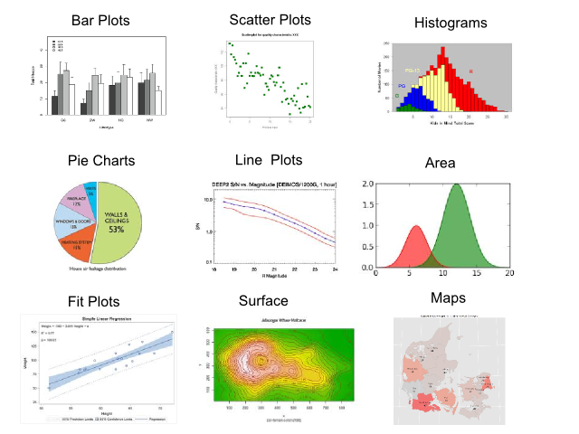
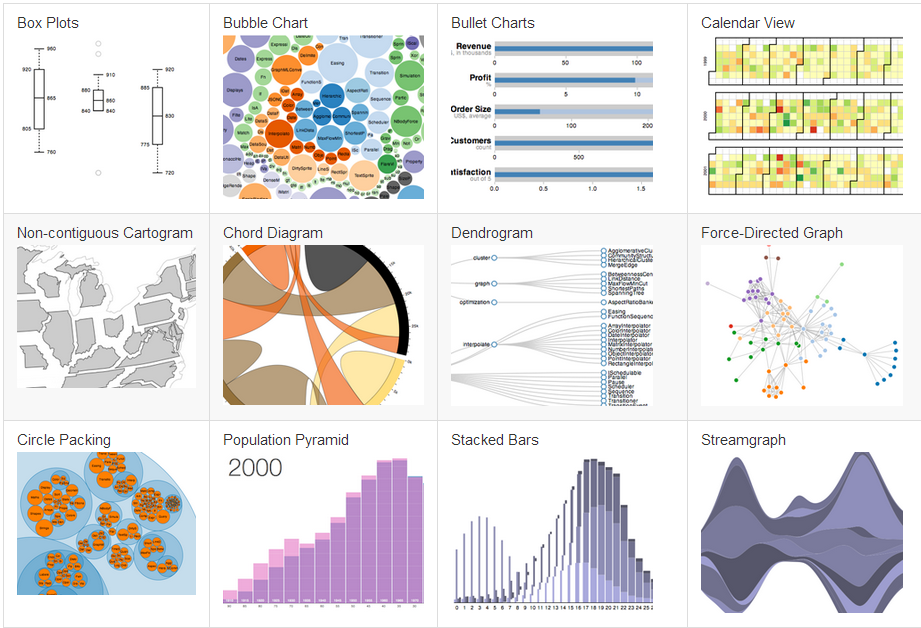

### The usual suspects

<center>  </center>

--- bg:#FFFFCC

## GGPLOT 2 

> The ggplot2 package, created by Hadley Wickham, offers a powerful graphics language for creating elegant and complex plots. 
> It is unlike most other graphics packages because it has a deep underlying grammar.

---

Example:  
**Proportion of Danish women aged 50-69 years invited to mammography screening**

```{r ggplot0, eval=F}
x <- data.frame( years = factor(1990:2010, levels = 1990:2010) ,
                 percent = c(0,4,8,8,14,rep(18,9), 23,24,18,19,48,89,100));
txt.perc <- function(x, d){ paste( format ( x, digits = 1, nsmall = d), "%", sep = "") }
titl <-'Proportion of Danish women aged 50-69 years \ninvited to mammography screening'; 

pl <- ggplot(x,aes(x=years, y=percent, fill = percent)) +    
  
  geom_bar( width =0.9) +  ylab('percent') + xlab('') +    
  
  geom_text(data=x,aes(x=years,y=percent,label=txt.perc(percent, 0)),vjust=-0.5, size = 4) +    
  
  geom_text(aes(x=nrow(x)/2,y=90,label= titl),vjust=-0.5) +   
  
  theme_bw() +
  
  scale_y_continuous( breaks=seq(0, 100, 5)  , limits = c(0, 110), expand = c(0,0) ) + 
  
  theme( 
    axis.text.x= element_text( size= 12 ) , 
    legend.position = "none" ,
    panel.margin = unit(0,"null")  
  ) 
```
---

<center></center>

---

## The usual suspects and more in R : ggplot2 

Map example : 

```{r ggplot, eval=FALSE}
m0 <- ggplot(data=MapDf)
m1 <- m0 + 
      geom_path(aes(x=long, y=lat, group=group), color='gray') + 
      coord_equal() + 
      xlim(8,13) + 
      labs( title = "Cancer Diagnoses in Denmark")

m2 <- m1 +  
      geom_polygon(   aes(x=long, y=lat, group=group, fill=id), alpha = 0.5   ) 

map <- m2 + 
       geom_text(data = centroids, x=centroids$long, y=centroids$lat, label = centroids$label, size = 2) +
       coord_map(project="globular") + 
       theme(legend.position = "none") 
map
```

--- 

#### Denmark, cancer cases per region. 


---

## More ggplot2 : heat map example  

```{r ggplot2}
# Make the heatmap : 
load("data/month_year")
c.scale <- scale_fill_gradient(low = "white", 
                                high = "steelblue",
                               limits=c(min(month_year$freq),
                                        max(month_year$freq)))
p1 <- ggplot(month_year, aes(month, year)) + 
  geom_tile(aes(fill = freq), color="white") 
p2 <- p1 + c.scale
```

--- 
```{r ggplot3}
p2
```


--- .notso bg:url(assets/img/bike_ggplot.png)

## Not so usual plots and diagrams 

London Cycle Hire and Pollution, made with R and ggplot

*see the post in [spatialy](http://spatialanalysis.co.uk/2012/02/london-cycle-hire-pollution/)* 

--- bg:#E6E6FA

## Today's visualizations 

### To visualize 

> * large data 
> * complex data 
> * interactions
> * data explorations 

### We use : 

> * new plots, diagrams, etc. 
> * interactivity 
> * real-time graphing
> * animations 
> * 3D

---

<center><a href="https://github.com/mbostock/d3/wiki/Gallery"></a></center>

---

<center><a href="https://github.com/mbostock/d3/wiki/Gallery"></a></center>


--- bg:#E6E6FA

## But, How To in R !!?? 

**R** is a great tool to make modern visualizations. 

Due to its growing enthusiastic community, many packages and tutorials have been made to visualize data. 

Here, we will use mainly these packages : 

* [slidify](http://slidify.org) is an extremly powerful tool to convert any **Rmd** (R markdown) document to a beautiful and custom html5 presentation. This presentation is done with it. [slidify examples](http://ramnathv.github.io/slidifyExamples/)
* [rCharts](https://github.com/ramnathv/rCharts). rCharts is an R package to create, customize and publish interactive javascript visualizations from R using a familiar lattice style plotting interface.
* [Corrplot](https://github.com/taiyun/corrplot). Package corrplot is for visualizing a correlation matrix and
confidence interval. It also contains some algorithms to do matrix reordering.
* [GoogleVis](http://decastillo.github.io/googleVis_Tutorial/)

--- bg:#E6E6FA

## R , d3.js HTML5 and javascript 

To diplay and run the visualizations, one common procedure is use `HTML5` and `javascript`, to allow web access and manipulation. 

Combination of `rCharts`, `googleVis`, `ggplot2` , `d3.js` and custom programming will transform R in one of the best platforms to make `complex-interactive-animated` visualizations. 


--- .segue bg:indigo
## EXAMPLES 


--- bg:#FFFFCC
## Time plots, zooms....  

Let us code an interactive graph: 

```{r timeplot}
require(rCharts)
load("data/time_data")
n1 <- nPlot(
  N~dateint,
  data =dtb ,
  group = "id",  # even though only one series need to specify group
  type = "lineWithFocusChart"
)
n1$xAxis(
  tickFormat=
    "#!function(d) { return d3.time.format('%Y %b')(new Date( d )); }!#"
)
n1$x2Axis(
  tickFormat=
    "#!function(d) {return d3.time.format('%Y')(new Date( d ));}!#"
)
n1$set( width = 700, height = 500)
```
---
## Time plot of movements of screened women 

```{r, echo=FALSE}
n1$print("chart_time")
```
---

## Sankey Diagrams  : 

```{r}
set.seed(12)
require(igraph)
require(rCharts)
g <- graph.tree(40, children = 4)

E(g)$weight = 1
edgelist <- get.data.frame(g) #this will give us a data frame with from,to,weight
colnames(edgelist) <- c("source","target","value")
edgelist$source <- as.character(edgelist$source)
edgelist$target <- as.character(edgelist$target)
sanPlot <- rCharts$new()
sanPlot$setLib('libraries/widgets/d3_sankey')
sanPlot$setTemplate(script = 'libraries/widgets/d3_sankey/layouts/deff.html')
sanPlot$set(
  data = edgelist,
  nodeWidth = 15,
  nodePadding = 10,
  layout = 32,
  width = 960,
  height = 500
)
```

---

```{r , echo=FALSE}
sanPlot$print()
```

--- 

## Hicharts 

```{r hi1}
load("data/tabcancer")
tcancer <- as.data.frame(tabcancer)
l.r2007  <- c("Hovedstaden", "Sjelland","Syddanmark", "Midtjylland", "Nordjylland")
names(tcancer) <- c("year","region", "N", "time")
tcancer$region <- factor(tcancer$region, 
                         levels = levels(tcancer$region), labels = l.r2007 )
a <- hPlot(N ~ year, data = tcancer, type = "bubble", 
           title = "Number of cancer cases by year and region (zoomable)",
           subtitle = "sampled data (2e6 from 24e6)", size = "N", group = "region")
a$chart(zoomType = "xy")
```

---

```{r , echo=FALSE}
a$print('hichart1')
```

--- . segue bg:indigo

## d3.js EXAMPLES 

--- 

## d3.js examples 

### Made with R code and d3.js examples 

Database: Sample of Cervical Screening Database (Denmark). 

* [ZOOMABLE BUBBLE] (../d3s//bubble.html)
* [ZOOMABLE BUBBLE NO SIZES](../d3s/bubble_no_prop.html)
* [INTERACTIVE TREE LAYOUT](../d3s/tree_layout.html)
* [ZOOMABLE TREE MAP](../d3s/treemap.html)
* [ZOOMABLE TREE MAP, NO SIZES](../d3s/treemap_noprop.html)

---

## LINKS  

General: 

* [Showing results from Cox Proportional Hazard Models in R with simPH](http://www.r-bloggers.com/showing-results-from-cox-proportional-hazard-models-in-r-with-simph/)
* [Graphs R CookBook](http://www.cookbook-r.com/Graphs/)
* [How do you visualize too much data?](http://fellinlovewithdata.com/guides/how-do-you-visualize-too-much-data)
* [Interactive charts and slides with R, googleVis and knitr](http://dl.dropboxusercontent.com/u/7586336/blogger/Cambridge_R_googleVis_with_knitr_and_RStudio_May_2012.html#%281%29)
* [50 Best US Cities of 2012 ](http://glimmer.rstudio.com/vivekpatil/bb50citiesrank/). Link to code [here](https://github.com/patilv/bb50citiesrank)
* [ds3.js](http://biovisualize.github.io/d3visualization/)

* [openCPU](https://public.opencpu.org/). Scientific computing in the cloud. *For anyone, anywhere*.

---
##LINKS

Videos: 

* [Drawing Dynamic Visualizations](http://vimeo.com/66085662)

BLogs : 

* [**Taiyun Wei**. *About my work and thoughts*](http://weitaiyun.blogspot.dk/)

---

## LINKS
R 

* [R Interactive Graphics with SVG](http://timelyportfolio.github.io/gridSVG_intro/)
* [rCharts to d3-horizon] (http://timelyportfolio.github.io/rCharts_d3_horizon/#slide-1)
* [rCharts](http://ramnathv.github.io/rCharts/)
* [rCharts Gallery] (http://rcharts.io/gallery/)

---
## LINKS 

R packages : 

* [slidify](http://slidify.org) is an extremly powerful tool to convert any **Rmd** (R markdown) document to a beautiful and custom html5 presentation. This presentation is done with it. [slidify examples](http://ramnathv.github.io/slidifyExamples/)
* [rCharts](https://github.com/ramnathv/rCharts). rCharts is an R package to create, customize and publish interactive javascript visualizations from R using a familiar lattice style plotting interface.
* [iPlots](http://stats.math.uni-augsburg.de/iplots/). iPlots is a package which provides high interaction statistical graphics, written in Java.
* [Corrplot](https://github.com/taiyun/corrplot). Package corrplot is for visualizing a correlation matrix and
confidence interval. It also contains some algorithms to do matrix reordering.
* [GoogleVis tutorial](http://decastillo.github.io/googleVis_Tutorial/#1)

---
## LINKS

D3 : 

* [D3 gallery](https://github.com/mbostock/d3/wiki/Gallery)
* [D3.JS: DATA-DRIVEN DELIGHT](http://anna.ps/talks/fel/#/)
* [D3 tutorials](http://alignedleft.com/tutorials/d3/)
* [D3.js Gallery](http://biovisualize.github.io/d3visualization/)


