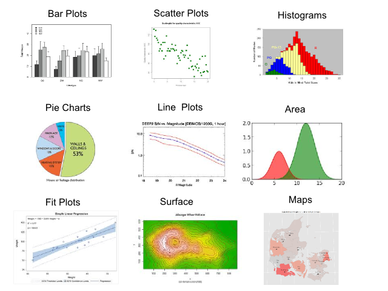
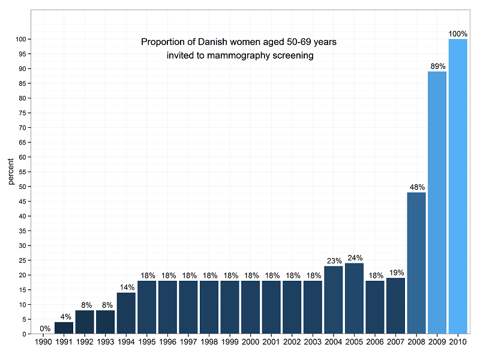
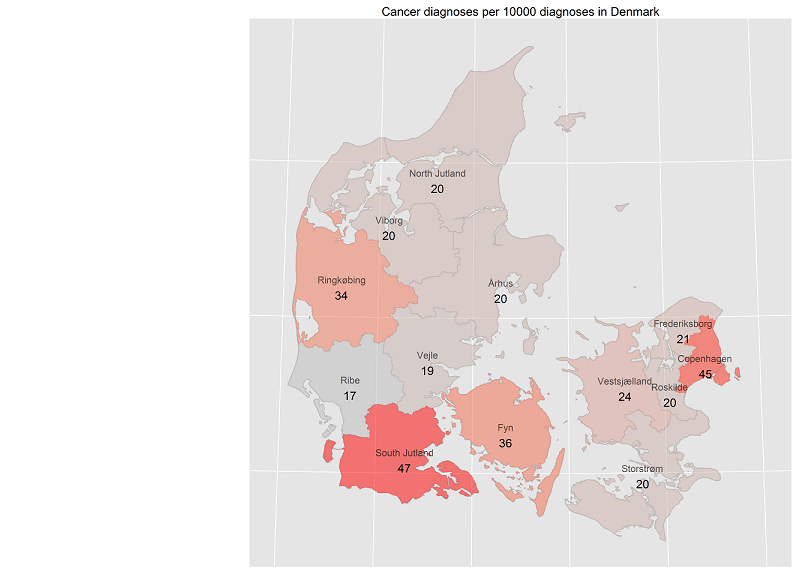
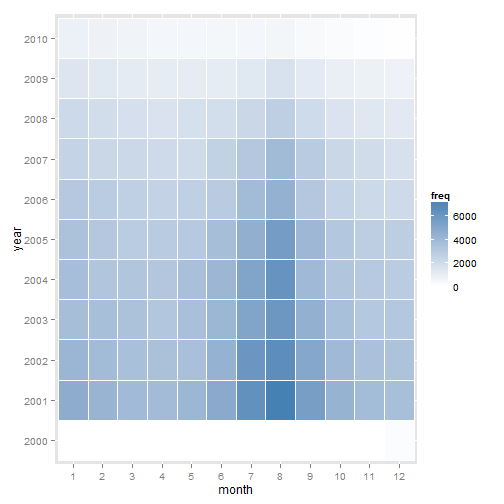
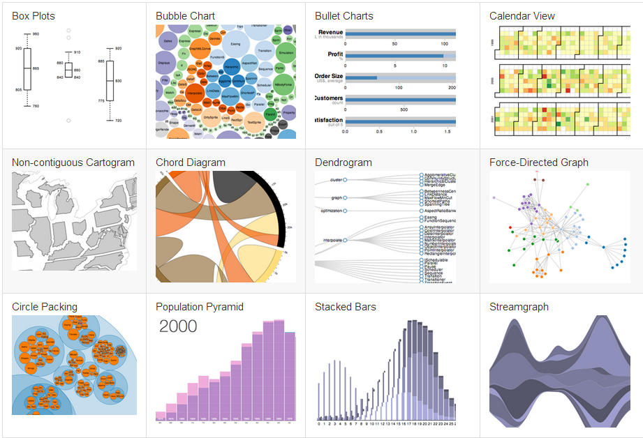
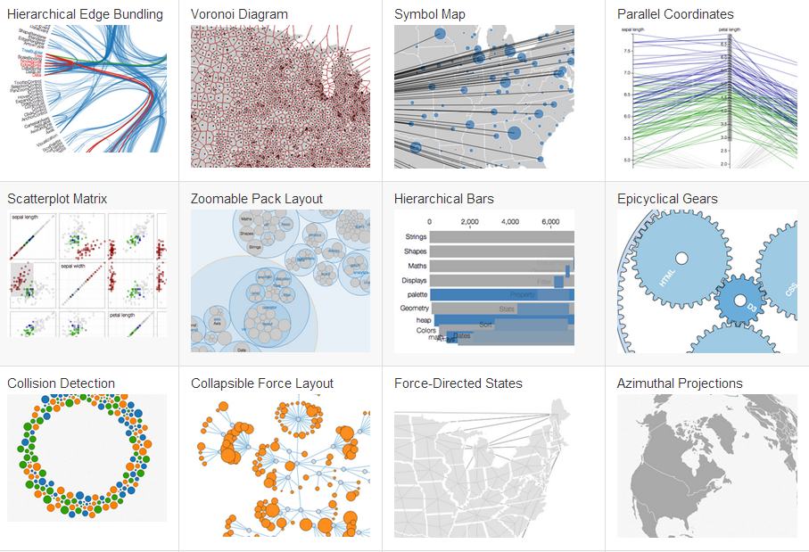

### The usual suspects

<center>  </center>

--- bg:#FFFFCC

## GGPLOT 2 

> The ggplot2 package, created by Hadley Wickham, offers a powerful graphics language for creating elegant and complex plots. 
> It is unlike most other graphics packages because it has a deep underlying grammar.

---

Example:  
**Proportion of Danish women aged 50-69 years invited to mammography screening**


```r
x <- data.frame( years = factor(1990:2010, levels = 1990:2010) ,
                 percent = c(0,4,8,8,14,rep(18,9), 23,24,18,19,48,89,100));
txt.perc <- function(x, d){ paste( format ( x, digits = 1, nsmall = d), "%", sep = "") }
titl <-'Proportion of Danish women aged 50-69 years \ninvited to mammography screening'; 

pl <- ggplot(x,aes(x=years, y=percent, fill = percent)) +    
  
  geom_bar( width =0.9) +  ylab('percent') + xlab('') +    
  
  geom_text(data=x,aes(x=years,y=percent,label=txt.perc(percent, 0)),vjust=-0.5, size = 4) +    
  
  geom_text(aes(x=nrow(x)/2,y=90,label= titl),vjust=-0.5) +   
  
  theme_bw() +
  
  scale_y_continuous( breaks=seq(0, 100, 5)  , limits = c(0, 110), expand = c(0,0) ) + 
  
  theme( 
    axis.text.x= element_text( size= 12 ) , 
    legend.position = "none" ,
    panel.margin = unit(0,"null")  
  ) 
```

---

<center></center>

---

## The usual suspects and more in R : ggplot2 

Map example : 


```r
m0 <- ggplot(data=MapDf)
m1 <- m0 + 
      geom_path(aes(x=long, y=lat, group=group), color='gray') + 
      coord_equal() + 
      xlim(8,13) + 
      labs( title = "Cancer Diagnoses in Denmark")

m2 <- m1 +  
      geom_polygon(   aes(x=long, y=lat, group=group, fill=id), alpha = 0.5   ) 

map <- m2 + 
       geom_text(data = centroids, x=centroids$long, y=centroids$lat, label = centroids$label, size = 2) +
       coord_map(project="globular") + 
       theme(legend.position = "none") 
map
```


--- 

#### Denmark, cancer cases per region. 



---

## More ggplot2 : heat map example  


```r
# Make the heatmap : 
load("data/month_year")
c.scale <- scale_fill_gradient(low = "white", 
                                high = "steelblue",
                               limits=c(min(month_year$freq),
                                        max(month_year$freq)))
p1 <- ggplot(month_year, aes(month, year)) + 
  geom_tile(aes(fill = freq), color="white") 
p2 <- p1 + c.scale
```


--- 

```r
p2
```

 


--- .notso bg:url(assets/img/bike_ggplot.png)

## Not so usual plots and diagrams 

London Cycle Hire and Pollution, made with R and ggplot

*see the post in [spatialy](http://spatialanalysis.co.uk/2012/02/london-cycle-hire-pollution/)* 

--- bg:#E6E6FA

## Today's visualizations 

### To visualize 

> * large data 
> * complex data 
> * interactions
> * data explorations 

### We use : 

> * new plots, diagrams, etc. 
> * interactivity 
> * real-time graphing
> * animations 
> * 3D

---

<center><a href="https://github.com/mbostock/d3/wiki/Gallery"></a></center>

---

<center><a href="https://github.com/mbostock/d3/wiki/Gallery"></a></center>


--- bg:#E6E6FA

## But, How To in R !!?? 

**R** is a great tool to make modern visualizations. 

Due to its growing enthusiastic community, many packages and tutorials have been made to visualize data. 

Here, we will use mainly these packages : 

* [slidify](http://slidify.org) is an extremly powerful tool to convert any **Rmd** (R markdown) document to a beautiful and custom html5 presentation. This presentation is done with it. [slidify examples](http://ramnathv.github.io/slidifyExamples/)
* [rCharts](https://github.com/ramnathv/rCharts). rCharts is an R package to create, customize and publish interactive javascript visualizations from R using a familiar lattice style plotting interface.
* [Corrplot](https://github.com/taiyun/corrplot). Package corrplot is for visualizing a correlation matrix and
confidence interval. It also contains some algorithms to do matrix reordering.
* [GoogleVis](http://decastillo.github.io/googleVis_Tutorial/)

--- bg:#E6E6FA

## R , d3.js HTML5 and javascript 

To diplay and run the visualizations, one common procedure is use `HTML5` and `javascript`, to allow web access and manipulation. 

Combination of `rCharts`, `googleVis`, `ggplot2` , `d3.js` and custom programming will transform R in one of the best platforms to make `complex-interactive-animated` visualizations. 


--- .segue bg:indigo
## EXAMPLES 


--- bg:#FFFFCC
## Time plots, zooms....  

Let us code an interactive graph: 


```r
require(rCharts)
load("data/time_data")
n1 <- nPlot(
  N~dateint,
  data =dtb ,
  group = "id",  # even though only one series need to specify group
  type = "lineWithFocusChart"
)
n1$xAxis(
  tickFormat=
    "#!function(d) { return d3.time.format('%Y %b')(new Date( d )); }!#"
)
n1$x2Axis(
  tickFormat=
    "#!function(d) {return d3.time.format('%Y')(new Date( d ));}!#"
)
n1$set( width = 700, height = 500)
```

---
## Time plot of movements of screened women 


<div id = 'chart_time' class = 'rChart nvd3'></div>
<script type='text/javascript'>
 $(document).ready(function(){
      drawchart_time()
    });
    function drawchart_time(){  
      var opts = {
 "dom": "chart_time",
"width":    700,
"height":    500,
"x": "dateint",
"y": "N",
"group": "id",
"type": "lineWithFocusChart",
"id": "chart_time" 
},
        data = [
 {
 "cf2": -33482,
"N": 1,
"id": "number of movements to",
"dateint": -2.8928e+12 
},
{
 "cf2": -33451,
"N": 1,
"id": "number of movements to",
"dateint": -2.8902e+12 
},
{
 "cf2": -33206,
"N": 1,
"id": "number of movements to",
"dateint": -2.869e+12 
},
{
 "cf2": -33025,
"N": 1,
"id": "number of movements to",
"dateint": -2.8534e+12 
},
{
 "cf2": -32994,
"N": 1,
"id": "number of movements to",
"dateint": -2.8507e+12 
},
{
 "cf2": -32964,
"N": 1,
"id": "number of movements to",
"dateint": -2.8481e+12 
},
{
 "cf2": -32598,
"N": 1,
"id": "number of movements to",
"dateint": -2.8165e+12 
},
{
 "cf2": -32355,
"N": 1,
"id": "number of movements to",
"dateint": -2.7955e+12 
},
{
 "cf2": -32294,
"N": 1,
"id": "number of movements to",
"dateint": -2.7902e+12 
},
{
 "cf2": -31960,
"N": 1,
"id": "number of movements to",
"dateint": -2.7613e+12 
},
{
 "cf2": -31868,
"N": 1,
"id": "number of movements to",
"dateint": -2.7534e+12 
},
{
 "cf2": -31807,
"N": 1,
"id": "number of movements to",
"dateint": -2.7481e+12 
},
{
 "cf2": -31472,
"N": 2,
"id": "number of movements to",
"dateint": -2.7192e+12 
},
{
 "cf2": -31320,
"N": 1,
"id": "number of movements to",
"dateint": -2.706e+12 
},
{
 "cf2": -31259,
"N": 1,
"id": "number of movements to",
"dateint": -2.7008e+12 
},
{
 "cf2": -30955,
"N": 2,
"id": "number of movements to",
"dateint": -2.6745e+12 
},
{
 "cf2": -30925,
"N": 1,
"id": "number of movements to",
"dateint": -2.6719e+12 
},
{
 "cf2": -30833,
"N": 1,
"id": "number of movements to",
"dateint": -2.664e+12 
},
{
 "cf2": -30802,
"N": 1,
"id": "number of movements to",
"dateint": -2.6613e+12 
},
{
 "cf2": -30772,
"N": 2,
"id": "number of movements to",
"dateint": -2.6587e+12 
},
{
 "cf2": -30680,
"N": 1,
"id": "number of movements to",
"dateint": -2.6508e+12 
},
{
 "cf2": -30621,
"N": 1,
"id": "number of movements to",
"dateint": -2.6457e+12 
},
{
 "cf2": -30560,
"N": 1,
"id": "number of movements to",
"dateint": -2.6404e+12 
},
{
 "cf2": -30499,
"N": 1,
"id": "number of movements to",
"dateint": -2.6351e+12 
},
{
 "cf2": -30468,
"N": 2,
"id": "number of movements to",
"dateint": -2.6324e+12 
},
{
 "cf2": -30437,
"N": 1,
"id": "number of movements to",
"dateint": -2.6298e+12 
},
{
 "cf2": -30376,
"N": 1,
"id": "number of movements to",
"dateint": -2.6245e+12 
},
{
 "cf2": -30346,
"N": 1,
"id": "number of movements to",
"dateint": -2.6219e+12 
},
{
 "cf2": -30315,
"N": 1,
"id": "number of movements to",
"dateint": -2.6192e+12 
},
{
 "cf2": -30256,
"N": 1,
"id": "number of movements to",
"dateint": -2.6141e+12 
},
{
 "cf2": -30225,
"N": 2,
"id": "number of movements to",
"dateint": -2.6114e+12 
},
{
 "cf2": -30103,
"N": 1,
"id": "number of movements to",
"dateint": -2.6009e+12 
},
{
 "cf2": -29950,
"N": 1,
"id": "number of movements to",
"dateint": -2.5877e+12 
},
{
 "cf2": -29919,
"N": 1,
"id": "number of movements to",
"dateint": -2.585e+12 
},
{
 "cf2": -29859,
"N": 1,
"id": "number of movements to",
"dateint": -2.5798e+12 
},
{
 "cf2": -29768,
"N": 1,
"id": "number of movements to",
"dateint": -2.572e+12 
},
{
 "cf2": -29584,
"N": 1,
"id": "number of movements to",
"dateint": -2.5561e+12 
},
{
 "cf2": -29464,
"N": 1,
"id": "number of movements to",
"dateint": -2.5457e+12 
},
{
 "cf2": -29403,
"N": 2,
"id": "number of movements to",
"dateint": -2.5404e+12 
},
{
 "cf2": -29372,
"N": 1,
"id": "number of movements to",
"dateint": -2.5377e+12 
},
{
 "cf2": -29341,
"N": 2,
"id": "number of movements to",
"dateint": -2.5351e+12 
},
{
 "cf2": -29311,
"N": 1,
"id": "number of movements to",
"dateint": -2.5325e+12 
},
{
 "cf2": -29160,
"N": 1,
"id": "number of movements to",
"dateint": -2.5194e+12 
},
{
 "cf2": -29099,
"N": 2,
"id": "number of movements to",
"dateint": -2.5142e+12 
},
{
 "cf2": -29068,
"N": 2,
"id": "number of movements to",
"dateint": -2.5115e+12 
},
{
 "cf2": -29038,
"N": 2,
"id": "number of movements to",
"dateint": -2.5089e+12 
},
{
 "cf2": -29007,
"N": 2,
"id": "number of movements to",
"dateint": -2.5062e+12 
},
{
 "cf2": -28946,
"N": 2,
"id": "number of movements to",
"dateint": -2.5009e+12 
},
{
 "cf2": -28915,
"N": 1,
"id": "number of movements to",
"dateint": -2.4983e+12 
},
{
 "cf2": -28795,
"N": 1,
"id": "number of movements to",
"dateint": -2.4879e+12 
},
{
 "cf2": -28764,
"N": 1,
"id": "number of movements to",
"dateint": -2.4852e+12 
},
{
 "cf2": -28703,
"N": 1,
"id": "number of movements to",
"dateint": -2.4799e+12 
},
{
 "cf2": -28673,
"N": 1,
"id": "number of movements to",
"dateint": -2.4773e+12 
},
{
 "cf2": -28611,
"N": 1,
"id": "number of movements to",
"dateint": -2.472e+12 
},
{
 "cf2": -28550,
"N": 1,
"id": "number of movements to",
"dateint": -2.4667e+12 
},
{
 "cf2": -28520,
"N": 2,
"id": "number of movements to",
"dateint": -2.4641e+12 
},
{
 "cf2": -28429,
"N": 2,
"id": "number of movements to",
"dateint": -2.4563e+12 
},
{
 "cf2": -28398,
"N": 1,
"id": "number of movements to",
"dateint": -2.4536e+12 
},
{
 "cf2": -28368,
"N": 2,
"id": "number of movements to",
"dateint": -2.451e+12 
},
{
 "cf2": -28337,
"N": 1,
"id": "number of movements to",
"dateint": -2.4483e+12 
},
{
 "cf2": -28215,
"N": 1,
"id": "number of movements to",
"dateint": -2.4378e+12 
},
{
 "cf2": -28123,
"N": 2,
"id": "number of movements to",
"dateint": -2.4298e+12 
},
{
 "cf2": -27758,
"N": 1,
"id": "number of movements to",
"dateint": -2.3983e+12 
},
{
 "cf2": -27727,
"N": 1,
"id": "number of movements to",
"dateint": -2.3956e+12 
},
{
 "cf2": -27607,
"N": 1,
"id": "number of movements to",
"dateint": -2.3852e+12 
},
{
 "cf2": -27577,
"N": 1,
"id": "number of movements to",
"dateint": -2.3827e+12 
},
{
 "cf2": -27485,
"N": 2,
"id": "number of movements to",
"dateint": -2.3747e+12 
},
{
 "cf2": -27424,
"N": 1,
"id": "number of movements to",
"dateint": -2.3694e+12 
},
{
 "cf2": -27393,
"N": 2,
"id": "number of movements to",
"dateint": -2.3668e+12 
},
{
 "cf2": -27334,
"N": 2,
"id": "number of movements to",
"dateint": -2.3617e+12 
},
{
 "cf2": -27242,
"N": 1,
"id": "number of movements to",
"dateint": -2.3537e+12 
},
{
 "cf2": -27181,
"N": 1,
"id": "number of movements to",
"dateint": -2.3484e+12 
},
{
 "cf2": -27028,
"N": 1,
"id": "number of movements to",
"dateint": -2.3352e+12 
},
{
 "cf2": -26968,
"N": 2,
"id": "number of movements to",
"dateint": -2.33e+12 
},
{
 "cf2": -26907,
"N": 1,
"id": "number of movements to",
"dateint": -2.3248e+12 
},
{
 "cf2": -26846,
"N": 1,
"id": "number of movements to",
"dateint": -2.3195e+12 
},
{
 "cf2": -26815,
"N": 2,
"id": "number of movements to",
"dateint": -2.3168e+12 
},
{
 "cf2": -26784,
"N": 2,
"id": "number of movements to",
"dateint": -2.3141e+12 
},
{
 "cf2": -26723,
"N": 1,
"id": "number of movements to",
"dateint": -2.3089e+12 
},
{
 "cf2": -26631,
"N": 1,
"id": "number of movements to",
"dateint": -2.3009e+12 
},
{
 "cf2": -26572,
"N": 1,
"id": "number of movements to",
"dateint": -2.2958e+12 
},
{
 "cf2": -26419,
"N": 1,
"id": "number of movements to",
"dateint": -2.2826e+12 
},
{
 "cf2": -26358,
"N": 1,
"id": "number of movements to",
"dateint": -2.2773e+12 
},
{
 "cf2": -26297,
"N": 2,
"id": "number of movements to",
"dateint": -2.2721e+12 
},
{
 "cf2": -26207,
"N": 1,
"id": "number of movements to",
"dateint": -2.2643e+12 
},
{
 "cf2": -26146,
"N": 1,
"id": "number of movements to",
"dateint": -2.259e+12 
},
{
 "cf2": -26054,
"N": 1,
"id": "number of movements to",
"dateint": -2.2511e+12 
},
{
 "cf2": -25993,
"N": 2,
"id": "number of movements to",
"dateint": -2.2458e+12 
},
{
 "cf2": -25901,
"N": 1,
"id": "number of movements to",
"dateint": -2.2378e+12 
},
{
 "cf2": -25812,
"N": 2,
"id": "number of movements to",
"dateint": -2.2302e+12 
},
{
 "cf2": -25720,
"N": 1,
"id": "number of movements to",
"dateint": -2.2222e+12 
},
{
 "cf2": -25689,
"N": 1,
"id": "number of movements to",
"dateint": -2.2195e+12 
},
{
 "cf2": -25659,
"N": 1,
"id": "number of movements to",
"dateint": -2.2169e+12 
},
{
 "cf2": -25567,
"N": 19976,
"id": "number of movements to",
"dateint": -2.209e+12 
},
{
 "cf2": -25536,
"N": 144,
"id": "number of movements to",
"dateint": -2.2063e+12 
},
{
 "cf2": -25508,
"N": 168,
"id": "number of movements to",
"dateint": -2.2039e+12 
},
{
 "cf2": -25477,
"N": 183,
"id": "number of movements to",
"dateint": -2.2012e+12 
},
{
 "cf2": -25447,
"N": 175,
"id": "number of movements to",
"dateint": -2.1986e+12 
},
{
 "cf2": -25416,
"N": 162,
"id": "number of movements to",
"dateint": -2.1959e+12 
},
{
 "cf2": -25386,
"N": 186,
"id": "number of movements to",
"dateint": -2.1934e+12 
},
{
 "cf2": -25355,
"N": 173,
"id": "number of movements to",
"dateint": -2.1907e+12 
},
{
 "cf2": -25324,
"N": 158,
"id": "number of movements to",
"dateint": -2.188e+12 
},
{
 "cf2": -25294,
"N": 187,
"id": "number of movements to",
"dateint": -2.1854e+12 
},
{
 "cf2": -25263,
"N": 149,
"id": "number of movements to",
"dateint": -2.1827e+12 
},
{
 "cf2": -25233,
"N": 167,
"id": "number of movements to",
"dateint": -2.1801e+12 
},
{
 "cf2": -25202,
"N": 160,
"id": "number of movements to",
"dateint": -2.1775e+12 
},
{
 "cf2": -25171,
"N": 152,
"id": "number of movements to",
"dateint": -2.1748e+12 
},
{
 "cf2": -25143,
"N": 187,
"id": "number of movements to",
"dateint": -2.1724e+12 
},
{
 "cf2": -25112,
"N": 180,
"id": "number of movements to",
"dateint": -2.1697e+12 
},
{
 "cf2": -25082,
"N": 159,
"id": "number of movements to",
"dateint": -2.1671e+12 
},
{
 "cf2": -25051,
"N": 163,
"id": "number of movements to",
"dateint": -2.1644e+12 
},
{
 "cf2": -25021,
"N": 144,
"id": "number of movements to",
"dateint": -2.1618e+12 
},
{
 "cf2": -24990,
"N": 191,
"id": "number of movements to",
"dateint": -2.1591e+12 
},
{
 "cf2": -24959,
"N": 186,
"id": "number of movements to",
"dateint": -2.1565e+12 
},
{
 "cf2": -24929,
"N": 191,
"id": "number of movements to",
"dateint": -2.1539e+12 
},
{
 "cf2": -24898,
"N": 165,
"id": "number of movements to",
"dateint": -2.1512e+12 
},
{
 "cf2": -24868,
"N": 188,
"id": "number of movements to",
"dateint": -2.1486e+12 
},
{
 "cf2": -24837,
"N": 170,
"id": "number of movements to",
"dateint": -2.1459e+12 
},
{
 "cf2": -24806,
"N": 167,
"id": "number of movements to",
"dateint": -2.1432e+12 
},
{
 "cf2": -24778,
"N": 204,
"id": "number of movements to",
"dateint": -2.1408e+12 
},
{
 "cf2": -24747,
"N": 191,
"id": "number of movements to",
"dateint": -2.1381e+12 
},
{
 "cf2": -24717,
"N": 165,
"id": "number of movements to",
"dateint": -2.1355e+12 
},
{
 "cf2": -24686,
"N": 172,
"id": "number of movements to",
"dateint": -2.1329e+12 
},
{
 "cf2": -24656,
"N": 170,
"id": "number of movements to",
"dateint": -2.1303e+12 
},
{
 "cf2": -24625,
"N": 197,
"id": "number of movements to",
"dateint": -2.1276e+12 
},
{
 "cf2": -24594,
"N": 201,
"id": "number of movements to",
"dateint": -2.1249e+12 
},
{
 "cf2": -24564,
"N": 178,
"id": "number of movements to",
"dateint": -2.1223e+12 
},
{
 "cf2": -24533,
"N": 200,
"id": "number of movements to",
"dateint": -2.1197e+12 
},
{
 "cf2": -24503,
"N": 187,
"id": "number of movements to",
"dateint": -2.1171e+12 
},
{
 "cf2": -24472,
"N": 199,
"id": "number of movements to",
"dateint": -2.1144e+12 
},
{
 "cf2": -24441,
"N": 205,
"id": "number of movements to",
"dateint": -2.1117e+12 
},
{
 "cf2": -24413,
"N": 216,
"id": "number of movements to",
"dateint": -2.1093e+12 
},
{
 "cf2": -24382,
"N": 208,
"id": "number of movements to",
"dateint": -2.1066e+12 
},
{
 "cf2": -24352,
"N": 216,
"id": "number of movements to",
"dateint": -2.104e+12 
},
{
 "cf2": -24321,
"N": 191,
"id": "number of movements to",
"dateint": -2.1013e+12 
},
{
 "cf2": -24291,
"N": 157,
"id": "number of movements to",
"dateint": -2.0987e+12 
},
{
 "cf2": -24260,
"N": 170,
"id": "number of movements to",
"dateint": -2.0961e+12 
},
{
 "cf2": -24229,
"N": 192,
"id": "number of movements to",
"dateint": -2.0934e+12 
},
{
 "cf2": -24199,
"N": 190,
"id": "number of movements to",
"dateint": -2.0908e+12 
},
{
 "cf2": -24168,
"N": 152,
"id": "number of movements to",
"dateint": -2.0881e+12 
},
{
 "cf2": -24138,
"N": 174,
"id": "number of movements to",
"dateint": -2.0855e+12 
},
{
 "cf2": -24107,
"N": 194,
"id": "number of movements to",
"dateint": -2.0828e+12 
},
{
 "cf2": -24076,
"N": 183,
"id": "number of movements to",
"dateint": -2.0802e+12 
},
{
 "cf2": -24047,
"N": 230,
"id": "number of movements to",
"dateint": -2.0777e+12 
},
{
 "cf2": -24016,
"N": 192,
"id": "number of movements to",
"dateint": -2.075e+12 
},
{
 "cf2": -23986,
"N": 203,
"id": "number of movements to",
"dateint": -2.0724e+12 
},
{
 "cf2": -23955,
"N": 204,
"id": "number of movements to",
"dateint": -2.0697e+12 
},
{
 "cf2": -23925,
"N": 188,
"id": "number of movements to",
"dateint": -2.0671e+12 
},
{
 "cf2": -23894,
"N": 194,
"id": "number of movements to",
"dateint": -2.0644e+12 
},
{
 "cf2": -23863,
"N": 190,
"id": "number of movements to",
"dateint": -2.0618e+12 
},
{
 "cf2": -23833,
"N": 207,
"id": "number of movements to",
"dateint": -2.0592e+12 
},
{
 "cf2": -23802,
"N": 180,
"id": "number of movements to",
"dateint": -2.0565e+12 
},
{
 "cf2": -23772,
"N": 180,
"id": "number of movements to",
"dateint": -2.0539e+12 
},
{
 "cf2": -23741,
"N": 214,
"id": "number of movements to",
"dateint": -2.0512e+12 
},
{
 "cf2": -23710,
"N": 217,
"id": "number of movements to",
"dateint": -2.0485e+12 
},
{
 "cf2": -23682,
"N": 193,
"id": "number of movements to",
"dateint": -2.0461e+12 
},
{
 "cf2": -23651,
"N": 255,
"id": "number of movements to",
"dateint": -2.0434e+12 
},
{
 "cf2": -23621,
"N": 222,
"id": "number of movements to",
"dateint": -2.0409e+12 
},
{
 "cf2": -23590,
"N": 195,
"id": "number of movements to",
"dateint": -2.0382e+12 
},
{
 "cf2": -23560,
"N": 197,
"id": "number of movements to",
"dateint": -2.0356e+12 
},
{
 "cf2": -23529,
"N": 218,
"id": "number of movements to",
"dateint": -2.0329e+12 
},
{
 "cf2": -23498,
"N": 228,
"id": "number of movements to",
"dateint": -2.0302e+12 
},
{
 "cf2": -23468,
"N": 205,
"id": "number of movements to",
"dateint": -2.0276e+12 
},
{
 "cf2": -23437,
"N": 207,
"id": "number of movements to",
"dateint": -2.025e+12 
},
{
 "cf2": -23407,
"N": 201,
"id": "number of movements to",
"dateint": -2.0224e+12 
},
{
 "cf2": -23376,
"N": 222,
"id": "number of movements to",
"dateint": -2.0197e+12 
},
{
 "cf2": -23345,
"N": 196,
"id": "number of movements to",
"dateint": -2.017e+12 
},
{
 "cf2": -23317,
"N": 227,
"id": "number of movements to",
"dateint": -2.0146e+12 
},
{
 "cf2": -23286,
"N": 215,
"id": "number of movements to",
"dateint": -2.0119e+12 
},
{
 "cf2": -23256,
"N": 200,
"id": "number of movements to",
"dateint": -2.0093e+12 
},
{
 "cf2": -23225,
"N": 212,
"id": "number of movements to",
"dateint": -2.0066e+12 
},
{
 "cf2": -23195,
"N": 199,
"id": "number of movements to",
"dateint": -2.004e+12 
},
{
 "cf2": -23164,
"N": 217,
"id": "number of movements to",
"dateint": -2.0014e+12 
},
{
 "cf2": -23133,
"N": 215,
"id": "number of movements to",
"dateint": -1.9987e+12 
},
{
 "cf2": -23103,
"N": 220,
"id": "number of movements to",
"dateint": -1.9961e+12 
},
{
 "cf2": -23072,
"N": 201,
"id": "number of movements to",
"dateint": -1.9934e+12 
},
{
 "cf2": -23042,
"N": 210,
"id": "number of movements to",
"dateint": -1.9908e+12 
},
{
 "cf2": -23011,
"N": 220,
"id": "number of movements to",
"dateint": -1.9882e+12 
},
{
 "cf2": -22980,
"N": 234,
"id": "number of movements to",
"dateint": -1.9855e+12 
},
{
 "cf2": -22952,
"N": 252,
"id": "number of movements to",
"dateint": -1.9831e+12 
},
{
 "cf2": -22921,
"N": 217,
"id": "number of movements to",
"dateint": -1.9804e+12 
},
{
 "cf2": -22891,
"N": 255,
"id": "number of movements to",
"dateint": -1.9778e+12 
},
{
 "cf2": -22860,
"N": 225,
"id": "number of movements to",
"dateint": -1.9751e+12 
},
{
 "cf2": -22830,
"N": 214,
"id": "number of movements to",
"dateint": -1.9725e+12 
},
{
 "cf2": -22799,
"N": 218,
"id": "number of movements to",
"dateint": -1.9698e+12 
},
{
 "cf2": -22768,
"N": 227,
"id": "number of movements to",
"dateint": -1.9672e+12 
},
{
 "cf2": -22738,
"N": 224,
"id": "number of movements to",
"dateint": -1.9646e+12 
},
{
 "cf2": -22707,
"N": 211,
"id": "number of movements to",
"dateint": -1.9619e+12 
},
{
 "cf2": -22677,
"N": 217,
"id": "number of movements to",
"dateint": -1.9593e+12 
},
{
 "cf2": -22646,
"N": 247,
"id": "number of movements to",
"dateint": -1.9566e+12 
},
{
 "cf2": -22615,
"N": 223,
"id": "number of movements to",
"dateint": -1.9539e+12 
},
{
 "cf2": -22586,
"N": 288,
"id": "number of movements to",
"dateint": -1.9514e+12 
},
{
 "cf2": -22555,
"N": 261,
"id": "number of movements to",
"dateint": -1.9488e+12 
},
{
 "cf2": -22525,
"N": 245,
"id": "number of movements to",
"dateint": -1.9462e+12 
},
{
 "cf2": -22494,
"N": 227,
"id": "number of movements to",
"dateint": -1.9435e+12 
},
{
 "cf2": -22464,
"N": 256,
"id": "number of movements to",
"dateint": -1.9409e+12 
},
{
 "cf2": -22433,
"N": 250,
"id": "number of movements to",
"dateint": -1.9382e+12 
},
{
 "cf2": -22402,
"N": 258,
"id": "number of movements to",
"dateint": -1.9355e+12 
},
{
 "cf2": -22372,
"N": 262,
"id": "number of movements to",
"dateint": -1.9329e+12 
},
{
 "cf2": -22341,
"N": 215,
"id": "number of movements to",
"dateint": -1.9303e+12 
},
{
 "cf2": -22311,
"N": 223,
"id": "number of movements to",
"dateint": -1.9277e+12 
},
{
 "cf2": -22280,
"N": 271,
"id": "number of movements to",
"dateint": -1.925e+12 
},
{
 "cf2": -22249,
"N": 240,
"id": "number of movements to",
"dateint": -1.9223e+12 
},
{
 "cf2": -22221,
"N": 284,
"id": "number of movements to",
"dateint": -1.9199e+12 
},
{
 "cf2": -22190,
"N": 275,
"id": "number of movements to",
"dateint": -1.9172e+12 
},
{
 "cf2": -22160,
"N": 267,
"id": "number of movements to",
"dateint": -1.9146e+12 
},
{
 "cf2": -22129,
"N": 241,
"id": "number of movements to",
"dateint": -1.9119e+12 
},
{
 "cf2": -22099,
"N": 232,
"id": "number of movements to",
"dateint": -1.9094e+12 
},
{
 "cf2": -22068,
"N": 268,
"id": "number of movements to",
"dateint": -1.9067e+12 
},
{
 "cf2": -22037,
"N": 268,
"id": "number of movements to",
"dateint": -1.904e+12 
},
{
 "cf2": -22007,
"N": 238,
"id": "number of movements to",
"dateint": -1.9014e+12 
},
{
 "cf2": -21976,
"N": 248,
"id": "number of movements to",
"dateint": -1.8987e+12 
},
{
 "cf2": -21946,
"N": 276,
"id": "number of movements to",
"dateint": -1.8961e+12 
},
{
 "cf2": -21915,
"N": 257,
"id": "number of movements to",
"dateint": -1.8935e+12 
},
{
 "cf2": -21884,
"N": 236,
"id": "number of movements to",
"dateint": -1.8908e+12 
},
{
 "cf2": -21856,
"N": 305,
"id": "number of movements to",
"dateint": -1.8884e+12 
},
{
 "cf2": -21825,
"N": 305,
"id": "number of movements to",
"dateint": -1.8857e+12 
},
{
 "cf2": -21795,
"N": 296,
"id": "number of movements to",
"dateint": -1.8831e+12 
},
{
 "cf2": -21764,
"N": 246,
"id": "number of movements to",
"dateint": -1.8804e+12 
},
{
 "cf2": -21734,
"N": 257,
"id": "number of movements to",
"dateint": -1.8778e+12 
},
{
 "cf2": -21703,
"N": 276,
"id": "number of movements to",
"dateint": -1.8751e+12 
},
{
 "cf2": -21672,
"N": 267,
"id": "number of movements to",
"dateint": -1.8725e+12 
},
{
 "cf2": -21642,
"N": 275,
"id": "number of movements to",
"dateint": -1.8699e+12 
},
{
 "cf2": -21611,
"N": 255,
"id": "number of movements to",
"dateint": -1.8672e+12 
},
{
 "cf2": -21581,
"N": 236,
"id": "number of movements to",
"dateint": -1.8646e+12 
},
{
 "cf2": -21550,
"N": 246,
"id": "number of movements to",
"dateint": -1.8619e+12 
},
{
 "cf2": -21519,
"N": 265,
"id": "number of movements to",
"dateint": -1.8592e+12 
},
{
 "cf2": -21491,
"N": 292,
"id": "number of movements to",
"dateint": -1.8568e+12 
},
{
 "cf2": -21460,
"N": 273,
"id": "number of movements to",
"dateint": -1.8541e+12 
},
{
 "cf2": -21430,
"N": 279,
"id": "number of movements to",
"dateint": -1.8516e+12 
},
{
 "cf2": -21399,
"N": 263,
"id": "number of movements to",
"dateint": -1.8489e+12 
},
{
 "cf2": -21369,
"N": 266,
"id": "number of movements to",
"dateint": -1.8463e+12 
},
{
 "cf2": -21338,
"N": 255,
"id": "number of movements to",
"dateint": -1.8436e+12 
},
{
 "cf2": -21307,
"N": 246,
"id": "number of movements to",
"dateint": -1.8409e+12 
},
{
 "cf2": -21277,
"N": 256,
"id": "number of movements to",
"dateint": -1.8383e+12 
},
{
 "cf2": -21246,
"N": 281,
"id": "number of movements to",
"dateint": -1.8357e+12 
},
{
 "cf2": -21216,
"N": 270,
"id": "number of movements to",
"dateint": -1.8331e+12 
},
{
 "cf2": -21185,
"N": 268,
"id": "number of movements to",
"dateint": -1.8304e+12 
},
{
 "cf2": -21154,
"N": 240,
"id": "number of movements to",
"dateint": -1.8277e+12 
},
{
 "cf2": -21125,
"N": 288,
"id": "number of movements to",
"dateint": -1.8252e+12 
},
{
 "cf2": -21094,
"N": 308,
"id": "number of movements to",
"dateint": -1.8225e+12 
},
{
 "cf2": -21064,
"N": 272,
"id": "number of movements to",
"dateint": -1.8199e+12 
},
{
 "cf2": -21033,
"N": 275,
"id": "number of movements to",
"dateint": -1.8173e+12 
},
{
 "cf2": -21003,
"N": 289,
"id": "number of movements to",
"dateint": -1.8147e+12 
},
{
 "cf2": -20972,
"N": 319,
"id": "number of movements to",
"dateint": -1.812e+12 
},
{
 "cf2": -20941,
"N": 281,
"id": "number of movements to",
"dateint": -1.8093e+12 
},
{
 "cf2": -20911,
"N": 277,
"id": "number of movements to",
"dateint": -1.8067e+12 
},
{
 "cf2": -20880,
"N": 260,
"id": "number of movements to",
"dateint": -1.804e+12 
},
{
 "cf2": -20850,
"N": 313,
"id": "number of movements to",
"dateint": -1.8014e+12 
},
{
 "cf2": -20819,
"N": 268,
"id": "number of movements to",
"dateint": -1.7988e+12 
},
{
 "cf2": -20788,
"N": 271,
"id": "number of movements to",
"dateint": -1.7961e+12 
},
{
 "cf2": -20760,
"N": 283,
"id": "number of movements to",
"dateint": -1.7937e+12 
},
{
 "cf2": -20729,
"N": 310,
"id": "number of movements to",
"dateint": -1.791e+12 
},
{
 "cf2": -20699,
"N": 329,
"id": "number of movements to",
"dateint": -1.7884e+12 
},
{
 "cf2": -20668,
"N": 275,
"id": "number of movements to",
"dateint": -1.7857e+12 
},
{
 "cf2": -20638,
"N": 288,
"id": "number of movements to",
"dateint": -1.7831e+12 
},
{
 "cf2": -20607,
"N": 309,
"id": "number of movements to",
"dateint": -1.7804e+12 
},
{
 "cf2": -20576,
"N": 309,
"id": "number of movements to",
"dateint": -1.7778e+12 
},
{
 "cf2": -20546,
"N": 278,
"id": "number of movements to",
"dateint": -1.7752e+12 
},
{
 "cf2": -20515,
"N": 247,
"id": "number of movements to",
"dateint": -1.7725e+12 
},
{
 "cf2": -20485,
"N": 324,
"id": "number of movements to",
"dateint": -1.7699e+12 
},
{
 "cf2": -20454,
"N": 337,
"id": "number of movements to",
"dateint": -1.7672e+12 
},
{
 "cf2": -20423,
"N": 297,
"id": "number of movements to",
"dateint": -1.7645e+12 
},
{
 "cf2": -20395,
"N": 356,
"id": "number of movements to",
"dateint": -1.7621e+12 
},
{
 "cf2": -20364,
"N": 309,
"id": "number of movements to",
"dateint": -1.7594e+12 
},
{
 "cf2": -20334,
"N": 328,
"id": "number of movements to",
"dateint": -1.7569e+12 
},
{
 "cf2": -20303,
"N": 305,
"id": "number of movements to",
"dateint": -1.7542e+12 
},
{
 "cf2": -20273,
"N": 288,
"id": "number of movements to",
"dateint": -1.7516e+12 
},
{
 "cf2": -20242,
"N": 289,
"id": "number of movements to",
"dateint": -1.7489e+12 
},
{
 "cf2": -20211,
"N": 319,
"id": "number of movements to",
"dateint": -1.7462e+12 
},
{
 "cf2": -20181,
"N": 314,
"id": "number of movements to",
"dateint": -1.7436e+12 
},
{
 "cf2": -20150,
"N": 273,
"id": "number of movements to",
"dateint": -1.741e+12 
},
{
 "cf2": -20120,
"N": 297,
"id": "number of movements to",
"dateint": -1.7384e+12 
},
{
 "cf2": -20089,
"N": 306,
"id": "number of movements to",
"dateint": -1.7357e+12 
},
{
 "cf2": -20058,
"N": 322,
"id": "number of movements to",
"dateint": -1.733e+12 
},
{
 "cf2": -20030,
"N": 338,
"id": "number of movements to",
"dateint": -1.7306e+12 
},
{
 "cf2": -19999,
"N": 336,
"id": "number of movements to",
"dateint": -1.7279e+12 
},
{
 "cf2": -19969,
"N": 319,
"id": "number of movements to",
"dateint": -1.7253e+12 
},
{
 "cf2": -19938,
"N": 270,
"id": "number of movements to",
"dateint": -1.7226e+12 
},
{
 "cf2": -19908,
"N": 285,
"id": "number of movements to",
"dateint": -1.7201e+12 
},
{
 "cf2": -19877,
"N": 293,
"id": "number of movements to",
"dateint": -1.7174e+12 
},
{
 "cf2": -19846,
"N": 282,
"id": "number of movements to",
"dateint": -1.7147e+12 
},
{
 "cf2": -19816,
"N": 295,
"id": "number of movements to",
"dateint": -1.7121e+12 
},
{
 "cf2": -19785,
"N": 253,
"id": "number of movements to",
"dateint": -1.7094e+12 
},
{
 "cf2": -19755,
"N": 319,
"id": "number of movements to",
"dateint": -1.7068e+12 
},
{
 "cf2": -19724,
"N": 287,
"id": "number of movements to",
"dateint": -1.7042e+12 
},
{
 "cf2": -19693,
"N": 304,
"id": "number of movements to",
"dateint": -1.7015e+12 
},
{
 "cf2": -19664,
"N": 320,
"id": "number of movements to",
"dateint": -1.699e+12 
},
{
 "cf2": -19633,
"N": 378,
"id": "number of movements to",
"dateint": -1.6963e+12 
},
{
 "cf2": -19603,
"N": 328,
"id": "number of movements to",
"dateint": -1.6937e+12 
},
{
 "cf2": -19572,
"N": 338,
"id": "number of movements to",
"dateint": -1.691e+12 
},
{
 "cf2": -19542,
"N": 311,
"id": "number of movements to",
"dateint": -1.6884e+12 
},
{
 "cf2": -19511,
"N": 301,
"id": "number of movements to",
"dateint": -1.6858e+12 
},
{
 "cf2": -19480,
"N": 295,
"id": "number of movements to",
"dateint": -1.6831e+12 
},
{
 "cf2": -19450,
"N": 286,
"id": "number of movements to",
"dateint": -1.6805e+12 
},
{
 "cf2": -19419,
"N": 303,
"id": "number of movements to",
"dateint": -1.6778e+12 
},
{
 "cf2": -19389,
"N": 281,
"id": "number of movements to",
"dateint": -1.6752e+12 
},
{
 "cf2": -19358,
"N": 312,
"id": "number of movements to",
"dateint": -1.6725e+12 
},
{
 "cf2": -19327,
"N": 332,
"id": "number of movements to",
"dateint": -1.6699e+12 
},
{
 "cf2": -19299,
"N": 380,
"id": "number of movements to",
"dateint": -1.6674e+12 
},
{
 "cf2": -19268,
"N": 357,
"id": "number of movements to",
"dateint": -1.6648e+12 
},
{
 "cf2": -19238,
"N": 350,
"id": "number of movements to",
"dateint": -1.6622e+12 
},
{
 "cf2": -19207,
"N": 305,
"id": "number of movements to",
"dateint": -1.6595e+12 
},
{
 "cf2": -19177,
"N": 340,
"id": "number of movements to",
"dateint": -1.6569e+12 
},
{
 "cf2": -19146,
"N": 354,
"id": "number of movements to",
"dateint": -1.6542e+12 
},
{
 "cf2": -19115,
"N": 335,
"id": "number of movements to",
"dateint": -1.6515e+12 
},
{
 "cf2": -19085,
"N": 333,
"id": "number of movements to",
"dateint": -1.6489e+12 
},
{
 "cf2": -19054,
"N": 350,
"id": "number of movements to",
"dateint": -1.6463e+12 
},
{
 "cf2": -19024,
"N": 317,
"id": "number of movements to",
"dateint": -1.6437e+12 
},
{
 "cf2": -18993,
"N": 354,
"id": "number of movements to",
"dateint": -1.641e+12 
},
{
 "cf2": -18962,
"N": 335,
"id": "number of movements to",
"dateint": -1.6383e+12 
},
{
 "cf2": -18934,
"N": 414,
"id": "number of movements to",
"dateint": -1.6359e+12 
},
{
 "cf2": -18903,
"N": 410,
"id": "number of movements to",
"dateint": -1.6332e+12 
},
{
 "cf2": -18873,
"N": 376,
"id": "number of movements to",
"dateint": -1.6306e+12 
},
{
 "cf2": -18842,
"N": 342,
"id": "number of movements to",
"dateint": -1.6279e+12 
},
{
 "cf2": -18812,
"N": 365,
"id": "number of movements to",
"dateint": -1.6254e+12 
},
{
 "cf2": -18781,
"N": 360,
"id": "number of movements to",
"dateint": -1.6227e+12 
},
{
 "cf2": -18750,
"N": 352,
"id": "number of movements to",
"dateint": -1.62e+12 
},
{
 "cf2": -18720,
"N": 373,
"id": "number of movements to",
"dateint": -1.6174e+12 
},
{
 "cf2": -18689,
"N": 360,
"id": "number of movements to",
"dateint": -1.6147e+12 
},
{
 "cf2": -18659,
"N": 311,
"id": "number of movements to",
"dateint": -1.6121e+12 
},
{
 "cf2": -18628,
"N": 323,
"id": "number of movements to",
"dateint": -1.6095e+12 
},
{
 "cf2": -18597,
"N": 339,
"id": "number of movements to",
"dateint": -1.6068e+12 
},
{
 "cf2": -18569,
"N": 362,
"id": "number of movements to",
"dateint": -1.6044e+12 
},
{
 "cf2": -18538,
"N": 356,
"id": "number of movements to",
"dateint": -1.6017e+12 
},
{
 "cf2": -18508,
"N": 324,
"id": "number of movements to",
"dateint": -1.5991e+12 
},
{
 "cf2": -18477,
"N": 336,
"id": "number of movements to",
"dateint": -1.5964e+12 
},
{
 "cf2": -18447,
"N": 321,
"id": "number of movements to",
"dateint": -1.5938e+12 
},
{
 "cf2": -18416,
"N": 327,
"id": "number of movements to",
"dateint": -1.5911e+12 
},
{
 "cf2": -18385,
"N": 351,
"id": "number of movements to",
"dateint": -1.5885e+12 
},
{
 "cf2": -18355,
"N": 403,
"id": "number of movements to",
"dateint": -1.5859e+12 
},
{
 "cf2": -18324,
"N": 430,
"id": "number of movements to",
"dateint": -1.5832e+12 
},
{
 "cf2": -18294,
"N": 421,
"id": "number of movements to",
"dateint": -1.5806e+12 
},
{
 "cf2": -18263,
"N": 488,
"id": "number of movements to",
"dateint": -1.5779e+12 
},
{
 "cf2": -18232,
"N": 478,
"id": "number of movements to",
"dateint": -1.5752e+12 
},
{
 "cf2": -18203,
"N": 491,
"id": "number of movements to",
"dateint": -1.5727e+12 
},
{
 "cf2": -18172,
"N": 498,
"id": "number of movements to",
"dateint": -1.5701e+12 
},
{
 "cf2": -18142,
"N": 464,
"id": "number of movements to",
"dateint": -1.5675e+12 
},
{
 "cf2": -18111,
"N": 455,
"id": "number of movements to",
"dateint": -1.5648e+12 
},
{
 "cf2": -18081,
"N": 406,
"id": "number of movements to",
"dateint": -1.5622e+12 
},
{
 "cf2": -18050,
"N": 421,
"id": "number of movements to",
"dateint": -1.5595e+12 
},
{
 "cf2": -18019,
"N": 418,
"id": "number of movements to",
"dateint": -1.5568e+12 
},
{
 "cf2": -17989,
"N": 401,
"id": "number of movements to",
"dateint": -1.5542e+12 
},
{
 "cf2": -17958,
"N": 375,
"id": "number of movements to",
"dateint": -1.5516e+12 
},
{
 "cf2": -17928,
"N": 397,
"id": "number of movements to",
"dateint": -1.549e+12 
},
{
 "cf2": -17897,
"N": 495,
"id": "number of movements to",
"dateint": -1.5463e+12 
},
{
 "cf2": -17866,
"N": 413,
"id": "number of movements to",
"dateint": -1.5436e+12 
},
{
 "cf2": -17838,
"N": 472,
"id": "number of movements to",
"dateint": -1.5412e+12 
},
{
 "cf2": -17807,
"N": 509,
"id": "number of movements to",
"dateint": -1.5385e+12 
},
{
 "cf2": -17777,
"N": 528,
"id": "number of movements to",
"dateint": -1.5359e+12 
},
{
 "cf2": -17746,
"N": 409,
"id": "number of movements to",
"dateint": -1.5333e+12 
},
{
 "cf2": -17716,
"N": 495,
"id": "number of movements to",
"dateint": -1.5307e+12 
},
{
 "cf2": -17685,
"N": 436,
"id": "number of movements to",
"dateint": -1.528e+12 
},
{
 "cf2": -17654,
"N": 429,
"id": "number of movements to",
"dateint": -1.5253e+12 
},
{
 "cf2": -17624,
"N": 453,
"id": "number of movements to",
"dateint": -1.5227e+12 
},
{
 "cf2": -17593,
"N": 423,
"id": "number of movements to",
"dateint": -1.52e+12 
},
{
 "cf2": -17563,
"N": 453,
"id": "number of movements to",
"dateint": -1.5174e+12 
},
{
 "cf2": -17532,
"N": 503,
"id": "number of movements to",
"dateint": -1.5148e+12 
},
{
 "cf2": -17501,
"N": 490,
"id": "number of movements to",
"dateint": -1.5121e+12 
},
{
 "cf2": -17473,
"N": 478,
"id": "number of movements to",
"dateint": -1.5097e+12 
},
{
 "cf2": -17442,
"N": 498,
"id": "number of movements to",
"dateint": -1.507e+12 
},
{
 "cf2": -17412,
"N": 521,
"id": "number of movements to",
"dateint": -1.5044e+12 
},
{
 "cf2": -17381,
"N": 448,
"id": "number of movements to",
"dateint": -1.5017e+12 
},
{
 "cf2": -17351,
"N": 448,
"id": "number of movements to",
"dateint": -1.4991e+12 
},
{
 "cf2": -17320,
"N": 474,
"id": "number of movements to",
"dateint": -1.4964e+12 
},
{
 "cf2": -17289,
"N": 411,
"id": "number of movements to",
"dateint": -1.4938e+12 
},
{
 "cf2": -17259,
"N": 358,
"id": "number of movements to",
"dateint": -1.4912e+12 
},
{
 "cf2": -17228,
"N": 387,
"id": "number of movements to",
"dateint": -1.4885e+12 
},
{
 "cf2": -17198,
"N": 434,
"id": "number of movements to",
"dateint": -1.4859e+12 
},
{
 "cf2": -17167,
"N": 449,
"id": "number of movements to",
"dateint": -1.4832e+12 
},
{
 "cf2": -17136,
"N": 447,
"id": "number of movements to",
"dateint": -1.4806e+12 
},
{
 "cf2": -17108,
"N": 543,
"id": "number of movements to",
"dateint": -1.4781e+12 
},
{
 "cf2": -17077,
"N": 548,
"id": "number of movements to",
"dateint": -1.4755e+12 
},
{
 "cf2": -17047,
"N": 487,
"id": "number of movements to",
"dateint": -1.4729e+12 
},
{
 "cf2": -17016,
"N": 494,
"id": "number of movements to",
"dateint": -1.4702e+12 
},
{
 "cf2": -16986,
"N": 484,
"id": "number of movements to",
"dateint": -1.4676e+12 
},
{
 "cf2": -16955,
"N": 471,
"id": "number of movements to",
"dateint": -1.4649e+12 
},
{
 "cf2": -16924,
"N": 490,
"id": "number of movements to",
"dateint": -1.4622e+12 
},
{
 "cf2": -16894,
"N": 457,
"id": "number of movements to",
"dateint": -1.4596e+12 
},
{
 "cf2": -16863,
"N": 441,
"id": "number of movements to",
"dateint": -1.457e+12 
},
{
 "cf2": -16833,
"N": 444,
"id": "number of movements to",
"dateint": -1.4544e+12 
},
{
 "cf2": -16802,
"N": 471,
"id": "number of movements to",
"dateint": -1.4517e+12 
},
{
 "cf2": -16771,
"N": 474,
"id": "number of movements to",
"dateint": -1.449e+12 
},
{
 "cf2": -16742,
"N": 565,
"id": "number of movements to",
"dateint": -1.4465e+12 
},
{
 "cf2": -16711,
"N": 524,
"id": "number of movements to",
"dateint": -1.4438e+12 
},
{
 "cf2": -16681,
"N": 532,
"id": "number of movements to",
"dateint": -1.4412e+12 
},
{
 "cf2": -16650,
"N": 489,
"id": "number of movements to",
"dateint": -1.4386e+12 
},
{
 "cf2": -16620,
"N": 501,
"id": "number of movements to",
"dateint": -1.436e+12 
},
{
 "cf2": -16589,
"N": 495,
"id": "number of movements to",
"dateint": -1.4333e+12 
},
{
 "cf2": -16558,
"N": 502,
"id": "number of movements to",
"dateint": -1.4306e+12 
},
{
 "cf2": -16528,
"N": 480,
"id": "number of movements to",
"dateint": -1.428e+12 
},
{
 "cf2": -16497,
"N": 446,
"id": "number of movements to",
"dateint": -1.4253e+12 
},
{
 "cf2": -16467,
"N": 479,
"id": "number of movements to",
"dateint": -1.4227e+12 
},
{
 "cf2": -16436,
"N": 491,
"id": "number of movements to",
"dateint": -1.4201e+12 
},
{
 "cf2": -16405,
"N": 495,
"id": "number of movements to",
"dateint": -1.4174e+12 
},
{
 "cf2": -16377,
"N": 570,
"id": "number of movements to",
"dateint": -1.415e+12 
},
{
 "cf2": -16346,
"N": 498,
"id": "number of movements to",
"dateint": -1.4123e+12 
},
{
 "cf2": -16316,
"N": 610,
"id": "number of movements to",
"dateint": -1.4097e+12 
},
{
 "cf2": -16285,
"N": 504,
"id": "number of movements to",
"dateint": -1.407e+12 
},
{
 "cf2": -16255,
"N": 518,
"id": "number of movements to",
"dateint": -1.4044e+12 
},
{
 "cf2": -16224,
"N": 536,
"id": "number of movements to",
"dateint": -1.4018e+12 
},
{
 "cf2": -16193,
"N": 491,
"id": "number of movements to",
"dateint": -1.3991e+12 
},
{
 "cf2": -16163,
"N": 498,
"id": "number of movements to",
"dateint": -1.3965e+12 
},
{
 "cf2": -16132,
"N": 439,
"id": "number of movements to",
"dateint": -1.3938e+12 
},
{
 "cf2": -16102,
"N": 489,
"id": "number of movements to",
"dateint": -1.3912e+12 
},
{
 "cf2": -16071,
"N": 524,
"id": "number of movements to",
"dateint": -1.3885e+12 
},
{
 "cf2": -16040,
"N": 507,
"id": "number of movements to",
"dateint": -1.3859e+12 
},
{
 "cf2": -16012,
"N": 602,
"id": "number of movements to",
"dateint": -1.3834e+12 
},
{
 "cf2": -15981,
"N": 574,
"id": "number of movements to",
"dateint": -1.3808e+12 
},
{
 "cf2": -15951,
"N": 555,
"id": "number of movements to",
"dateint": -1.3782e+12 
},
{
 "cf2": -15920,
"N": 540,
"id": "number of movements to",
"dateint": -1.3755e+12 
},
{
 "cf2": -15890,
"N": 523,
"id": "number of movements to",
"dateint": -1.3729e+12 
},
{
 "cf2": -15859,
"N": 519,
"id": "number of movements to",
"dateint": -1.3702e+12 
},
{
 "cf2": -15828,
"N": 534,
"id": "number of movements to",
"dateint": -1.3675e+12 
},
{
 "cf2": -15798,
"N": 540,
"id": "number of movements to",
"dateint": -1.3649e+12 
},
{
 "cf2": -15767,
"N": 594,
"id": "number of movements to",
"dateint": -1.3623e+12 
},
{
 "cf2": -15737,
"N": 594,
"id": "number of movements to",
"dateint": -1.3597e+12 
},
{
 "cf2": -15706,
"N": 549,
"id": "number of movements to",
"dateint": -1.357e+12 
},
{
 "cf2": -15675,
"N": 575,
"id": "number of movements to",
"dateint": -1.3543e+12 
},
{
 "cf2": -15647,
"N": 618,
"id": "number of movements to",
"dateint": -1.3519e+12 
},
{
 "cf2": -15616,
"N": 570,
"id": "number of movements to",
"dateint": -1.3492e+12 
},
{
 "cf2": -15586,
"N": 607,
"id": "number of movements to",
"dateint": -1.3466e+12 
},
{
 "cf2": -15555,
"N": 560,
"id": "number of movements to",
"dateint": -1.344e+12 
},
{
 "cf2": -15525,
"N": 581,
"id": "number of movements to",
"dateint": -1.3414e+12 
},
{
 "cf2": -15494,
"N": 564,
"id": "number of movements to",
"dateint": -1.3387e+12 
},
{
 "cf2": -15463,
"N": 551,
"id": "number of movements to",
"dateint": -1.336e+12 
},
{
 "cf2": -15433,
"N": 468,
"id": "number of movements to",
"dateint": -1.3334e+12 
},
{
 "cf2": -15402,
"N": 504,
"id": "number of movements to",
"dateint": -1.3307e+12 
},
{
 "cf2": -15372,
"N": 555,
"id": "number of movements to",
"dateint": -1.3281e+12 
},
{
 "cf2": -15341,
"N": 596,
"id": "number of movements to",
"dateint": -1.3255e+12 
},
{
 "cf2": -15310,
"N": 594,
"id": "number of movements to",
"dateint": -1.3228e+12 
},
{
 "cf2": -15281,
"N": 697,
"id": "number of movements to",
"dateint": -1.3203e+12 
},
{
 "cf2": -15250,
"N": 648,
"id": "number of movements to",
"dateint": -1.3176e+12 
},
{
 "cf2": -15220,
"N": 641,
"id": "number of movements to",
"dateint": -1.315e+12 
},
{
 "cf2": -15189,
"N": 599,
"id": "number of movements to",
"dateint": -1.3123e+12 
},
{
 "cf2": -15159,
"N": 608,
"id": "number of movements to",
"dateint": -1.3097e+12 
},
{
 "cf2": -15128,
"N": 580,
"id": "number of movements to",
"dateint": -1.3071e+12 
},
{
 "cf2": -15097,
"N": 509,
"id": "number of movements to",
"dateint": -1.3044e+12 
},
{
 "cf2": -15067,
"N": 544,
"id": "number of movements to",
"dateint": -1.3018e+12 
},
{
 "cf2": -15036,
"N": 554,
"id": "number of movements to",
"dateint": -1.2991e+12 
},
{
 "cf2": -15006,
"N": 605,
"id": "number of movements to",
"dateint": -1.2965e+12 
},
{
 "cf2": -14975,
"N": 689,
"id": "number of movements to",
"dateint": -1.2938e+12 
},
{
 "cf2": -14944,
"N": 695,
"id": "number of movements to",
"dateint": -1.2912e+12 
},
{
 "cf2": -14916,
"N": 659,
"id": "number of movements to",
"dateint": -1.2887e+12 
},
{
 "cf2": -14885,
"N": 605,
"id": "number of movements to",
"dateint": -1.2861e+12 
},
{
 "cf2": -14855,
"N": 604,
"id": "number of movements to",
"dateint": -1.2835e+12 
},
{
 "cf2": -14824,
"N": 620,
"id": "number of movements to",
"dateint": -1.2808e+12 
},
{
 "cf2": -14794,
"N": 571,
"id": "number of movements to",
"dateint": -1.2782e+12 
},
{
 "cf2": -14763,
"N": 652,
"id": "number of movements to",
"dateint": -1.2755e+12 
},
{
 "cf2": -14732,
"N": 609,
"id": "number of movements to",
"dateint": -1.2728e+12 
},
{
 "cf2": -14702,
"N": 580,
"id": "number of movements to",
"dateint": -1.2703e+12 
},
{
 "cf2": -14671,
"N": 551,
"id": "number of movements to",
"dateint": -1.2676e+12 
},
{
 "cf2": -14641,
"N": 623,
"id": "number of movements to",
"dateint": -1.265e+12 
},
{
 "cf2": -14610,
"N": 638,
"id": "number of movements to",
"dateint": -1.2623e+12 
},
{
 "cf2": -14579,
"N": 617,
"id": "number of movements to",
"dateint": -1.2596e+12 
},
{
 "cf2": -14551,
"N": 740,
"id": "number of movements to",
"dateint": -1.2572e+12 
},
{
 "cf2": -14520,
"N": 721,
"id": "number of movements to",
"dateint": -1.2545e+12 
},
{
 "cf2": -14490,
"N": 731,
"id": "number of movements to",
"dateint": -1.2519e+12 
},
{
 "cf2": -14459,
"N": 681,
"id": "number of movements to",
"dateint": -1.2493e+12 
},
{
 "cf2": -14429,
"N": 710,
"id": "number of movements to",
"dateint": -1.2467e+12 
},
{
 "cf2": -14398,
"N": 718,
"id": "number of movements to",
"dateint": -1.244e+12 
},
{
 "cf2": -14367,
"N": 593,
"id": "number of movements to",
"dateint": -1.2413e+12 
},
{
 "cf2": -14337,
"N": 649,
"id": "number of movements to",
"dateint": -1.2387e+12 
},
{
 "cf2": -14306,
"N": 651,
"id": "number of movements to",
"dateint": -1.236e+12 
},
{
 "cf2": -14276,
"N": 633,
"id": "number of movements to",
"dateint": -1.2334e+12 
},
{
 "cf2": -14245,
"N": 708,
"id": "number of movements to",
"dateint": -1.2308e+12 
},
{
 "cf2": -14214,
"N": 667,
"id": "number of movements to",
"dateint": -1.2281e+12 
},
{
 "cf2": -14186,
"N": 770,
"id": "number of movements to",
"dateint": -1.2257e+12 
},
{
 "cf2": -14155,
"N": 768,
"id": "number of movements to",
"dateint": -1.223e+12 
},
{
 "cf2": -14125,
"N": 747,
"id": "number of movements to",
"dateint": -1.2204e+12 
},
{
 "cf2": -14094,
"N": 779,
"id": "number of movements to",
"dateint": -1.2177e+12 
},
{
 "cf2": -14064,
"N": 759,
"id": "number of movements to",
"dateint": -1.2151e+12 
},
{
 "cf2": -14033,
"N": 765,
"id": "number of movements to",
"dateint": -1.2125e+12 
},
{
 "cf2": -14002,
"N": 670,
"id": "number of movements to",
"dateint": -1.2098e+12 
},
{
 "cf2": -13972,
"N": 616,
"id": "number of movements to",
"dateint": -1.2072e+12 
},
{
 "cf2": -13941,
"N": 601,
"id": "number of movements to",
"dateint": -1.2045e+12 
},
{
 "cf2": -13911,
"N": 618,
"id": "number of movements to",
"dateint": -1.2019e+12 
},
{
 "cf2": -13880,
"N": 697,
"id": "number of movements to",
"dateint": -1.1992e+12 
},
{
 "cf2": -13849,
"N": 745,
"id": "number of movements to",
"dateint": -1.1966e+12 
},
{
 "cf2": -13820,
"N": 899,
"id": "number of movements to",
"dateint": -1.194e+12 
},
{
 "cf2": -13789,
"N": 830,
"id": "number of movements to",
"dateint": -1.1914e+12 
},
{
 "cf2": -13759,
"N": 743,
"id": "number of movements to",
"dateint": -1.1888e+12 
},
{
 "cf2": -13728,
"N": 732,
"id": "number of movements to",
"dateint": -1.1861e+12 
},
{
 "cf2": -13698,
"N": 757,
"id": "number of movements to",
"dateint": -1.1835e+12 
},
{
 "cf2": -13667,
"N": 744,
"id": "number of movements to",
"dateint": -1.1808e+12 
},
{
 "cf2": -13636,
"N": 799,
"id": "number of movements to",
"dateint": -1.1782e+12 
},
{
 "cf2": -13606,
"N": 692,
"id": "number of movements to",
"dateint": -1.1756e+12 
},
{
 "cf2": -13575,
"N": 628,
"id": "number of movements to",
"dateint": -1.1729e+12 
},
{
 "cf2": -13545,
"N": 708,
"id": "number of movements to",
"dateint": -1.1703e+12 
},
{
 "cf2": -13514,
"N": 789,
"id": "number of movements to",
"dateint": -1.1676e+12 
},
{
 "cf2": -13483,
"N": 718,
"id": "number of movements to",
"dateint": -1.1649e+12 
},
{
 "cf2": -13455,
"N": 817,
"id": "number of movements to",
"dateint": -1.1625e+12 
},
{
 "cf2": -13424,
"N": 811,
"id": "number of movements to",
"dateint": -1.1598e+12 
},
{
 "cf2": -13394,
"N": 790,
"id": "number of movements to",
"dateint": -1.1572e+12 
},
{
 "cf2": -13363,
"N": 761,
"id": "number of movements to",
"dateint": -1.1546e+12 
},
{
 "cf2": -13333,
"N": 884,
"id": "number of movements to",
"dateint": -1.152e+12 
},
{
 "cf2": -13302,
"N": 769,
"id": "number of movements to",
"dateint": -1.1493e+12 
},
{
 "cf2": -13271,
"N": 759,
"id": "number of movements to",
"dateint": -1.1466e+12 
},
{
 "cf2": -13241,
"N": 734,
"id": "number of movements to",
"dateint": -1.144e+12 
},
{
 "cf2": -13210,
"N": 748,
"id": "number of movements to",
"dateint": -1.1413e+12 
},
{
 "cf2": -13180,
"N": 725,
"id": "number of movements to",
"dateint": -1.1388e+12 
},
{
 "cf2": -13149,
"N": 797,
"id": "number of movements to",
"dateint": -1.1361e+12 
},
{
 "cf2": -13118,
"N": 802,
"id": "number of movements to",
"dateint": -1.1334e+12 
},
{
 "cf2": -13090,
"N": 978,
"id": "number of movements to",
"dateint": -1.131e+12 
},
{
 "cf2": -13059,
"N": 879,
"id": "number of movements to",
"dateint": -1.1283e+12 
},
{
 "cf2": -13029,
"N": 919,
"id": "number of movements to",
"dateint": -1.1257e+12 
},
{
 "cf2": -12998,
"N": 861,
"id": "number of movements to",
"dateint": -1.123e+12 
},
{
 "cf2": -12968,
"N": 811,
"id": "number of movements to",
"dateint": -1.1204e+12 
},
{
 "cf2": -12937,
"N": 856,
"id": "number of movements to",
"dateint": -1.1178e+12 
},
{
 "cf2": -12906,
"N": 837,
"id": "number of movements to",
"dateint": -1.1151e+12 
},
{
 "cf2": -12876,
"N": 797,
"id": "number of movements to",
"dateint": -1.1125e+12 
},
{
 "cf2": -12845,
"N": 793,
"id": "number of movements to",
"dateint": -1.1098e+12 
},
{
 "cf2": -12815,
"N": 872,
"id": "number of movements to",
"dateint": -1.1072e+12 
},
{
 "cf2": -12784,
"N": 912,
"id": "number of movements to",
"dateint": -1.1045e+12 
},
{
 "cf2": -12753,
"N": 872,
"id": "number of movements to",
"dateint": -1.1019e+12 
},
{
 "cf2": -12725,
"N": 989,
"id": "number of movements to",
"dateint": -1.0994e+12 
},
{
 "cf2": -12694,
"N": 909,
"id": "number of movements to",
"dateint": -1.0968e+12 
},
{
 "cf2": -12664,
"N": 864,
"id": "number of movements to",
"dateint": -1.0942e+12 
},
{
 "cf2": -12633,
"N": 911,
"id": "number of movements to",
"dateint": -1.0915e+12 
},
{
 "cf2": -12603,
"N": 912,
"id": "number of movements to",
"dateint": -1.0889e+12 
},
{
 "cf2": -12572,
"N": 932,
"id": "number of movements to",
"dateint": -1.0862e+12 
},
{
 "cf2": -12541,
"N": 947,
"id": "number of movements to",
"dateint": -1.0835e+12 
},
{
 "cf2": -12511,
"N": 860,
"id": "number of movements to",
"dateint": -1.081e+12 
},
{
 "cf2": -12480,
"N": 808,
"id": "number of movements to",
"dateint": -1.0783e+12 
},
{
 "cf2": -12450,
"N": 822,
"id": "number of movements to",
"dateint": -1.0757e+12 
},
{
 "cf2": -12419,
"N": 919,
"id": "number of movements to",
"dateint": -1.073e+12 
},
{
 "cf2": -12388,
"N": 941,
"id": "number of movements to",
"dateint": -1.0703e+12 
},
{
 "cf2": -12359,
"N": 1169,
"id": "number of movements to",
"dateint": -1.0678e+12 
},
{
 "cf2": -12328,
"N": 1025,
"id": "number of movements to",
"dateint": -1.0651e+12 
},
{
 "cf2": -12298,
"N": 1083,
"id": "number of movements to",
"dateint": -1.0625e+12 
},
{
 "cf2": -12267,
"N": 896,
"id": "number of movements to",
"dateint": -1.0599e+12 
},
{
 "cf2": -12237,
"N": 994,
"id": "number of movements to",
"dateint": -1.0573e+12 
},
{
 "cf2": -12206,
"N": 991,
"id": "number of movements to",
"dateint": -1.0546e+12 
},
{
 "cf2": -12175,
"N": 983,
"id": "number of movements to",
"dateint": -1.0519e+12 
},
{
 "cf2": -12145,
"N": 873,
"id": "number of movements to",
"dateint": -1.0493e+12 
},
{
 "cf2": -12114,
"N": 862,
"id": "number of movements to",
"dateint": -1.0466e+12 
},
{
 "cf2": -12084,
"N": 929,
"id": "number of movements to",
"dateint": -1.0441e+12 
},
{
 "cf2": -12053,
"N": 911,
"id": "number of movements to",
"dateint": -1.0414e+12 
},
{
 "cf2": -12022,
"N": 968,
"id": "number of movements to",
"dateint": -1.0387e+12 
},
{
 "cf2": -11994,
"N": 1154,
"id": "number of movements to",
"dateint": -1.0363e+12 
},
{
 "cf2": -11963,
"N": 1227,
"id": "number of movements to",
"dateint": -1.0336e+12 
},
{
 "cf2": -11933,
"N": 1208,
"id": "number of movements to",
"dateint": -1.031e+12 
},
{
 "cf2": -11902,
"N": 1108,
"id": "number of movements to",
"dateint": -1.0283e+12 
},
{
 "cf2": -11872,
"N": 1072,
"id": "number of movements to",
"dateint": -1.0257e+12 
},
{
 "cf2": -11841,
"N": 1044,
"id": "number of movements to",
"dateint": -1.0231e+12 
},
{
 "cf2": -11810,
"N": 953,
"id": "number of movements to",
"dateint": -1.0204e+12 
},
{
 "cf2": -11780,
"N": 974,
"id": "number of movements to",
"dateint": -1.0178e+12 
},
{
 "cf2": -11749,
"N": 958,
"id": "number of movements to",
"dateint": -1.0151e+12 
},
{
 "cf2": -11719,
"N": 1079,
"id": "number of movements to",
"dateint": -1.0125e+12 
},
{
 "cf2": -11688,
"N": 1123,
"id": "number of movements to",
"dateint": -1.0098e+12 
},
{
 "cf2": -11657,
"N": 1065,
"id": "number of movements to",
"dateint": -1.0072e+12 
},
{
 "cf2": -11629,
"N": 1286,
"id": "number of movements to",
"dateint": -1.0047e+12 
},
{
 "cf2": -11598,
"N": 1163,
"id": "number of movements to",
"dateint": -1.0021e+12 
},
{
 "cf2": -11568,
"N": 1145,
"id": "number of movements to",
"dateint": -9.9948e+11 
},
{
 "cf2": -11537,
"N": 1100,
"id": "number of movements to",
"dateint": -9.968e+11 
},
{
 "cf2": -11507,
"N": 1094,
"id": "number of movements to",
"dateint": -9.942e+11 
},
{
 "cf2": -11476,
"N": 1143,
"id": "number of movements to",
"dateint": -9.9153e+11 
},
{
 "cf2": -11445,
"N": 1035,
"id": "number of movements to",
"dateint": -9.8885e+11 
},
{
 "cf2": -11415,
"N": 1104,
"id": "number of movements to",
"dateint": -9.8626e+11 
},
{
 "cf2": -11384,
"N": 968,
"id": "number of movements to",
"dateint": -9.8358e+11 
},
{
 "cf2": -11354,
"N": 1170,
"id": "number of movements to",
"dateint": -9.8099e+11 
},
{
 "cf2": -11323,
"N": 1066,
"id": "number of movements to",
"dateint": -9.7831e+11 
},
{
 "cf2": -11292,
"N": 1087,
"id": "number of movements to",
"dateint": -9.7563e+11 
},
{
 "cf2": -11264,
"N": 1230,
"id": "number of movements to",
"dateint": -9.7321e+11 
},
{
 "cf2": -11233,
"N": 1294,
"id": "number of movements to",
"dateint": -9.7053e+11 
},
{
 "cf2": -11203,
"N": 1230,
"id": "number of movements to",
"dateint": -9.6794e+11 
},
{
 "cf2": -11172,
"N": 1217,
"id": "number of movements to",
"dateint": -9.6526e+11 
},
{
 "cf2": -11142,
"N": 1157,
"id": "number of movements to",
"dateint": -9.6267e+11 
},
{
 "cf2": -11111,
"N": 1103,
"id": "number of movements to",
"dateint": -9.5999e+11 
},
{
 "cf2": -11080,
"N": 1215,
"id": "number of movements to",
"dateint": -9.5731e+11 
},
{
 "cf2": -11050,
"N": 1080,
"id": "number of movements to",
"dateint": -9.5472e+11 
},
{
 "cf2": -11019,
"N": 991,
"id": "number of movements to",
"dateint": -9.5204e+11 
},
{
 "cf2": -10989,
"N": 1066,
"id": "number of movements to",
"dateint": -9.4945e+11 
},
{
 "cf2": -10958,
"N": 1116,
"id": "number of movements to",
"dateint": -9.4677e+11 
},
{
 "cf2": -10927,
"N": 1231,
"id": "number of movements to",
"dateint": -9.4409e+11 
},
{
 "cf2": -10898,
"N": 1352,
"id": "number of movements to",
"dateint": -9.4159e+11 
},
{
 "cf2": -10867,
"N": 1279,
"id": "number of movements to",
"dateint": -9.3891e+11 
},
{
 "cf2": -10837,
"N": 1223,
"id": "number of movements to",
"dateint": -9.3632e+11 
},
{
 "cf2": -10806,
"N": 1134,
"id": "number of movements to",
"dateint": -9.3364e+11 
},
{
 "cf2": -10776,
"N": 1166,
"id": "number of movements to",
"dateint": -9.3105e+11 
},
{
 "cf2": -10745,
"N": 1225,
"id": "number of movements to",
"dateint": -9.2837e+11 
},
{
 "cf2": -10714,
"N": 1250,
"id": "number of movements to",
"dateint": -9.2569e+11 
},
{
 "cf2": -10684,
"N": 1215,
"id": "number of movements to",
"dateint": -9.231e+11 
},
{
 "cf2": -10653,
"N": 1138,
"id": "number of movements to",
"dateint": -9.2042e+11 
},
{
 "cf2": -10623,
"N": 1062,
"id": "number of movements to",
"dateint": -9.1783e+11 
},
{
 "cf2": -10592,
"N": 1096,
"id": "number of movements to",
"dateint": -9.1515e+11 
},
{
 "cf2": -10561,
"N": 1226,
"id": "number of movements to",
"dateint": -9.1247e+11 
},
{
 "cf2": -10533,
"N": 1410,
"id": "number of movements to",
"dateint": -9.1005e+11 
},
{
 "cf2": -10502,
"N": 1356,
"id": "number of movements to",
"dateint": -9.0737e+11 
},
{
 "cf2": -10472,
"N": 1267,
"id": "number of movements to",
"dateint": -9.0478e+11 
},
{
 "cf2": -10441,
"N": 1236,
"id": "number of movements to",
"dateint": -9.021e+11 
},
{
 "cf2": -10411,
"N": 1374,
"id": "number of movements to",
"dateint": -8.9951e+11 
},
{
 "cf2": -10380,
"N": 1295,
"id": "number of movements to",
"dateint": -8.9683e+11 
},
{
 "cf2": -10349,
"N": 1240,
"id": "number of movements to",
"dateint": -8.9415e+11 
},
{
 "cf2": -10319,
"N": 1347,
"id": "number of movements to",
"dateint": -8.9156e+11 
},
{
 "cf2": -10288,
"N": 1207,
"id": "number of movements to",
"dateint": -8.8888e+11 
},
{
 "cf2": -10258,
"N": 1182,
"id": "number of movements to",
"dateint": -8.8629e+11 
},
{
 "cf2": -10227,
"N": 1261,
"id": "number of movements to",
"dateint": -8.8361e+11 
},
{
 "cf2": -10196,
"N": 1287,
"id": "number of movements to",
"dateint": -8.8093e+11 
},
{
 "cf2": -10168,
"N": 1531,
"id": "number of movements to",
"dateint": -8.7852e+11 
},
{
 "cf2": -10137,
"N": 1506,
"id": "number of movements to",
"dateint": -8.7584e+11 
},
{
 "cf2": -10107,
"N": 1596,
"id": "number of movements to",
"dateint": -8.7324e+11 
},
{
 "cf2": -10076,
"N": 1453,
"id": "number of movements to",
"dateint": -8.7057e+11 
},
{
 "cf2": -10046,
"N": 1426,
"id": "number of movements to",
"dateint": -8.6797e+11 
},
{
 "cf2": -10015,
"N": 1429,
"id": "number of movements to",
"dateint": -8.653e+11 
},
{
 "cf2":  -9984,
"N": 1420,
"id": "number of movements to",
"dateint": -8.6262e+11 
},
{
 "cf2":  -9954,
"N": 1345,
"id": "number of movements to",
"dateint": -8.6003e+11 
},
{
 "cf2":  -9923,
"N": 1273,
"id": "number of movements to",
"dateint": -8.5735e+11 
},
{
 "cf2":  -9893,
"N": 1382,
"id": "number of movements to",
"dateint": -8.5476e+11 
},
{
 "cf2":  -9862,
"N": 1354,
"id": "number of movements to",
"dateint": -8.5208e+11 
},
{
 "cf2":  -9831,
"N": 1320,
"id": "number of movements to",
"dateint": -8.494e+11 
},
{
 "cf2":  -9803,
"N": 1591,
"id": "number of movements to",
"dateint": -8.4698e+11 
},
{
 "cf2":  -9772,
"N": 1588,
"id": "number of movements to",
"dateint": -8.443e+11 
},
{
 "cf2":  -9742,
"N": 1658,
"id": "number of movements to",
"dateint": -8.4171e+11 
},
{
 "cf2":  -9711,
"N": 1528,
"id": "number of movements to",
"dateint": -8.3903e+11 
},
{
 "cf2":  -9681,
"N": 1514,
"id": "number of movements to",
"dateint": -8.3644e+11 
},
{
 "cf2":  -9650,
"N": 1606,
"id": "number of movements to",
"dateint": -8.3376e+11 
},
{
 "cf2":  -9619,
"N": 1579,
"id": "number of movements to",
"dateint": -8.3108e+11 
},
{
 "cf2":  -9589,
"N": 1488,
"id": "number of movements to",
"dateint": -8.2849e+11 
},
{
 "cf2":  -9558,
"N": 1437,
"id": "number of movements to",
"dateint": -8.2581e+11 
},
{
 "cf2":  -9528,
"N": 1533,
"id": "number of movements to",
"dateint": -8.2322e+11 
},
{
 "cf2":  -9497,
"N": 1626,
"id": "number of movements to",
"dateint": -8.2054e+11 
},
{
 "cf2":  -9466,
"N": 1618,
"id": "number of movements to",
"dateint": -8.1786e+11 
},
{
 "cf2":  -9437,
"N": 1879,
"id": "number of movements to",
"dateint": -8.1536e+11 
},
{
 "cf2":  -9406,
"N": 1788,
"id": "number of movements to",
"dateint": -8.1268e+11 
},
{
 "cf2":  -9376,
"N": 1698,
"id": "number of movements to",
"dateint": -8.1009e+11 
},
{
 "cf2":  -9345,
"N": 1594,
"id": "number of movements to",
"dateint": -8.0741e+11 
},
{
 "cf2":  -9315,
"N": 1672,
"id": "number of movements to",
"dateint": -8.0482e+11 
},
{
 "cf2":  -9284,
"N": 1720,
"id": "number of movements to",
"dateint": -8.0214e+11 
},
{
 "cf2":  -9253,
"N": 1754,
"id": "number of movements to",
"dateint": -7.9946e+11 
},
{
 "cf2":  -9223,
"N": 1479,
"id": "number of movements to",
"dateint": -7.9687e+11 
},
{
 "cf2":  -9192,
"N": 1584,
"id": "number of movements to",
"dateint": -7.9419e+11 
},
{
 "cf2":  -9162,
"N": 1670,
"id": "number of movements to",
"dateint": -7.916e+11 
},
{
 "cf2":  -9131,
"N": 1764,
"id": "number of movements to",
"dateint": -7.8892e+11 
},
{
 "cf2":  -9100,
"N": 1728,
"id": "number of movements to",
"dateint": -7.8624e+11 
},
{
 "cf2":  -9072,
"N": 1978,
"id": "number of movements to",
"dateint": -7.8382e+11 
},
{
 "cf2":  -9041,
"N": 1826,
"id": "number of movements to",
"dateint": -7.8114e+11 
},
{
 "cf2":  -9011,
"N": 1894,
"id": "number of movements to",
"dateint": -7.7855e+11 
},
{
 "cf2":  -8980,
"N": 1623,
"id": "number of movements to",
"dateint": -7.7587e+11 
},
{
 "cf2":  -8950,
"N": 1680,
"id": "number of movements to",
"dateint": -7.7328e+11 
},
{
 "cf2":  -8919,
"N": 1733,
"id": "number of movements to",
"dateint": -7.706e+11 
},
{
 "cf2":  -8888,
"N": 1727,
"id": "number of movements to",
"dateint": -7.6792e+11 
},
{
 "cf2":  -8858,
"N": 1626,
"id": "number of movements to",
"dateint": -7.6533e+11 
},
{
 "cf2":  -8827,
"N": 1524,
"id": "number of movements to",
"dateint": -7.6265e+11 
},
{
 "cf2":  -8797,
"N": 1620,
"id": "number of movements to",
"dateint": -7.6006e+11 
},
{
 "cf2":  -8766,
"N": 1781,
"id": "number of movements to",
"dateint": -7.5738e+11 
},
{
 "cf2":  -8735,
"N": 1765,
"id": "number of movements to",
"dateint": -7.547e+11 
},
{
 "cf2":  -8707,
"N": 2089,
"id": "number of movements to",
"dateint": -7.5228e+11 
},
{
 "cf2":  -8676,
"N": 1851,
"id": "number of movements to",
"dateint": -7.4961e+11 
},
{
 "cf2":  -8646,
"N": 2068,
"id": "number of movements to",
"dateint": -7.4701e+11 
},
{
 "cf2":  -8615,
"N": 1846,
"id": "number of movements to",
"dateint": -7.4434e+11 
},
{
 "cf2":  -8585,
"N": 1783,
"id": "number of movements to",
"dateint": -7.4174e+11 
},
{
 "cf2":  -8554,
"N": 1627,
"id": "number of movements to",
"dateint": -7.3907e+11 
},
{
 "cf2":  -8523,
"N": 1747,
"id": "number of movements to",
"dateint": -7.3639e+11 
},
{
 "cf2":  -8493,
"N": 1794,
"id": "number of movements to",
"dateint": -7.338e+11 
},
{
 "cf2":  -8462,
"N": 1476,
"id": "number of movements to",
"dateint": -7.3112e+11 
},
{
 "cf2":  -8432,
"N": 1505,
"id": "number of movements to",
"dateint": -7.2852e+11 
},
{
 "cf2":  -8401,
"N": 1698,
"id": "number of movements to",
"dateint": -7.2585e+11 
},
{
 "cf2":  -8370,
"N": 1717,
"id": "number of movements to",
"dateint": -7.2317e+11 
},
{
 "cf2":  -8342,
"N": 1978,
"id": "number of movements to",
"dateint": -7.2075e+11 
},
{
 "cf2":  -8311,
"N": 1916,
"id": "number of movements to",
"dateint": -7.1807e+11 
},
{
 "cf2":  -8281,
"N": 1882,
"id": "number of movements to",
"dateint": -7.1548e+11 
},
{
 "cf2":  -8250,
"N": 1704,
"id": "number of movements to",
"dateint": -7.128e+11 
},
{
 "cf2":  -8220,
"N": 1664,
"id": "number of movements to",
"dateint": -7.1021e+11 
},
{
 "cf2":  -8189,
"N": 1568,
"id": "number of movements to",
"dateint": -7.0753e+11 
},
{
 "cf2":  -8158,
"N": 1562,
"id": "number of movements to",
"dateint": -7.0485e+11 
},
{
 "cf2":  -8128,
"N": 1443,
"id": "number of movements to",
"dateint": -7.0226e+11 
},
{
 "cf2":  -8097,
"N": 1464,
"id": "number of movements to",
"dateint": -6.9958e+11 
},
{
 "cf2":  -8067,
"N": 1415,
"id": "number of movements to",
"dateint": -6.9699e+11 
},
{
 "cf2":  -8036,
"N": 1581,
"id": "number of movements to",
"dateint": -6.9431e+11 
},
{
 "cf2":  -8005,
"N": 1587,
"id": "number of movements to",
"dateint": -6.9163e+11 
},
{
 "cf2":  -7976,
"N": 1776,
"id": "number of movements to",
"dateint": -6.8913e+11 
},
{
 "cf2":  -7945,
"N": 1643,
"id": "number of movements to",
"dateint": -6.8645e+11 
},
{
 "cf2":  -7915,
"N": 1696,
"id": "number of movements to",
"dateint": -6.8386e+11 
},
{
 "cf2":  -7884,
"N": 1522,
"id": "number of movements to",
"dateint": -6.8118e+11 
},
{
 "cf2":  -7854,
"N": 1489,
"id": "number of movements to",
"dateint": -6.7859e+11 
},
{
 "cf2":  -7823,
"N": 1454,
"id": "number of movements to",
"dateint": -6.7591e+11 
},
{
 "cf2":  -7792,
"N": 1405,
"id": "number of movements to",
"dateint": -6.7323e+11 
},
{
 "cf2":  -7762,
"N": 1315,
"id": "number of movements to",
"dateint": -6.7064e+11 
},
{
 "cf2":  -7731,
"N": 1396,
"id": "number of movements to",
"dateint": -6.6796e+11 
},
{
 "cf2":  -7701,
"N": 1358,
"id": "number of movements to",
"dateint": -6.6537e+11 
},
{
 "cf2":  -7670,
"N": 1531,
"id": "number of movements to",
"dateint": -6.6269e+11 
},
{
 "cf2":  -7639,
"N": 1372,
"id": "number of movements to",
"dateint": -6.6001e+11 
},
{
 "cf2":  -7611,
"N": 1572,
"id": "number of movements to",
"dateint": -6.5759e+11 
},
{
 "cf2":  -7580,
"N": 1663,
"id": "number of movements to",
"dateint": -6.5491e+11 
},
{
 "cf2":  -7550,
"N": 1548,
"id": "number of movements to",
"dateint": -6.5232e+11 
},
{
 "cf2":  -7519,
"N": 1462,
"id": "number of movements to",
"dateint": -6.4964e+11 
},
{
 "cf2":  -7489,
"N": 1303,
"id": "number of movements to",
"dateint": -6.4705e+11 
},
{
 "cf2":  -7458,
"N": 1381,
"id": "number of movements to",
"dateint": -6.4437e+11 
},
{
 "cf2":  -7427,
"N": 1305,
"id": "number of movements to",
"dateint": -6.4169e+11 
},
{
 "cf2":  -7397,
"N": 1256,
"id": "number of movements to",
"dateint": -6.391e+11 
},
{
 "cf2":  -7366,
"N": 1177,
"id": "number of movements to",
"dateint": -6.3642e+11 
},
{
 "cf2":  -7336,
"N": 1264,
"id": "number of movements to",
"dateint": -6.3383e+11 
},
{
 "cf2":  -7305,
"N": 1262,
"id": "number of movements to",
"dateint": -6.3115e+11 
},
{
 "cf2":  -7274,
"N": 1275,
"id": "number of movements to",
"dateint": -6.2847e+11 
},
{
 "cf2":  -7246,
"N": 1523,
"id": "number of movements to",
"dateint": -6.2605e+11 
},
{
 "cf2":  -7215,
"N": 1526,
"id": "number of movements to",
"dateint": -6.2338e+11 
},
{
 "cf2":  -7185,
"N": 1414,
"id": "number of movements to",
"dateint": -6.2078e+11 
},
{
 "cf2":  -7154,
"N": 1300,
"id": "number of movements to",
"dateint": -6.1811e+11 
},
{
 "cf2":  -7124,
"N": 1331,
"id": "number of movements to",
"dateint": -6.1551e+11 
},
{
 "cf2":  -7093,
"N": 1217,
"id": "number of movements to",
"dateint": -6.1284e+11 
},
{
 "cf2":  -7062,
"N": 1241,
"id": "number of movements to",
"dateint": -6.1016e+11 
},
{
 "cf2":  -7032,
"N": 1246,
"id": "number of movements to",
"dateint": -6.0756e+11 
},
{
 "cf2":  -7001,
"N": 1167,
"id": "number of movements to",
"dateint": -6.0489e+11 
},
{
 "cf2":  -6971,
"N": 1165,
"id": "number of movements to",
"dateint": -6.0229e+11 
},
{
 "cf2":  -6940,
"N": 1270,
"id": "number of movements to",
"dateint": -5.9962e+11 
},
{
 "cf2":  -6909,
"N": 1175,
"id": "number of movements to",
"dateint": -5.9694e+11 
},
{
 "cf2":  -6881,
"N": 1324,
"id": "number of movements to",
"dateint": -5.9452e+11 
},
{
 "cf2":  -6850,
"N": 1342,
"id": "number of movements to",
"dateint": -5.9184e+11 
},
{
 "cf2":  -6820,
"N": 1345,
"id": "number of movements to",
"dateint": -5.8925e+11 
},
{
 "cf2":  -6789,
"N": 1204,
"id": "number of movements to",
"dateint": -5.8657e+11 
},
{
 "cf2":  -6759,
"N": 1252,
"id": "number of movements to",
"dateint": -5.8398e+11 
},
{
 "cf2":  -6728,
"N": 1110,
"id": "number of movements to",
"dateint": -5.813e+11 
},
{
 "cf2":  -6697,
"N": 1076,
"id": "number of movements to",
"dateint": -5.7862e+11 
},
{
 "cf2":  -6667,
"N": 1074,
"id": "number of movements to",
"dateint": -5.7603e+11 
},
{
 "cf2":  -6636,
"N": 1197,
"id": "number of movements to",
"dateint": -5.7335e+11 
},
{
 "cf2":  -6606,
"N": 1089,
"id": "number of movements to",
"dateint": -5.7076e+11 
},
{
 "cf2":  -6575,
"N": 1101,
"id": "number of movements to",
"dateint": -5.6808e+11 
},
{
 "cf2":  -6544,
"N": 1135,
"id": "number of movements to",
"dateint": -5.654e+11 
},
{
 "cf2":  -6515,
"N": 1420,
"id": "number of movements to",
"dateint": -5.629e+11 
},
{
 "cf2":  -6484,
"N": 1278,
"id": "number of movements to",
"dateint": -5.6022e+11 
},
{
 "cf2":  -6454,
"N": 1212,
"id": "number of movements to",
"dateint": -5.5763e+11 
},
{
 "cf2":  -6423,
"N": 1055,
"id": "number of movements to",
"dateint": -5.5495e+11 
},
{
 "cf2":  -6393,
"N": 1108,
"id": "number of movements to",
"dateint": -5.5236e+11 
},
{
 "cf2":  -6362,
"N": 1144,
"id": "number of movements to",
"dateint": -5.4968e+11 
},
{
 "cf2":  -6331,
"N": 1102,
"id": "number of movements to",
"dateint": -5.47e+11 
},
{
 "cf2":  -6301,
"N": 1164,
"id": "number of movements to",
"dateint": -5.4441e+11 
},
{
 "cf2":  -6270,
"N": 1117,
"id": "number of movements to",
"dateint": -5.4173e+11 
},
{
 "cf2":  -6240,
"N": 1162,
"id": "number of movements to",
"dateint": -5.3914e+11 
},
{
 "cf2":  -6209,
"N": 1161,
"id": "number of movements to",
"dateint": -5.3646e+11 
},
{
 "cf2":  -6178,
"N": 1101,
"id": "number of movements to",
"dateint": -5.3378e+11 
},
{
 "cf2":  -6150,
"N": 1324,
"id": "number of movements to",
"dateint": -5.3136e+11 
},
{
 "cf2":  -6119,
"N": 1345,
"id": "number of movements to",
"dateint": -5.2868e+11 
},
{
 "cf2":  -6089,
"N": 1265,
"id": "number of movements to",
"dateint": -5.2609e+11 
},
{
 "cf2":  -6058,
"N": 1126,
"id": "number of movements to",
"dateint": -5.2341e+11 
},
{
 "cf2":  -6028,
"N": 1127,
"id": "number of movements to",
"dateint": -5.2082e+11 
},
{
 "cf2":  -5997,
"N": 1125,
"id": "number of movements to",
"dateint": -5.1814e+11 
},
{
 "cf2":  -5966,
"N": 1154,
"id": "number of movements to",
"dateint": -5.1546e+11 
},
{
 "cf2":  -5936,
"N": 1080,
"id": "number of movements to",
"dateint": -5.1287e+11 
},
{
 "cf2":  -5905,
"N": 983,
"id": "number of movements to",
"dateint": -5.1019e+11 
},
{
 "cf2":  -5875,
"N": 1160,
"id": "number of movements to",
"dateint": -5.076e+11 
},
{
 "cf2":  -5844,
"N": 1077,
"id": "number of movements to",
"dateint": -5.0492e+11 
},
{
 "cf2":  -5813,
"N": 1108,
"id": "number of movements to",
"dateint": -5.0224e+11 
},
{
 "cf2":  -5785,
"N": 1285,
"id": "number of movements to",
"dateint": -4.9982e+11 
},
{
 "cf2":  -5754,
"N": 1128,
"id": "number of movements to",
"dateint": -4.9715e+11 
},
{
 "cf2":  -5724,
"N": 1195,
"id": "number of movements to",
"dateint": -4.9455e+11 
},
{
 "cf2":  -5693,
"N": 1182,
"id": "number of movements to",
"dateint": -4.9188e+11 
},
{
 "cf2":  -5663,
"N": 1151,
"id": "number of movements to",
"dateint": -4.8928e+11 
},
{
 "cf2":  -5632,
"N": 1117,
"id": "number of movements to",
"dateint": -4.866e+11 
},
{
 "cf2":  -5601,
"N": 1083,
"id": "number of movements to",
"dateint": -4.8393e+11 
},
{
 "cf2":  -5571,
"N": 1136,
"id": "number of movements to",
"dateint": -4.8133e+11 
},
{
 "cf2":  -5540,
"N": 1115,
"id": "number of movements to",
"dateint": -4.7866e+11 
},
{
 "cf2":  -5510,
"N": 1024,
"id": "number of movements to",
"dateint": -4.7606e+11 
},
{
 "cf2":  -5479,
"N": 1120,
"id": "number of movements to",
"dateint": -4.7339e+11 
},
{
 "cf2":  -5448,
"N": 1107,
"id": "number of movements to",
"dateint": -4.7071e+11 
},
{
 "cf2":  -5420,
"N": 1282,
"id": "number of movements to",
"dateint": -4.6829e+11 
},
{
 "cf2":  -5389,
"N": 1238,
"id": "number of movements to",
"dateint": -4.6561e+11 
},
{
 "cf2":  -5359,
"N": 1206,
"id": "number of movements to",
"dateint": -4.6302e+11 
},
{
 "cf2":  -5328,
"N": 1211,
"id": "number of movements to",
"dateint": -4.6034e+11 
},
{
 "cf2":  -5298,
"N": 1223,
"id": "number of movements to",
"dateint": -4.5775e+11 
},
{
 "cf2":  -5267,
"N": 1204,
"id": "number of movements to",
"dateint": -4.5507e+11 
},
{
 "cf2":  -5236,
"N": 1180,
"id": "number of movements to",
"dateint": -4.5239e+11 
},
{
 "cf2":  -5206,
"N": 1085,
"id": "number of movements to",
"dateint": -4.498e+11 
},
{
 "cf2":  -5175,
"N": 1099,
"id": "number of movements to",
"dateint": -4.4712e+11 
},
{
 "cf2":  -5145,
"N": 1193,
"id": "number of movements to",
"dateint": -4.4453e+11 
},
{
 "cf2":  -5114,
"N": 1137,
"id": "number of movements to",
"dateint": -4.4185e+11 
},
{
 "cf2":  -5083,
"N": 1240,
"id": "number of movements to",
"dateint": -4.3917e+11 
},
{
 "cf2":  -5054,
"N": 1308,
"id": "number of movements to",
"dateint": -4.3667e+11 
},
{
 "cf2":  -5023,
"N": 1276,
"id": "number of movements to",
"dateint": -4.3399e+11 
},
{
 "cf2":  -4993,
"N": 1279,
"id": "number of movements to",
"dateint": -4.314e+11 
},
{
 "cf2":  -4962,
"N": 1196,
"id": "number of movements to",
"dateint": -4.2872e+11 
},
{
 "cf2":  -4932,
"N": 1281,
"id": "number of movements to",
"dateint": -4.2612e+11 
},
{
 "cf2":  -4901,
"N": 1277,
"id": "number of movements to",
"dateint": -4.2345e+11 
},
{
 "cf2":  -4870,
"N": 1128,
"id": "number of movements to",
"dateint": -4.2077e+11 
},
{
 "cf2":  -4840,
"N": 1070,
"id": "number of movements to",
"dateint": -4.1818e+11 
},
{
 "cf2":  -4809,
"N": 1168,
"id": "number of movements to",
"dateint": -4.155e+11 
},
{
 "cf2":  -4779,
"N": 1142,
"id": "number of movements to",
"dateint": -4.1291e+11 
},
{
 "cf2":  -4748,
"N": 1162,
"id": "number of movements to",
"dateint": -4.1023e+11 
},
{
 "cf2":  -4717,
"N": 1100,
"id": "number of movements to",
"dateint": -4.0755e+11 
},
{
 "cf2":  -4689,
"N": 1389,
"id": "number of movements to",
"dateint": -4.0513e+11 
},
{
 "cf2":  -4658,
"N": 1293,
"id": "number of movements to",
"dateint": -4.0245e+11 
},
{
 "cf2":  -4628,
"N": 1205,
"id": "number of movements to",
"dateint": -3.9986e+11 
},
{
 "cf2":  -4597,
"N": 1255,
"id": "number of movements to",
"dateint": -3.9718e+11 
},
{
 "cf2":  -4567,
"N": 1155,
"id": "number of movements to",
"dateint": -3.9459e+11 
},
{
 "cf2":  -4536,
"N": 1159,
"id": "number of movements to",
"dateint": -3.9191e+11 
},
{
 "cf2":  -4505,
"N": 1213,
"id": "number of movements to",
"dateint": -3.8923e+11 
},
{
 "cf2":  -4475,
"N": 1249,
"id": "number of movements to",
"dateint": -3.8664e+11 
},
{
 "cf2":  -4444,
"N": 1043,
"id": "number of movements to",
"dateint": -3.8396e+11 
},
{
 "cf2":  -4414,
"N": 1151,
"id": "number of movements to",
"dateint": -3.8137e+11 
},
{
 "cf2":  -4383,
"N": 1201,
"id": "number of movements to",
"dateint": -3.7869e+11 
},
{
 "cf2":  -4352,
"N": 1221,
"id": "number of movements to",
"dateint": -3.7601e+11 
},
{
 "cf2":  -4324,
"N": 1338,
"id": "number of movements to",
"dateint": -3.7359e+11 
},
{
 "cf2":  -4293,
"N": 1239,
"id": "number of movements to",
"dateint": -3.7092e+11 
},
{
 "cf2":  -4263,
"N": 1339,
"id": "number of movements to",
"dateint": -3.6832e+11 
},
{
 "cf2":  -4232,
"N": 1228,
"id": "number of movements to",
"dateint": -3.6564e+11 
},
{
 "cf2":  -4202,
"N": 1156,
"id": "number of movements to",
"dateint": -3.6305e+11 
},
{
 "cf2":  -4171,
"N": 1080,
"id": "number of movements to",
"dateint": -3.6037e+11 
},
{
 "cf2":  -4140,
"N": 1192,
"id": "number of movements to",
"dateint": -3.577e+11 
},
{
 "cf2":  -4110,
"N": 1224,
"id": "number of movements to",
"dateint": -3.551e+11 
},
{
 "cf2":  -4079,
"N": 1212,
"id": "number of movements to",
"dateint": -3.5243e+11 
},
{
 "cf2":  -4049,
"N": 1296,
"id": "number of movements to",
"dateint": -3.4983e+11 
},
{
 "cf2":  -4018,
"N": 1265,
"id": "number of movements to",
"dateint": -3.4716e+11 
},
{
 "cf2":  -3987,
"N": 1210,
"id": "number of movements to",
"dateint": -3.4448e+11 
},
{
 "cf2":  -3959,
"N": 1400,
"id": "number of movements to",
"dateint": -3.4206e+11 
},
{
 "cf2":  -3928,
"N": 1286,
"id": "number of movements to",
"dateint": -3.3938e+11 
},
{
 "cf2":  -3898,
"N": 1270,
"id": "number of movements to",
"dateint": -3.3679e+11 
},
{
 "cf2":  -3867,
"N": 1175,
"id": "number of movements to",
"dateint": -3.3411e+11 
},
{
 "cf2":  -3837,
"N": 1259,
"id": "number of movements to",
"dateint": -3.3152e+11 
},
{
 "cf2":  -3806,
"N": 1223,
"id": "number of movements to",
"dateint": -3.2884e+11 
},
{
 "cf2":  -3775,
"N": 1227,
"id": "number of movements to",
"dateint": -3.2616e+11 
},
{
 "cf2":  -3745,
"N": 1214,
"id": "number of movements to",
"dateint": -3.2357e+11 
},
{
 "cf2":  -3714,
"N": 1076,
"id": "number of movements to",
"dateint": -3.2089e+11 
},
{
 "cf2":  -3684,
"N": 1168,
"id": "number of movements to",
"dateint": -3.183e+11 
},
{
 "cf2":  -3653,
"N": 1116,
"id": "number of movements to",
"dateint": -3.1562e+11 
},
{
 "cf2":  -3622,
"N": 1283,
"id": "number of movements to",
"dateint": -3.1294e+11 
},
{
 "cf2":  -3593,
"N": 1430,
"id": "number of movements to",
"dateint": -3.1044e+11 
},
{
 "cf2":  -3562,
"N": 1352,
"id": "number of movements to",
"dateint": -3.0776e+11 
},
{
 "cf2":  -3532,
"N": 1348,
"id": "number of movements to",
"dateint": -3.0516e+11 
},
{
 "cf2":  -3501,
"N": 1172,
"id": "number of movements to",
"dateint": -3.0249e+11 
},
{
 "cf2":  -3471,
"N": 1360,
"id": "number of movements to",
"dateint": -2.9989e+11 
},
{
 "cf2":  -3440,
"N": 1237,
"id": "number of movements to",
"dateint": -2.9722e+11 
},
{
 "cf2":  -3409,
"N": 1369,
"id": "number of movements to",
"dateint": -2.9454e+11 
},
{
 "cf2":  -3379,
"N": 1235,
"id": "number of movements to",
"dateint": -2.9195e+11 
},
{
 "cf2":  -3348,
"N": 1184,
"id": "number of movements to",
"dateint": -2.8927e+11 
},
{
 "cf2":  -3318,
"N": 1222,
"id": "number of movements to",
"dateint": -2.8668e+11 
},
{
 "cf2":  -3287,
"N": 1232,
"id": "number of movements to",
"dateint": -2.84e+11 
},
{
 "cf2":  -3256,
"N": 1153,
"id": "number of movements to",
"dateint": -2.8132e+11 
},
{
 "cf2":  -3228,
"N": 1395,
"id": "number of movements to",
"dateint": -2.789e+11 
},
{
 "cf2":  -3197,
"N": 1262,
"id": "number of movements to",
"dateint": -2.7622e+11 
},
{
 "cf2":  -3167,
"N": 1372,
"id": "number of movements to",
"dateint": -2.7363e+11 
},
{
 "cf2":  -3136,
"N": 1227,
"id": "number of movements to",
"dateint": -2.7095e+11 
},
{
 "cf2":  -3106,
"N": 1336,
"id": "number of movements to",
"dateint": -2.6836e+11 
},
{
 "cf2":  -3075,
"N": 1302,
"id": "number of movements to",
"dateint": -2.6568e+11 
},
{
 "cf2":  -3044,
"N": 1253,
"id": "number of movements to",
"dateint": -2.63e+11 
},
{
 "cf2":  -3014,
"N": 1267,
"id": "number of movements to",
"dateint": -2.6041e+11 
},
{
 "cf2":  -2983,
"N": 1205,
"id": "number of movements to",
"dateint": -2.5773e+11 
},
{
 "cf2":  -2953,
"N": 1245,
"id": "number of movements to",
"dateint": -2.5514e+11 
},
{
 "cf2":  -2922,
"N": 1281,
"id": "number of movements to",
"dateint": -2.5246e+11 
},
{
 "cf2":  -2891,
"N": 1332,
"id": "number of movements to",
"dateint": -2.4978e+11 
},
{
 "cf2":  -2863,
"N": 1359,
"id": "number of movements to",
"dateint": -2.4736e+11 
},
{
 "cf2":  -2832,
"N": 1453,
"id": "number of movements to",
"dateint": -2.4468e+11 
},
{
 "cf2":  -2802,
"N": 1430,
"id": "number of movements to",
"dateint": -2.4209e+11 
},
{
 "cf2":  -2771,
"N": 1307,
"id": "number of movements to",
"dateint": -2.3941e+11 
},
{
 "cf2":  -2741,
"N": 1302,
"id": "number of movements to",
"dateint": -2.3682e+11 
},
{
 "cf2":  -2710,
"N": 1246,
"id": "number of movements to",
"dateint": -2.3414e+11 
},
{
 "cf2":  -2679,
"N": 1365,
"id": "number of movements to",
"dateint": -2.3147e+11 
},
{
 "cf2":  -2649,
"N": 1196,
"id": "number of movements to",
"dateint": -2.2887e+11 
},
{
 "cf2":  -2618,
"N": 1163,
"id": "number of movements to",
"dateint": -2.262e+11 
},
{
 "cf2":  -2588,
"N": 1120,
"id": "number of movements to",
"dateint": -2.236e+11 
},
{
 "cf2":  -2557,
"N": 1301,
"id": "number of movements to",
"dateint": -2.2092e+11 
},
{
 "cf2":  -2526,
"N": 1266,
"id": "number of movements to",
"dateint": -2.1825e+11 
},
{
 "cf2":  -2498,
"N": 1457,
"id": "number of movements to",
"dateint": -2.1583e+11 
},
{
 "cf2":  -2467,
"N": 1422,
"id": "number of movements to",
"dateint": -2.1315e+11 
},
{
 "cf2":  -2437,
"N": 1404,
"id": "number of movements to",
"dateint": -2.1056e+11 
},
{
 "cf2":  -2406,
"N": 1373,
"id": "number of movements to",
"dateint": -2.0788e+11 
},
{
 "cf2":  -2376,
"N": 1379,
"id": "number of movements to",
"dateint": -2.0529e+11 
},
{
 "cf2":  -2345,
"N": 1338,
"id": "number of movements to",
"dateint": -2.0261e+11 
},
{
 "cf2":  -2314,
"N": 1354,
"id": "number of movements to",
"dateint": -1.9993e+11 
},
{
 "cf2":  -2284,
"N": 1283,
"id": "number of movements to",
"dateint": -1.9734e+11 
},
{
 "cf2":  -2253,
"N": 1186,
"id": "number of movements to",
"dateint": -1.9466e+11 
},
{
 "cf2":  -2223,
"N": 1243,
"id": "number of movements to",
"dateint": -1.9207e+11 
},
{
 "cf2":  -2192,
"N": 1290,
"id": "number of movements to",
"dateint": -1.8939e+11 
},
{
 "cf2":  -2161,
"N": 1242,
"id": "number of movements to",
"dateint": -1.8671e+11 
},
{
 "cf2":  -2132,
"N": 1435,
"id": "number of movements to",
"dateint": -1.842e+11 
},
{
 "cf2":  -2101,
"N": 1419,
"id": "number of movements to",
"dateint": -1.8153e+11 
},
{
 "cf2":  -2071,
"N": 1312,
"id": "number of movements to",
"dateint": -1.7893e+11 
},
{
 "cf2":  -2040,
"N": 1244,
"id": "number of movements to",
"dateint": -1.7626e+11 
},
{
 "cf2":  -2010,
"N": 1303,
"id": "number of movements to",
"dateint": -1.7366e+11 
},
{
 "cf2":  -1979,
"N": 1273,
"id": "number of movements to",
"dateint": -1.7099e+11 
},
{
 "cf2":  -1948,
"N": 1249,
"id": "number of movements to",
"dateint": -1.6831e+11 
},
{
 "cf2":  -1918,
"N": 1321,
"id": "number of movements to",
"dateint": -1.6572e+11 
},
{
 "cf2":  -1887,
"N": 1192,
"id": "number of movements to",
"dateint": -1.6304e+11 
},
{
 "cf2":  -1857,
"N": 1353,
"id": "number of movements to",
"dateint": -1.6044e+11 
},
{
 "cf2":  -1826,
"N": 1261,
"id": "number of movements to",
"dateint": -1.5777e+11 
},
{
 "cf2":  -1795,
"N": 1172,
"id": "number of movements to",
"dateint": -1.5509e+11 
},
{
 "cf2":  -1767,
"N": 1386,
"id": "number of movements to",
"dateint": -1.5267e+11 
},
{
 "cf2":  -1736,
"N": 1392,
"id": "number of movements to",
"dateint": -1.4999e+11 
},
{
 "cf2":  -1706,
"N": 1391,
"id": "number of movements to",
"dateint": -1.474e+11 
},
{
 "cf2":  -1675,
"N": 1323,
"id": "number of movements to",
"dateint": -1.4472e+11 
},
{
 "cf2":  -1645,
"N": 1336,
"id": "number of movements to",
"dateint": -1.4213e+11 
},
{
 "cf2":  -1614,
"N": 1308,
"id": "number of movements to",
"dateint": -1.3945e+11 
},
{
 "cf2":  -1583,
"N": 1226,
"id": "number of movements to",
"dateint": -1.3677e+11 
},
{
 "cf2":  -1553,
"N": 1260,
"id": "number of movements to",
"dateint": -1.3418e+11 
},
{
 "cf2":  -1522,
"N": 1248,
"id": "number of movements to",
"dateint": -1.315e+11 
},
{
 "cf2":  -1492,
"N": 1293,
"id": "number of movements to",
"dateint": -1.2891e+11 
},
{
 "cf2":  -1461,
"N": 1220,
"id": "number of movements to",
"dateint": -1.2623e+11 
},
{
 "cf2":  -1430,
"N": 1231,
"id": "number of movements to",
"dateint": -1.2355e+11 
},
{
 "cf2":  -1402,
"N": 1432,
"id": "number of movements to",
"dateint": -1.2113e+11 
},
{
 "cf2":  -1371,
"N": 1524,
"id": "number of movements to",
"dateint": -1.1845e+11 
},
{
 "cf2":  -1341,
"N": 1317,
"id": "number of movements to",
"dateint": -1.1586e+11 
},
{
 "cf2":  -1310,
"N": 1297,
"id": "number of movements to",
"dateint": -1.1318e+11 
},
{
 "cf2":  -1280,
"N": 1354,
"id": "number of movements to",
"dateint": -1.1059e+11 
},
{
 "cf2":  -1249,
"N": 1374,
"id": "number of movements to",
"dateint": -1.0791e+11 
},
{
 "cf2":  -1218,
"N": 1303,
"id": "number of movements to",
"dateint": -1.0524e+11 
},
{
 "cf2":  -1188,
"N": 1363,
"id": "number of movements to",
"dateint": -1.0264e+11 
},
{
 "cf2":  -1157,
"N": 1291,
"id": "number of movements to",
"dateint": -9.9965e+10 
},
{
 "cf2":  -1127,
"N": 1191,
"id": "number of movements to",
"dateint": -9.7373e+10 
},
{
 "cf2":  -1096,
"N": 1245,
"id": "number of movements to",
"dateint": -9.4694e+10 
},
{
 "cf2":  -1065,
"N": 1218,
"id": "number of movements to",
"dateint": -9.2016e+10 
},
{
 "cf2":  -1037,
"N": 1315,
"id": "number of movements to",
"dateint": -8.9597e+10 
},
{
 "cf2":  -1006,
"N": 1269,
"id": "number of movements to",
"dateint": -8.6918e+10 
},
{
 "cf2":   -976,
"N": 1205,
"id": "number of movements to",
"dateint": -8.4326e+10 
},
{
 "cf2":   -945,
"N": 1162,
"id": "number of movements to",
"dateint": -8.1648e+10 
},
{
 "cf2":   -915,
"N": 1254,
"id": "number of movements to",
"dateint": -7.9056e+10 
},
{
 "cf2":   -884,
"N": 1046,
"id": "number of movements to",
"dateint": -7.6378e+10 
},
{
 "cf2":   -853,
"N": 1092,
"id": "number of movements to",
"dateint": -7.3699e+10 
},
{
 "cf2":   -823,
"N": 1124,
"id": "number of movements to",
"dateint": -7.1107e+10 
},
{
 "cf2":   -792,
"N": 992,
"id": "number of movements to",
"dateint": -6.8429e+10 
},
{
 "cf2":   -762,
"N": 1063,
"id": "number of movements to",
"dateint": -6.5837e+10 
},
{
 "cf2":   -731,
"N": 1005,
"id": "number of movements to",
"dateint": -6.3158e+10 
},
{
 "cf2":   -700,
"N": 1019,
"id": "number of movements to",
"dateint": -6.048e+10 
},
{
 "cf2":   -671,
"N": 1233,
"id": "number of movements to",
"dateint": -5.7974e+10 
},
{
 "cf2":   -640,
"N": 2627,
"id": "number of movements to",
"dateint": -5.5296e+10 
},
{
 "cf2":   -610,
"N": 1104,
"id": "number of movements to",
"dateint": -5.2704e+10 
},
{
 "cf2":   -579,
"N": 1050,
"id": "number of movements to",
"dateint": -5.0026e+10 
},
{
 "cf2":   -549,
"N": 1059,
"id": "number of movements to",
"dateint": -4.7434e+10 
},
{
 "cf2":   -518,
"N": 1040,
"id": "number of movements to",
"dateint": -4.4755e+10 
},
{
 "cf2":   -487,
"N": 999,
"id": "number of movements to",
"dateint": -4.2077e+10 
},
{
 "cf2":   -457,
"N": 991,
"id": "number of movements to",
"dateint": -3.9485e+10 
},
{
 "cf2":   -426,
"N": 907,
"id": "number of movements to",
"dateint": -3.6806e+10 
},
{
 "cf2":   -396,
"N": 1012,
"id": "number of movements to",
"dateint": -3.4214e+10 
},
{
 "cf2":   -365,
"N": 1009,
"id": "number of movements to",
"dateint": -3.1536e+10 
},
{
 "cf2":   -334,
"N": 912,
"id": "number of movements to",
"dateint": -2.8858e+10 
},
{
 "cf2":   -306,
"N": 1129,
"id": "number of movements to",
"dateint": -2.6438e+10 
},
{
 "cf2":   -275,
"N": 1030,
"id": "number of movements to",
"dateint": -2.376e+10 
},
{
 "cf2":   -245,
"N": 1091,
"id": "number of movements to",
"dateint": -2.1168e+10 
},
{
 "cf2":   -214,
"N": 952,
"id": "number of movements to",
"dateint": -1.849e+10 
},
{
 "cf2":   -184,
"N": 995,
"id": "number of movements to",
"dateint": -1.5898e+10 
},
{
 "cf2":   -153,
"N": 983,
"id": "number of movements to",
"dateint": -1.3219e+10 
},
{
 "cf2":   -122,
"N": 941,
"id": "number of movements to",
"dateint": -1.0541e+10 
},
{
 "cf2":    -92,
"N": 970,
"id": "number of movements to",
"dateint": -7.9488e+09 
},
{
 "cf2":    -61,
"N": 893,
"id": "number of movements to",
"dateint": -5.2704e+09 
},
{
 "cf2":    -31,
"N": 841,
"id": "number of movements to",
"dateint": -2.6784e+09 
},
{
 "cf2":      0,
"N": 811,
"id": "number of movements to",
"dateint":      0 
},
{
 "cf2":     31,
"N": 774,
"id": "number of movements to",
"dateint": 2.6784e+09 
},
{
 "cf2":     59,
"N": 946,
"id": "number of movements to",
"dateint": 5.0976e+09 
},
{
 "cf2":     90,
"N": 1082,
"id": "number of movements to",
"dateint": 7.776e+09 
},
{
 "cf2":    120,
"N": 1037,
"id": "number of movements to",
"dateint": 1.0368e+10 
},
{
 "cf2":    151,
"N": 901,
"id": "number of movements to",
"dateint": 1.3046e+10 
},
{
 "cf2":    181,
"N": 948,
"id": "number of movements to",
"dateint": 1.5638e+10 
},
{
 "cf2":    212,
"N": 981,
"id": "number of movements to",
"dateint": 1.8317e+10 
},
{
 "cf2":    243,
"N": 887,
"id": "number of movements to",
"dateint": 2.0995e+10 
},
{
 "cf2":    273,
"N": 977,
"id": "number of movements to",
"dateint": 2.3587e+10 
},
{
 "cf2":    304,
"N": 1000,
"id": "number of movements to",
"dateint": 2.6266e+10 
},
{
 "cf2":    334,
"N": 1108,
"id": "number of movements to",
"dateint": 2.8858e+10 
},
{
 "cf2":    365,
"N": 3010,
"id": "number of movements to",
"dateint": 3.1536e+10 
},
{
 "cf2":    396,
"N": 2712,
"id": "number of movements to",
"dateint": 3.4214e+10 
},
{
 "cf2":    424,
"N": 3126,
"id": "number of movements to",
"dateint": 3.6634e+10 
},
{
 "cf2":    455,
"N": 3185,
"id": "number of movements to",
"dateint": 3.9312e+10 
},
{
 "cf2":    485,
"N": 3582,
"id": "number of movements to",
"dateint": 4.1904e+10 
},
{
 "cf2":    516,
"N": 3857,
"id": "number of movements to",
"dateint": 4.4582e+10 
},
{
 "cf2":    546,
"N": 4149,
"id": "number of movements to",
"dateint": 4.7174e+10 
},
{
 "cf2":    577,
"N": 4828,
"id": "number of movements to",
"dateint": 4.9853e+10 
},
{
 "cf2":    608,
"N": 3710,
"id": "number of movements to",
"dateint": 5.2531e+10 
},
{
 "cf2":    638,
"N": 3352,
"id": "number of movements to",
"dateint": 5.5123e+10 
},
{
 "cf2":    669,
"N": 3300,
"id": "number of movements to",
"dateint": 5.7802e+10 
},
{
 "cf2":    699,
"N": 3134,
"id": "number of movements to",
"dateint": 6.0394e+10 
},
{
 "cf2":    730,
"N": 3039,
"id": "number of movements to",
"dateint": 6.3072e+10 
},
{
 "cf2":    761,
"N": 2788,
"id": "number of movements to",
"dateint": 6.575e+10 
},
{
 "cf2":    790,
"N": 3113,
"id": "number of movements to",
"dateint": 6.8256e+10 
},
{
 "cf2":    821,
"N": 3305,
"id": "number of movements to",
"dateint": 7.0934e+10 
},
{
 "cf2":    851,
"N": 3374,
"id": "number of movements to",
"dateint": 7.3526e+10 
},
{
 "cf2":    882,
"N": 3825,
"id": "number of movements to",
"dateint": 7.6205e+10 
},
{
 "cf2":    912,
"N": 4413,
"id": "number of movements to",
"dateint": 7.8797e+10 
},
{
 "cf2":    943,
"N": 4939,
"id": "number of movements to",
"dateint": 8.1475e+10 
},
{
 "cf2":    974,
"N": 3774,
"id": "number of movements to",
"dateint": 8.4154e+10 
},
{
 "cf2":   1004,
"N": 3586,
"id": "number of movements to",
"dateint": 8.6746e+10 
},
{
 "cf2":   1035,
"N": 3286,
"id": "number of movements to",
"dateint": 8.9424e+10 
},
{
 "cf2":   1065,
"N": 3317,
"id": "number of movements to",
"dateint": 9.2016e+10 
},
{
 "cf2":   1096,
"N": 3318,
"id": "number of movements to",
"dateint": 9.4694e+10 
},
{
 "cf2":   1127,
"N": 2820,
"id": "number of movements to",
"dateint": 9.7373e+10 
},
{
 "cf2":   1155,
"N": 3372,
"id": "number of movements to",
"dateint": 9.9792e+10 
},
{
 "cf2":   1186,
"N": 3592,
"id": "number of movements to",
"dateint": 1.0247e+11 
},
{
 "cf2":   1216,
"N": 3213,
"id": "number of movements to",
"dateint": 1.0506e+11 
},
{
 "cf2":   1247,
"N": 3983,
"id": "number of movements to",
"dateint": 1.0774e+11 
},
{
 "cf2":   1277,
"N": 4423,
"id": "number of movements to",
"dateint": 1.1033e+11 
},
{
 "cf2":   1308,
"N": 4938,
"id": "number of movements to",
"dateint": 1.1301e+11 
},
{
 "cf2":   1339,
"N": 3959,
"id": "number of movements to",
"dateint": 1.1569e+11 
},
{
 "cf2":   1369,
"N": 3608,
"id": "number of movements to",
"dateint": 1.1828e+11 
},
{
 "cf2":   1400,
"N": 3288,
"id": "number of movements to",
"dateint": 1.2096e+11 
},
{
 "cf2":   1430,
"N": 3137,
"id": "number of movements to",
"dateint": 1.2355e+11 
},
{
 "cf2":   1461,
"N": 3137,
"id": "number of movements to",
"dateint": 1.2623e+11 
},
{
 "cf2":   1492,
"N": 2669,
"id": "number of movements to",
"dateint": 1.2891e+11 
},
{
 "cf2":   1520,
"N": 3111,
"id": "number of movements to",
"dateint": 1.3133e+11 
},
{
 "cf2":   1551,
"N": 3341,
"id": "number of movements to",
"dateint": 1.3401e+11 
},
{
 "cf2":   1581,
"N": 3364,
"id": "number of movements to",
"dateint": 1.366e+11 
},
{
 "cf2":   1612,
"N": 3605,
"id": "number of movements to",
"dateint": 1.3928e+11 
},
{
 "cf2":   1642,
"N": 4252,
"id": "number of movements to",
"dateint": 1.4187e+11 
},
{
 "cf2":   1673,
"N": 4337,
"id": "number of movements to",
"dateint": 1.4455e+11 
},
{
 "cf2":   1704,
"N": 3301,
"id": "number of movements to",
"dateint": 1.4723e+11 
},
{
 "cf2":   1734,
"N": 3104,
"id": "number of movements to",
"dateint": 1.4982e+11 
},
{
 "cf2":   1765,
"N": 2756,
"id": "number of movements to",
"dateint": 1.525e+11 
},
{
 "cf2":   1795,
"N": 2706,
"id": "number of movements to",
"dateint": 1.5509e+11 
},
{
 "cf2":   1826,
"N": 2639,
"id": "number of movements to",
"dateint": 1.5777e+11 
},
{
 "cf2":   1857,
"N": 2406,
"id": "number of movements to",
"dateint": 1.6044e+11 
},
{
 "cf2":   1885,
"N": 2630,
"id": "number of movements to",
"dateint": 1.6286e+11 
},
{
 "cf2":   1916,
"N": 2739,
"id": "number of movements to",
"dateint": 1.6554e+11 
},
{
 "cf2":   1946,
"N": 2905,
"id": "number of movements to",
"dateint": 1.6813e+11 
},
{
 "cf2":   1977,
"N": 3949,
"id": "number of movements to",
"dateint": 1.7081e+11 
},
{
 "cf2":   2007,
"N": 3964,
"id": "number of movements to",
"dateint": 1.734e+11 
},
{
 "cf2":   2038,
"N": 4537,
"id": "number of movements to",
"dateint": 1.7608e+11 
},
{
 "cf2":   2069,
"N": 3834,
"id": "number of movements to",
"dateint": 1.7876e+11 
},
{
 "cf2":   2099,
"N": 3147,
"id": "number of movements to",
"dateint": 1.8135e+11 
},
{
 "cf2":   2130,
"N": 2937,
"id": "number of movements to",
"dateint": 1.8403e+11 
},
{
 "cf2":   2160,
"N": 2938,
"id": "number of movements to",
"dateint": 1.8662e+11 
},
{
 "cf2":   2191,
"N": 2696,
"id": "number of movements to",
"dateint": 1.893e+11 
},
{
 "cf2":   2222,
"N": 2751,
"id": "number of movements to",
"dateint": 1.9198e+11 
},
{
 "cf2":   2251,
"N": 3024,
"id": "number of movements to",
"dateint": 1.9449e+11 
},
{
 "cf2":   2282,
"N": 2975,
"id": "number of movements to",
"dateint": 1.9716e+11 
},
{
 "cf2":   2312,
"N": 3228,
"id": "number of movements to",
"dateint": 1.9976e+11 
},
{
 "cf2":   2343,
"N": 3931,
"id": "number of movements to",
"dateint": 2.0244e+11 
},
{
 "cf2":   2373,
"N": 4077,
"id": "number of movements to",
"dateint": 2.0503e+11 
},
{
 "cf2":   2404,
"N": 4587,
"id": "number of movements to",
"dateint": 2.0771e+11 
},
{
 "cf2":   2435,
"N": 3363,
"id": "number of movements to",
"dateint": 2.1038e+11 
},
{
 "cf2":   2465,
"N": 2974,
"id": "number of movements to",
"dateint": 2.1298e+11 
},
{
 "cf2":   2496,
"N": 2908,
"id": "number of movements to",
"dateint": 2.1565e+11 
},
{
 "cf2":   2526,
"N": 2835,
"id": "number of movements to",
"dateint": 2.1825e+11 
},
{
 "cf2":   2557,
"N": 2689,
"id": "number of movements to",
"dateint": 2.2092e+11 
},
{
 "cf2":   2588,
"N": 2435,
"id": "number of movements to",
"dateint": 2.236e+11 
},
{
 "cf2":   2616,
"N": 2719,
"id": "number of movements to",
"dateint": 2.2602e+11 
},
{
 "cf2":   2647,
"N": 2726,
"id": "number of movements to",
"dateint": 2.287e+11 
},
{
 "cf2":   2677,
"N": 2744,
"id": "number of movements to",
"dateint": 2.3129e+11 
},
{
 "cf2":   2708,
"N": 3363,
"id": "number of movements to",
"dateint": 2.3397e+11 
},
{
 "cf2":   2738,
"N": 3879,
"id": "number of movements to",
"dateint": 2.3656e+11 
},
{
 "cf2":   2769,
"N": 4493,
"id": "number of movements to",
"dateint": 2.3924e+11 
},
{
 "cf2":   2800,
"N": 3272,
"id": "number of movements to",
"dateint": 2.4192e+11 
},
{
 "cf2":   2830,
"N": 3057,
"id": "number of movements to",
"dateint": 2.4451e+11 
},
{
 "cf2":   2861,
"N": 2643,
"id": "number of movements to",
"dateint": 2.4719e+11 
},
{
 "cf2":   2891,
"N": 2722,
"id": "number of movements to",
"dateint": 2.4978e+11 
},
{
 "cf2":   2922,
"N": 2516,
"id": "number of movements to",
"dateint": 2.5246e+11 
},
{
 "cf2":   2953,
"N": 2268,
"id": "number of movements to",
"dateint": 2.5514e+11 
},
{
 "cf2":   2981,
"N": 2653,
"id": "number of movements to",
"dateint": 2.5756e+11 
},
{
 "cf2":   3012,
"N": 2710,
"id": "number of movements to",
"dateint": 2.6024e+11 
},
{
 "cf2":   3042,
"N": 2856,
"id": "number of movements to",
"dateint": 2.6283e+11 
},
{
 "cf2":   3073,
"N": 3586,
"id": "number of movements to",
"dateint": 2.6551e+11 
},
{
 "cf2":   3103,
"N": 3975,
"id": "number of movements to",
"dateint": 2.681e+11 
},
{
 "cf2":   3134,
"N": 4333,
"id": "number of movements to",
"dateint": 2.7078e+11 
},
{
 "cf2":   3165,
"N": 3471,
"id": "number of movements to",
"dateint": 2.7346e+11 
},
{
 "cf2":   3195,
"N": 2973,
"id": "number of movements to",
"dateint": 2.7605e+11 
},
{
 "cf2":   3226,
"N": 2631,
"id": "number of movements to",
"dateint": 2.7873e+11 
},
{
 "cf2":   3256,
"N": 2785,
"id": "number of movements to",
"dateint": 2.8132e+11 
},
{
 "cf2":   3287,
"N": 2611,
"id": "number of movements to",
"dateint": 2.84e+11 
},
{
 "cf2":   3318,
"N": 2375,
"id": "number of movements to",
"dateint": 2.8668e+11 
},
{
 "cf2":   3346,
"N": 2529,
"id": "number of movements to",
"dateint": 2.8909e+11 
},
{
 "cf2":   3377,
"N": 2677,
"id": "number of movements to",
"dateint": 2.9177e+11 
},
{
 "cf2":   3407,
"N": 2627,
"id": "number of movements to",
"dateint": 2.9436e+11 
},
{
 "cf2":   3438,
"N": 3356,
"id": "number of movements to",
"dateint": 2.9704e+11 
},
{
 "cf2":   3468,
"N": 3863,
"id": "number of movements to",
"dateint": 2.9964e+11 
},
{
 "cf2":   3499,
"N": 4145,
"id": "number of movements to",
"dateint": 3.0231e+11 
},
{
 "cf2":   3530,
"N": 3502,
"id": "number of movements to",
"dateint": 3.0499e+11 
},
{
 "cf2":   3560,
"N": 3125,
"id": "number of movements to",
"dateint": 3.0758e+11 
},
{
 "cf2":   3591,
"N": 2470,
"id": "number of movements to",
"dateint": 3.1026e+11 
},
{
 "cf2":   3621,
"N": 2440,
"id": "number of movements to",
"dateint": 3.1285e+11 
},
{
 "cf2":   3652,
"N": 2609,
"id": "number of movements to",
"dateint": 3.1553e+11 
},
{
 "cf2":   3683,
"N": 2249,
"id": "number of movements to",
"dateint": 3.1821e+11 
},
{
 "cf2":   3712,
"N": 2455,
"id": "number of movements to",
"dateint": 3.2072e+11 
},
{
 "cf2":   3743,
"N": 2556,
"id": "number of movements to",
"dateint": 3.234e+11 
},
{
 "cf2":   3773,
"N": 2434,
"id": "number of movements to",
"dateint": 3.2599e+11 
},
{
 "cf2":   3804,
"N": 3017,
"id": "number of movements to",
"dateint": 3.2867e+11 
},
{
 "cf2":   3834,
"N": 3684,
"id": "number of movements to",
"dateint": 3.3126e+11 
},
{
 "cf2":   3865,
"N": 3989,
"id": "number of movements to",
"dateint": 3.3394e+11 
},
{
 "cf2":   3896,
"N": 3065,
"id": "number of movements to",
"dateint": 3.3661e+11 
},
{
 "cf2":   3926,
"N": 2498,
"id": "number of movements to",
"dateint": 3.3921e+11 
},
{
 "cf2":   3957,
"N": 2320,
"id": "number of movements to",
"dateint": 3.4188e+11 
},
{
 "cf2":   3987,
"N": 2378,
"id": "number of movements to",
"dateint": 3.4448e+11 
},
{
 "cf2":   4018,
"N": 2156,
"id": "number of movements to",
"dateint": 3.4716e+11 
},
{
 "cf2":   4049,
"N": 2011,
"id": "number of movements to",
"dateint": 3.4983e+11 
},
{
 "cf2":   4077,
"N": 2174,
"id": "number of movements to",
"dateint": 3.5225e+11 
},
{
 "cf2":   4108,
"N": 2320,
"id": "number of movements to",
"dateint": 3.5493e+11 
},
{
 "cf2":   4138,
"N": 2299,
"id": "number of movements to",
"dateint": 3.5752e+11 
},
{
 "cf2":   4169,
"N": 2914,
"id": "number of movements to",
"dateint": 3.602e+11 
},
{
 "cf2":   4199,
"N": 3174,
"id": "number of movements to",
"dateint": 3.6279e+11 
},
{
 "cf2":   4230,
"N": 3794,
"id": "number of movements to",
"dateint": 3.6547e+11 
},
{
 "cf2":   4261,
"N": 2886,
"id": "number of movements to",
"dateint": 3.6815e+11 
},
{
 "cf2":   4291,
"N": 2545,
"id": "number of movements to",
"dateint": 3.7074e+11 
},
{
 "cf2":   4322,
"N": 2126,
"id": "number of movements to",
"dateint": 3.7342e+11 
},
{
 "cf2":   4352,
"N": 2227,
"id": "number of movements to",
"dateint": 3.7601e+11 
},
{
 "cf2":   4383,
"N": 2261,
"id": "number of movements to",
"dateint": 3.7869e+11 
},
{
 "cf2":   4414,
"N": 1950,
"id": "number of movements to",
"dateint": 3.8137e+11 
},
{
 "cf2":   4442,
"N": 2172,
"id": "number of movements to",
"dateint": 3.8379e+11 
},
{
 "cf2":   4473,
"N": 2159,
"id": "number of movements to",
"dateint": 3.8647e+11 
},
{
 "cf2":   4503,
"N": 2404,
"id": "number of movements to",
"dateint": 3.8906e+11 
},
{
 "cf2":   4534,
"N": 3079,
"id": "number of movements to",
"dateint": 3.9174e+11 
},
{
 "cf2":   4564,
"N": 3266,
"id": "number of movements to",
"dateint": 3.9433e+11 
},
{
 "cf2":   4595,
"N": 3875,
"id": "number of movements to",
"dateint": 3.9701e+11 
},
{
 "cf2":   4626,
"N": 3029,
"id": "number of movements to",
"dateint": 3.9969e+11 
},
{
 "cf2":   4656,
"N": 2551,
"id": "number of movements to",
"dateint": 4.0228e+11 
},
{
 "cf2":   4687,
"N": 2274,
"id": "number of movements to",
"dateint": 4.0496e+11 
},
{
 "cf2":   4717,
"N": 2382,
"id": "number of movements to",
"dateint": 4.0755e+11 
},
{
 "cf2":   4748,
"N": 2203,
"id": "number of movements to",
"dateint": 4.1023e+11 
},
{
 "cf2":   4779,
"N": 2056,
"id": "number of movements to",
"dateint": 4.1291e+11 
},
{
 "cf2":   4807,
"N": 2182,
"id": "number of movements to",
"dateint": 4.1532e+11 
},
{
 "cf2":   4838,
"N": 2412,
"id": "number of movements to",
"dateint": 4.18e+11 
},
{
 "cf2":   4868,
"N": 2472,
"id": "number of movements to",
"dateint": 4.206e+11 
},
{
 "cf2":   4899,
"N": 3054,
"id": "number of movements to",
"dateint": 4.2327e+11 
},
{
 "cf2":   4929,
"N": 3544,
"id": "number of movements to",
"dateint": 4.2587e+11 
},
{
 "cf2":   4960,
"N": 3931,
"id": "number of movements to",
"dateint": 4.2854e+11 
},
{
 "cf2":   4991,
"N": 3116,
"id": "number of movements to",
"dateint": 4.3122e+11 
},
{
 "cf2":   5021,
"N": 2572,
"id": "number of movements to",
"dateint": 4.3381e+11 
},
{
 "cf2":   5052,
"N": 2317,
"id": "number of movements to",
"dateint": 4.3649e+11 
},
{
 "cf2":   5082,
"N": 2519,
"id": "number of movements to",
"dateint": 4.3908e+11 
},
{
 "cf2":   5113,
"N": 2466,
"id": "number of movements to",
"dateint": 4.4176e+11 
},
{
 "cf2":   5144,
"N": 2210,
"id": "number of movements to",
"dateint": 4.4444e+11 
},
{
 "cf2":   5173,
"N": 2277,
"id": "number of movements to",
"dateint": 4.4695e+11 
},
{
 "cf2":   5204,
"N": 2401,
"id": "number of movements to",
"dateint": 4.4963e+11 
},
{
 "cf2":   5234,
"N": 2398,
"id": "number of movements to",
"dateint": 4.5222e+11 
},
{
 "cf2":   5265,
"N": 3125,
"id": "number of movements to",
"dateint": 4.549e+11 
},
{
 "cf2":   5295,
"N": 3642,
"id": "number of movements to",
"dateint": 4.5749e+11 
},
{
 "cf2":   5326,
"N": 3898,
"id": "number of movements to",
"dateint": 4.6017e+11 
},
{
 "cf2":   5357,
"N": 3225,
"id": "number of movements to",
"dateint": 4.6284e+11 
},
{
 "cf2":   5387,
"N": 2928,
"id": "number of movements to",
"dateint": 4.6544e+11 
},
{
 "cf2":   5418,
"N": 2534,
"id": "number of movements to",
"dateint": 4.6812e+11 
},
{
 "cf2":   5448,
"N": 2452,
"id": "number of movements to",
"dateint": 4.7071e+11 
},
{
 "cf2":   5479,
"N": 2469,
"id": "number of movements to",
"dateint": 4.7339e+11 
},
{
 "cf2":   5510,
"N": 2221,
"id": "number of movements to",
"dateint": 4.7606e+11 
},
{
 "cf2":   5538,
"N": 2538,
"id": "number of movements to",
"dateint": 4.7848e+11 
},
{
 "cf2":   5569,
"N": 2430,
"id": "number of movements to",
"dateint": 4.8116e+11 
},
{
 "cf2":   5599,
"N": 2676,
"id": "number of movements to",
"dateint": 4.8375e+11 
},
{
 "cf2":   5630,
"N": 3166,
"id": "number of movements to",
"dateint": 4.8643e+11 
},
{
 "cf2":   5660,
"N": 3821,
"id": "number of movements to",
"dateint": 4.8902e+11 
},
{
 "cf2":   5691,
"N": 4257,
"id": "number of movements to",
"dateint": 4.917e+11 
},
{
 "cf2":   5722,
"N": 3752,
"id": "number of movements to",
"dateint": 4.9438e+11 
},
{
 "cf2":   5752,
"N": 3121,
"id": "number of movements to",
"dateint": 4.9697e+11 
},
{
 "cf2":   5783,
"N": 2844,
"id": "number of movements to",
"dateint": 4.9965e+11 
},
{
 "cf2":   5813,
"N": 2687,
"id": "number of movements to",
"dateint": 5.0224e+11 
},
{
 "cf2":   5844,
"N": 2605,
"id": "number of movements to",
"dateint": 5.0492e+11 
},
{
 "cf2":   5875,
"N": 2426,
"id": "number of movements to",
"dateint": 5.076e+11 
},
{
 "cf2":   5903,
"N": 2621,
"id": "number of movements to",
"dateint": 5.1002e+11 
},
{
 "cf2":   5934,
"N": 2672,
"id": "number of movements to",
"dateint": 5.127e+11 
},
{
 "cf2":   5964,
"N": 2724,
"id": "number of movements to",
"dateint": 5.1529e+11 
},
{
 "cf2":   5995,
"N": 3238,
"id": "number of movements to",
"dateint": 5.1797e+11 
},
{
 "cf2":   6025,
"N": 3882,
"id": "number of movements to",
"dateint": 5.2056e+11 
},
{
 "cf2":   6056,
"N": 4442,
"id": "number of movements to",
"dateint": 5.2324e+11 
},
{
 "cf2":   6087,
"N": 3766,
"id": "number of movements to",
"dateint": 5.2592e+11 
},
{
 "cf2":   6117,
"N": 3020,
"id": "number of movements to",
"dateint": 5.2851e+11 
},
{
 "cf2":   6148,
"N": 2688,
"id": "number of movements to",
"dateint": 5.3119e+11 
},
{
 "cf2":   6178,
"N": 2733,
"id": "number of movements to",
"dateint": 5.3378e+11 
},
{
 "cf2":   6209,
"N": 2740,
"id": "number of movements to",
"dateint": 5.3646e+11 
},
{
 "cf2":   6240,
"N": 2287,
"id": "number of movements to",
"dateint": 5.3914e+11 
},
{
 "cf2":   6268,
"N": 2412,
"id": "number of movements to",
"dateint": 5.4156e+11 
},
{
 "cf2":   6299,
"N": 2590,
"id": "number of movements to",
"dateint": 5.4423e+11 
},
{
 "cf2":   6329,
"N": 2521,
"id": "number of movements to",
"dateint": 5.4683e+11 
},
{
 "cf2":   6360,
"N": 3075,
"id": "number of movements to",
"dateint": 5.495e+11 
},
{
 "cf2":   6390,
"N": 3766,
"id": "number of movements to",
"dateint": 5.521e+11 
},
{
 "cf2":   6421,
"N": 4421,
"id": "number of movements to",
"dateint": 5.5477e+11 
},
{
 "cf2":   6452,
"N": 3431,
"id": "number of movements to",
"dateint": 5.5745e+11 
},
{
 "cf2":   6482,
"N": 2782,
"id": "number of movements to",
"dateint": 5.6004e+11 
},
{
 "cf2":   6513,
"N": 2468,
"id": "number of movements to",
"dateint": 5.6272e+11 
},
{
 "cf2":   6543,
"N": 2422,
"id": "number of movements to",
"dateint": 5.6532e+11 
},
{
 "cf2":   6574,
"N": 2583,
"id": "number of movements to",
"dateint": 5.6799e+11 
},
{
 "cf2":   6605,
"N": 2334,
"id": "number of movements to",
"dateint": 5.7067e+11 
},
{
 "cf2":   6634,
"N": 2309,
"id": "number of movements to",
"dateint": 5.7318e+11 
},
{
 "cf2":   6665,
"N": 2489,
"id": "number of movements to",
"dateint": 5.7586e+11 
},
{
 "cf2":   6695,
"N": 2626,
"id": "number of movements to",
"dateint": 5.7845e+11 
},
{
 "cf2":   6726,
"N": 2995,
"id": "number of movements to",
"dateint": 5.8113e+11 
},
{
 "cf2":   6756,
"N": 3600,
"id": "number of movements to",
"dateint": 5.8372e+11 
},
{
 "cf2":   6787,
"N": 4326,
"id": "number of movements to",
"dateint": 5.864e+11 
},
{
 "cf2":   6818,
"N": 3160,
"id": "number of movements to",
"dateint": 5.8908e+11 
},
{
 "cf2":   6848,
"N": 2772,
"id": "number of movements to",
"dateint": 5.9167e+11 
},
{
 "cf2":   6879,
"N": 2511,
"id": "number of movements to",
"dateint": 5.9435e+11 
},
{
 "cf2":   6909,
"N": 2415,
"id": "number of movements to",
"dateint": 5.9694e+11 
},
{
 "cf2":   6940,
"N": 2683,
"id": "number of movements to",
"dateint": 5.9962e+11 
},
{
 "cf2":   6971,
"N": 2356,
"id": "number of movements to",
"dateint": 6.0229e+11 
},
{
 "cf2":   6999,
"N": 2388,
"id": "number of movements to",
"dateint": 6.0471e+11 
},
{
 "cf2":   7030,
"N": 2462,
"id": "number of movements to",
"dateint": 6.0739e+11 
},
{
 "cf2":   7060,
"N": 2796,
"id": "number of movements to",
"dateint": 6.0998e+11 
},
{
 "cf2":   7091,
"N": 3114,
"id": "number of movements to",
"dateint": 6.1266e+11 
},
{
 "cf2":   7121,
"N": 3624,
"id": "number of movements to",
"dateint": 6.1525e+11 
},
{
 "cf2":   7152,
"N": 4304,
"id": "number of movements to",
"dateint": 6.1793e+11 
},
{
 "cf2":   7183,
"N": 3626,
"id": "number of movements to",
"dateint": 6.2061e+11 
},
{
 "cf2":   7213,
"N": 2811,
"id": "number of movements to",
"dateint": 6.232e+11 
},
{
 "cf2":   7244,
"N": 2592,
"id": "number of movements to",
"dateint": 6.2588e+11 
},
{
 "cf2":   7274,
"N": 2431,
"id": "number of movements to",
"dateint": 6.2847e+11 
},
{
 "cf2":   7305,
"N": 2683,
"id": "number of movements to",
"dateint": 6.3115e+11 
},
{
 "cf2":   7336,
"N": 2376,
"id": "number of movements to",
"dateint": 6.3383e+11 
},
{
 "cf2":   7364,
"N": 2520,
"id": "number of movements to",
"dateint": 6.3625e+11 
},
{
 "cf2":   7395,
"N": 2482,
"id": "number of movements to",
"dateint": 6.3893e+11 
},
{
 "cf2":   7425,
"N": 2711,
"id": "number of movements to",
"dateint": 6.4152e+11 
},
{
 "cf2":   7456,
"N": 3219,
"id": "number of movements to",
"dateint": 6.442e+11 
},
{
 "cf2":   7486,
"N": 3764,
"id": "number of movements to",
"dateint": 6.4679e+11 
},
{
 "cf2":   7517,
"N": 4546,
"id": "number of movements to",
"dateint": 6.4947e+11 
},
{
 "cf2":   7548,
"N": 3895,
"id": "number of movements to",
"dateint": 6.5215e+11 
},
{
 "cf2":   7578,
"N": 2887,
"id": "number of movements to",
"dateint": 6.5474e+11 
},
{
 "cf2":   7609,
"N": 2383,
"id": "number of movements to",
"dateint": 6.5742e+11 
},
{
 "cf2":   7639,
"N": 2664,
"id": "number of movements to",
"dateint": 6.6001e+11 
},
{
 "cf2":   7670,
"N": 2886,
"id": "number of movements to",
"dateint": 6.6269e+11 
},
{
 "cf2":   7701,
"N": 2389,
"id": "number of movements to",
"dateint": 6.6537e+11 
},
{
 "cf2":   7729,
"N": 2407,
"id": "number of movements to",
"dateint": 6.6779e+11 
},
{
 "cf2":   7760,
"N": 2474,
"id": "number of movements to",
"dateint": 6.7046e+11 
},
{
 "cf2":   7790,
"N": 2549,
"id": "number of movements to",
"dateint": 6.7306e+11 
},
{
 "cf2":   7821,
"N": 3114,
"id": "number of movements to",
"dateint": 6.7573e+11 
},
{
 "cf2":   7851,
"N": 3874,
"id": "number of movements to",
"dateint": 6.7833e+11 
},
{
 "cf2":   7882,
"N": 4294,
"id": "number of movements to",
"dateint": 6.81e+11 
},
{
 "cf2":   7913,
"N": 3673,
"id": "number of movements to",
"dateint": 6.8368e+11 
},
{
 "cf2":   7943,
"N": 2527,
"id": "number of movements to",
"dateint": 6.8628e+11 
},
{
 "cf2":   7974,
"N": 2369,
"id": "number of movements to",
"dateint": 6.8895e+11 
},
{
 "cf2":   8004,
"N": 2344,
"id": "number of movements to",
"dateint": 6.9155e+11 
},
{
 "cf2":   8035,
"N": 2577,
"id": "number of movements to",
"dateint": 6.9422e+11 
},
{
 "cf2":   8066,
"N": 2453,
"id": "number of movements to",
"dateint": 6.969e+11 
},
{
 "cf2":   8095,
"N": 2420,
"id": "number of movements to",
"dateint": 6.9941e+11 
},
{
 "cf2":   8126,
"N": 2383,
"id": "number of movements to",
"dateint": 7.0209e+11 
},
{
 "cf2":   8156,
"N": 2588,
"id": "number of movements to",
"dateint": 7.0468e+11 
},
{
 "cf2":   8187,
"N": 3033,
"id": "number of movements to",
"dateint": 7.0736e+11 
},
{
 "cf2":   8217,
"N": 3632,
"id": "number of movements to",
"dateint": 7.0995e+11 
},
{
 "cf2":   8248,
"N": 4225,
"id": "number of movements to",
"dateint": 7.1263e+11 
},
{
 "cf2":   8279,
"N": 3292,
"id": "number of movements to",
"dateint": 7.1531e+11 
},
{
 "cf2":   8309,
"N": 2552,
"id": "number of movements to",
"dateint": 7.179e+11 
},
{
 "cf2":   8340,
"N": 2219,
"id": "number of movements to",
"dateint": 7.2058e+11 
},
{
 "cf2":   8370,
"N": 2242,
"id": "number of movements to",
"dateint": 7.2317e+11 
},
{
 "cf2":   8401,
"N": 2476,
"id": "number of movements to",
"dateint": 7.2585e+11 
},
{
 "cf2":   8432,
"N": 2223,
"id": "number of movements to",
"dateint": 7.2852e+11 
},
{
 "cf2":   8460,
"N": 2295,
"id": "number of movements to",
"dateint": 7.3094e+11 
},
{
 "cf2":   8491,
"N": 2199,
"id": "number of movements to",
"dateint": 7.3362e+11 
},
{
 "cf2":   8521,
"N": 2359,
"id": "number of movements to",
"dateint": 7.3621e+11 
},
{
 "cf2":   8552,
"N": 2782,
"id": "number of movements to",
"dateint": 7.3889e+11 
},
{
 "cf2":   8582,
"N": 3481,
"id": "number of movements to",
"dateint": 7.4148e+11 
},
{
 "cf2":   8613,
"N": 4238,
"id": "number of movements to",
"dateint": 7.4416e+11 
},
{
 "cf2":   8644,
"N": 3386,
"id": "number of movements to",
"dateint": 7.4684e+11 
},
{
 "cf2":   8674,
"N": 2604,
"id": "number of movements to",
"dateint": 7.4943e+11 
},
{
 "cf2":   8705,
"N": 2420,
"id": "number of movements to",
"dateint": 7.5211e+11 
},
{
 "cf2":   8735,
"N": 2373,
"id": "number of movements to",
"dateint": 7.547e+11 
},
{
 "cf2":   8766,
"N": 2621,
"id": "number of movements to",
"dateint": 7.5738e+11 
},
{
 "cf2":   8797,
"N": 2267,
"id": "number of movements to",
"dateint": 7.6006e+11 
},
{
 "cf2":   8825,
"N": 2285,
"id": "number of movements to",
"dateint": 7.6248e+11 
},
{
 "cf2":   8856,
"N": 2333,
"id": "number of movements to",
"dateint": 7.6516e+11 
},
{
 "cf2":   8886,
"N": 2508,
"id": "number of movements to",
"dateint": 7.6775e+11 
},
{
 "cf2":   8917,
"N": 2922,
"id": "number of movements to",
"dateint": 7.7043e+11 
},
{
 "cf2":   8947,
"N": 3750,
"id": "number of movements to",
"dateint": 7.7302e+11 
},
{
 "cf2":   8978,
"N": 4336,
"id": "number of movements to",
"dateint": 7.757e+11 
},
{
 "cf2":   9009,
"N": 3379,
"id": "number of movements to",
"dateint": 7.7838e+11 
},
{
 "cf2":   9039,
"N": 2500,
"id": "number of movements to",
"dateint": 7.8097e+11 
},
{
 "cf2":   9070,
"N": 2231,
"id": "number of movements to",
"dateint": 7.8365e+11 
},
{
 "cf2":   9100,
"N": 2272,
"id": "number of movements to",
"dateint": 7.8624e+11 
},
{
 "cf2":   9131,
"N": 2461,
"id": "number of movements to",
"dateint": 7.8892e+11 
},
{
 "cf2":   9162,
"N": 2290,
"id": "number of movements to",
"dateint": 7.916e+11 
},
{
 "cf2":   9190,
"N": 2276,
"id": "number of movements to",
"dateint": 7.9402e+11 
},
{
 "cf2":   9221,
"N": 2349,
"id": "number of movements to",
"dateint": 7.9669e+11 
},
{
 "cf2":   9251,
"N": 2626,
"id": "number of movements to",
"dateint": 7.9929e+11 
},
{
 "cf2":   9282,
"N": 2944,
"id": "number of movements to",
"dateint": 8.0196e+11 
},
{
 "cf2":   9312,
"N": 3892,
"id": "number of movements to",
"dateint": 8.0456e+11 
},
{
 "cf2":   9343,
"N": 4304,
"id": "number of movements to",
"dateint": 8.0724e+11 
},
{
 "cf2":   9374,
"N": 3573,
"id": "number of movements to",
"dateint": 8.0991e+11 
},
{
 "cf2":   9404,
"N": 2835,
"id": "number of movements to",
"dateint": 8.1251e+11 
},
{
 "cf2":   9435,
"N": 2686,
"id": "number of movements to",
"dateint": 8.1518e+11 
},
{
 "cf2":   9465,
"N": 2595,
"id": "number of movements to",
"dateint": 8.1778e+11 
},
{
 "cf2":   9496,
"N": 2532,
"id": "number of movements to",
"dateint": 8.2045e+11 
},
{
 "cf2":   9527,
"N": 2424,
"id": "number of movements to",
"dateint": 8.2313e+11 
},
{
 "cf2":   9556,
"N": 2273,
"id": "number of movements to",
"dateint": 8.2564e+11 
},
{
 "cf2":   9587,
"N": 2290,
"id": "number of movements to",
"dateint": 8.2832e+11 
},
{
 "cf2":   9617,
"N": 2230,
"id": "number of movements to",
"dateint": 8.3091e+11 
},
{
 "cf2":   9648,
"N": 2751,
"id": "number of movements to",
"dateint": 8.3359e+11 
},
{
 "cf2":   9678,
"N": 3597,
"id": "number of movements to",
"dateint": 8.3618e+11 
},
{
 "cf2":   9709,
"N": 4185,
"id": "number of movements to",
"dateint": 8.3886e+11 
},
{
 "cf2":   9740,
"N": 3321,
"id": "number of movements to",
"dateint": 8.4154e+11 
},
{
 "cf2":   9770,
"N": 2354,
"id": "number of movements to",
"dateint": 8.4413e+11 
},
{
 "cf2":   9801,
"N": 2179,
"id": "number of movements to",
"dateint": 8.4681e+11 
},
{
 "cf2":   9831,
"N": 2126,
"id": "number of movements to",
"dateint": 8.494e+11 
},
{
 "cf2":   9862,
"N": 2294,
"id": "number of movements to",
"dateint": 8.5208e+11 
},
{
 "cf2":   9893,
"N": 2260,
"id": "number of movements to",
"dateint": 8.5476e+11 
},
{
 "cf2":   9921,
"N": 2049,
"id": "number of movements to",
"dateint": 8.5717e+11 
},
{
 "cf2":   9952,
"N": 2093,
"id": "number of movements to",
"dateint": 8.5985e+11 
},
{
 "cf2":   9982,
"N": 2175,
"id": "number of movements to",
"dateint": 8.6244e+11 
},
{
 "cf2":  10013,
"N": 2709,
"id": "number of movements to",
"dateint": 8.6512e+11 
},
{
 "cf2":  10043,
"N": 3319,
"id": "number of movements to",
"dateint": 8.6772e+11 
},
{
 "cf2":  10074,
"N": 3986,
"id": "number of movements to",
"dateint": 8.7039e+11 
},
{
 "cf2":  10105,
"N": 3115,
"id": "number of movements to",
"dateint": 8.7307e+11 
},
{
 "cf2":  10135,
"N": 2373,
"id": "number of movements to",
"dateint": 8.7566e+11 
},
{
 "cf2":  10166,
"N": 2104,
"id": "number of movements to",
"dateint": 8.7834e+11 
},
{
 "cf2":  10196,
"N": 2023,
"id": "number of movements to",
"dateint": 8.8093e+11 
},
{
 "cf2":  10227,
"N": 2387,
"id": "number of movements to",
"dateint": 8.8361e+11 
},
{
 "cf2":  10258,
"N": 2035,
"id": "number of movements to",
"dateint": 8.8629e+11 
},
{
 "cf2":  10286,
"N": 2059,
"id": "number of movements to",
"dateint": 8.8871e+11 
},
{
 "cf2":  10317,
"N": 2060,
"id": "number of movements to",
"dateint": 8.9139e+11 
},
{
 "cf2":  10347,
"N": 2185,
"id": "number of movements to",
"dateint": 8.9398e+11 
},
{
 "cf2":  10378,
"N": 2565,
"id": "number of movements to",
"dateint": 8.9666e+11 
},
{
 "cf2":  10408,
"N": 3458,
"id": "number of movements to",
"dateint": 8.9925e+11 
},
{
 "cf2":  10439,
"N": 3973,
"id": "number of movements to",
"dateint": 9.0193e+11 
},
{
 "cf2":  10470,
"N": 2819,
"id": "number of movements to",
"dateint": 9.0461e+11 
},
{
 "cf2":  10500,
"N": 2189,
"id": "number of movements to",
"dateint": 9.072e+11 
},
{
 "cf2":  10531,
"N": 2020,
"id": "number of movements to",
"dateint": 9.0988e+11 
},
{
 "cf2":  10561,
"N": 1965,
"id": "number of movements to",
"dateint": 9.1247e+11 
},
{
 "cf2":  10592,
"N": 2205,
"id": "number of movements to",
"dateint": 9.1515e+11 
},
{
 "cf2":  10623,
"N": 2069,
"id": "number of movements to",
"dateint": 9.1783e+11 
},
{
 "cf2":  10651,
"N": 2071,
"id": "number of movements to",
"dateint": 9.2025e+11 
},
{
 "cf2":  10682,
"N": 1873,
"id": "number of movements to",
"dateint": 9.2292e+11 
},
{
 "cf2":  10712,
"N": 1974,
"id": "number of movements to",
"dateint": 9.2552e+11 
},
{
 "cf2":  10743,
"N": 2330,
"id": "number of movements to",
"dateint": 9.282e+11 
},
{
 "cf2":  10773,
"N": 3154,
"id": "number of movements to",
"dateint": 9.3079e+11 
},
{
 "cf2":  10804,
"N": 3942,
"id": "number of movements to",
"dateint": 9.3347e+11 
},
{
 "cf2":  10835,
"N": 2749,
"id": "number of movements to",
"dateint": 9.3614e+11 
},
{
 "cf2":  10865,
"N": 2090,
"id": "number of movements to",
"dateint": 9.3874e+11 
},
{
 "cf2":  10896,
"N": 1986,
"id": "number of movements to",
"dateint": 9.4141e+11 
},
{
 "cf2":  10926,
"N": 1975,
"id": "number of movements to",
"dateint": 9.4401e+11 
},
{
 "cf2":  10957,
"N": 2263,
"id": "number of movements to",
"dateint": 9.4668e+11 
},
{
 "cf2":  10988,
"N": 1950,
"id": "number of movements to",
"dateint": 9.4936e+11 
},
{
 "cf2":  11017,
"N": 1853,
"id": "number of movements to",
"dateint": 9.5187e+11 
},
{
 "cf2":  11048,
"N": 1969,
"id": "number of movements to",
"dateint": 9.5455e+11 
},
{
 "cf2":  11078,
"N": 1952,
"id": "number of movements to",
"dateint": 9.5714e+11 
},
{
 "cf2":  11109,
"N": 2346,
"id": "number of movements to",
"dateint": 9.5982e+11 
},
{
 "cf2":  11139,
"N": 2926,
"id": "number of movements to",
"dateint": 9.6241e+11 
},
{
 "cf2":  11170,
"N": 3712,
"id": "number of movements to",
"dateint": 9.6509e+11 
},
{
 "cf2":  11201,
"N": 2792,
"id": "number of movements to",
"dateint": 9.6777e+11 
},
{
 "cf2":  11231,
"N": 2190,
"id": "number of movements to",
"dateint": 9.7036e+11 
},
{
 "cf2":  11262,
"N": 1857,
"id": "number of movements to",
"dateint": 9.7304e+11 
},
{
 "cf2":  11292,
"N": 1826,
"id": "number of movements to",
"dateint": 9.7563e+11 
},
{
 "cf2":  11323,
"N": 2219,
"id": "number of movements to",
"dateint": 9.7831e+11 
},
{
 "cf2":  11354,
"N": 1890,
"id": "number of movements to",
"dateint": 9.8099e+11 
},
{
 "cf2":  11382,
"N": 1848,
"id": "number of movements to",
"dateint": 9.834e+11 
},
{
 "cf2":  11413,
"N": 1811,
"id": "number of movements to",
"dateint": 9.8608e+11 
},
{
 "cf2":  11443,
"N": 1883,
"id": "number of movements to",
"dateint": 9.8868e+11 
},
{
 "cf2":  11474,
"N": 2291,
"id": "number of movements to",
"dateint": 9.9135e+11 
},
{
 "cf2":  11504,
"N": 2969,
"id": "number of movements to",
"dateint": 9.9395e+11 
},
{
 "cf2":  11535,
"N": 3485,
"id": "number of movements to",
"dateint": 9.9662e+11 
},
{
 "cf2":  11566,
"N": 2669,
"id": "number of movements to",
"dateint": 9.993e+11 
},
{
 "cf2":  11596,
"N": 2056,
"id": "number of movements to",
"dateint": 1.0019e+12 
},
{
 "cf2":  11627,
"N": 1819,
"id": "number of movements to",
"dateint": 1.0046e+12 
},
{
 "cf2":  11657,
"N": 1768,
"id": "number of movements to",
"dateint": 1.0072e+12 
},
{
 "cf2":  11688,
"N": 2070,
"id": "number of movements to",
"dateint": 1.0098e+12 
},
{
 "cf2":  11719,
"N": 1894,
"id": "number of movements to",
"dateint": 1.0125e+12 
},
{
 "cf2":  11747,
"N": 1752,
"id": "number of movements to",
"dateint": 1.0149e+12 
},
{
 "cf2":  11778,
"N": 1720,
"id": "number of movements to",
"dateint": 1.0176e+12 
},
{
 "cf2":  11808,
"N": 1732,
"id": "number of movements to",
"dateint": 1.0202e+12 
},
{
 "cf2":  11839,
"N": 2167,
"id": "number of movements to",
"dateint": 1.0229e+12 
},
{
 "cf2":  11869,
"N": 2894,
"id": "number of movements to",
"dateint": 1.0255e+12 
},
{
 "cf2":  11900,
"N": 3368,
"id": "number of movements to",
"dateint": 1.0282e+12 
},
{
 "cf2":  11931,
"N": 2472,
"id": "number of movements to",
"dateint": 1.0308e+12 
},
{
 "cf2":  11961,
"N": 1904,
"id": "number of movements to",
"dateint": 1.0334e+12 
},
{
 "cf2":  11992,
"N": 1770,
"id": "number of movements to",
"dateint": 1.0361e+12 
},
{
 "cf2":  12022,
"N": 1744,
"id": "number of movements to",
"dateint": 1.0387e+12 
},
{
 "cf2":  12053,
"N": 1927,
"id": "number of movements to",
"dateint": 1.0414e+12 
},
{
 "cf2":  12084,
"N": 1791,
"id": "number of movements to",
"dateint": 1.0441e+12 
},
{
 "cf2":  12112,
"N": 1747,
"id": "number of movements to",
"dateint": 1.0465e+12 
},
{
 "cf2":  12143,
"N": 1622,
"id": "number of movements to",
"dateint": 1.0492e+12 
},
{
 "cf2":  12173,
"N": 1853,
"id": "number of movements to",
"dateint": 1.0517e+12 
},
{
 "cf2":  12204,
"N": 2022,
"id": "number of movements to",
"dateint": 1.0544e+12 
},
{
 "cf2":  12234,
"N": 2606,
"id": "number of movements to",
"dateint": 1.057e+12 
},
{
 "cf2":  12265,
"N": 3015,
"id": "number of movements to",
"dateint": 1.0597e+12 
},
{
 "cf2":  12296,
"N": 2301,
"id": "number of movements to",
"dateint": 1.0624e+12 
},
{
 "cf2":  12326,
"N": 1869,
"id": "number of movements to",
"dateint": 1.065e+12 
},
{
 "cf2":  12357,
"N": 1660,
"id": "number of movements to",
"dateint": 1.0676e+12 
},
{
 "cf2":  12387,
"N": 1587,
"id": "number of movements to",
"dateint": 1.0702e+12 
},
{
 "cf2":  12418,
"N": 1911,
"id": "number of movements to",
"dateint": 1.0729e+12 
},
{
 "cf2":  12449,
"N": 1759,
"id": "number of movements to",
"dateint": 1.0756e+12 
},
{
 "cf2":  12478,
"N": 1657,
"id": "number of movements to",
"dateint": 1.0781e+12 
},
{
 "cf2":  12509,
"N": 1624,
"id": "number of movements to",
"dateint": 1.0808e+12 
},
{
 "cf2":  12539,
"N": 1782,
"id": "number of movements to",
"dateint": 1.0834e+12 
},
{
 "cf2":  12570,
"N": 2164,
"id": "number of movements to",
"dateint": 1.086e+12 
},
{
 "cf2":  12600,
"N": 2608,
"id": "number of movements to",
"dateint": 1.0886e+12 
},
{
 "cf2":  12631,
"N": 3188,
"id": "number of movements to",
"dateint": 1.0913e+12 
},
{
 "cf2":  12662,
"N": 2283,
"id": "number of movements to",
"dateint": 1.094e+12 
},
{
 "cf2":  12692,
"N": 1778,
"id": "number of movements to",
"dateint": 1.0966e+12 
},
{
 "cf2":  12723,
"N": 1581,
"id": "number of movements to",
"dateint": 1.0993e+12 
},
{
 "cf2":  12753,
"N": 1616,
"id": "number of movements to",
"dateint": 1.1019e+12 
},
{
 "cf2":  12784,
"N": 1902,
"id": "number of movements to",
"dateint": 1.1045e+12 
},
{
 "cf2":  12815,
"N": 1692,
"id": "number of movements to",
"dateint": 1.1072e+12 
},
{
 "cf2":  12843,
"N": 1602,
"id": "number of movements to",
"dateint": 1.1096e+12 
},
{
 "cf2":  12874,
"N": 1616,
"id": "number of movements to",
"dateint": 1.1123e+12 
},
{
 "cf2":  12904,
"N": 1625,
"id": "number of movements to",
"dateint": 1.1149e+12 
},
{
 "cf2":  12935,
"N": 2014,
"id": "number of movements to",
"dateint": 1.1176e+12 
},
{
 "cf2":  12965,
"N": 2486,
"id": "number of movements to",
"dateint": 1.1202e+12 
},
{
 "cf2":  12996,
"N": 3152,
"id": "number of movements to",
"dateint": 1.1229e+12 
},
{
 "cf2":  13027,
"N": 2236,
"id": "number of movements to",
"dateint": 1.1255e+12 
},
{
 "cf2":  13057,
"N": 1866,
"id": "number of movements to",
"dateint": 1.1281e+12 
},
{
 "cf2":  13088,
"N": 1585,
"id": "number of movements to",
"dateint": 1.1308e+12 
},
{
 "cf2":  13118,
"N": 1499,
"id": "number of movements to",
"dateint": 1.1334e+12 
},
{
 "cf2":  13149,
"N": 1828,
"id": "number of movements to",
"dateint": 1.1361e+12 
},
{
 "cf2":  13180,
"N": 1688,
"id": "number of movements to",
"dateint": 1.1388e+12 
},
{
 "cf2":  13208,
"N": 1627,
"id": "number of movements to",
"dateint": 1.1412e+12 
},
{
 "cf2":  13239,
"N": 1496,
"id": "number of movements to",
"dateint": 1.1438e+12 
},
{
 "cf2":  13269,
"N": 1527,
"id": "number of movements to",
"dateint": 1.1464e+12 
},
{
 "cf2":  13300,
"N": 1811,
"id": "number of movements to",
"dateint": 1.1491e+12 
},
{
 "cf2":  13330,
"N": 2159,
"id": "number of movements to",
"dateint": 1.1517e+12 
},
{
 "cf2":  13361,
"N": 2822,
"id": "number of movements to",
"dateint": 1.1544e+12 
},
{
 "cf2":  13392,
"N": 2125,
"id": "number of movements to",
"dateint": 1.1571e+12 
},
{
 "cf2":  13422,
"N": 1650,
"id": "number of movements to",
"dateint": 1.1597e+12 
},
{
 "cf2":  13453,
"N": 1418,
"id": "number of movements to",
"dateint": 1.1623e+12 
},
{
 "cf2":  13483,
"N": 1386,
"id": "number of movements to",
"dateint": 1.1649e+12 
},
{
 "cf2":  13514,
"N": 1742,
"id": "number of movements to",
"dateint": 1.1676e+12 
},
{
 "cf2":  13545,
"N": 1574,
"id": "number of movements to",
"dateint": 1.1703e+12 
},
{
 "cf2":  13573,
"N": 1505,
"id": "number of movements to",
"dateint": 1.1727e+12 
},
{
 "cf2":  13604,
"N": 1442,
"id": "number of movements to",
"dateint": 1.1754e+12 
},
{
 "cf2":  13634,
"N": 1401,
"id": "number of movements to",
"dateint": 1.178e+12 
},
{
 "cf2":  13665,
"N": 1727,
"id": "number of movements to",
"dateint": 1.1807e+12 
},
{
 "cf2":  13695,
"N": 2181,
"id": "number of movements to",
"dateint": 1.1832e+12 
},
{
 "cf2":  13726,
"N": 2838,
"id": "number of movements to",
"dateint": 1.1859e+12 
},
{
 "cf2":  13757,
"N": 2105,
"id": "number of movements to",
"dateint": 1.1886e+12 
},
{
 "cf2":  13787,
"N": 1646,
"id": "number of movements to",
"dateint": 1.1912e+12 
},
{
 "cf2":  13818,
"N": 1373,
"id": "number of movements to",
"dateint": 1.1939e+12 
},
{
 "cf2":  13848,
"N": 1293,
"id": "number of movements to",
"dateint": 1.1965e+12 
},
{
 "cf2":  13879,
"N": 1633,
"id": "number of movements to",
"dateint": 1.1991e+12 
},
{
 "cf2":  13910,
"N": 1565,
"id": "number of movements to",
"dateint": 1.2018e+12 
},
{
 "cf2":  13939,
"N": 1440,
"id": "number of movements to",
"dateint": 1.2043e+12 
},
{
 "cf2":  13970,
"N": 1344,
"id": "number of movements to",
"dateint": 1.207e+12 
},
{
 "cf2":  14000,
"N": 1380,
"id": "number of movements to",
"dateint": 1.2096e+12 
},
{
 "cf2":  14031,
"N": 1486,
"id": "number of movements to",
"dateint": 1.2123e+12 
},
{
 "cf2":  14061,
"N": 1858,
"id": "number of movements to",
"dateint": 1.2149e+12 
},
{
 "cf2":  14092,
"N": 2426,
"id": "number of movements to",
"dateint": 1.2175e+12 
},
{
 "cf2":  14123,
"N": 1961,
"id": "number of movements to",
"dateint": 1.2202e+12 
},
{
 "cf2":  14153,
"N": 1426,
"id": "number of movements to",
"dateint": 1.2228e+12 
},
{
 "cf2":  14184,
"N": 1213,
"id": "number of movements to",
"dateint": 1.2255e+12 
},
{
 "cf2":  14214,
"N": 1174,
"id": "number of movements to",
"dateint": 1.2281e+12 
},
{
 "cf2":  14245,
"N": 1394,
"id": "number of movements to",
"dateint": 1.2308e+12 
},
{
 "cf2":  14276,
"N": 1290,
"id": "number of movements to",
"dateint": 1.2334e+12 
},
{
 "cf2":  14304,
"N": 1259,
"id": "number of movements to",
"dateint": 1.2359e+12 
},
{
 "cf2":  14335,
"N": 1126,
"id": "number of movements to",
"dateint": 1.2385e+12 
},
{
 "cf2":  14365,
"N": 1098,
"id": "number of movements to",
"dateint": 1.2411e+12 
},
{
 "cf2":  14396,
"N": 1248,
"id": "number of movements to",
"dateint": 1.2438e+12 
},
{
 "cf2":  14426,
"N": 1592,
"id": "number of movements to",
"dateint": 1.2464e+12 
},
{
 "cf2":  14457,
"N": 2124,
"id": "number of movements to",
"dateint": 1.2491e+12 
},
{
 "cf2":  14488,
"N": 1575,
"id": "number of movements to",
"dateint": 1.2518e+12 
},
{
 "cf2":  14518,
"N": 1209,
"id": "number of movements to",
"dateint": 1.2544e+12 
},
{
 "cf2":  14549,
"N": 1055,
"id": "number of movements to",
"dateint": 1.257e+12 
},
{
 "cf2":  14579,
"N": 1011,
"id": "number of movements to",
"dateint": 1.2596e+12 
},
{
 "cf2":  14610,
"N": 1270,
"id": "number of movements to",
"dateint": 1.2623e+12 
},
{
 "cf2":  14641,
"N": 1168,
"id": "number of movements to",
"dateint": 1.265e+12 
},
{
 "cf2":  14669,
"N": 1084,
"id": "number of movements to",
"dateint": 1.2674e+12 
},
{
 "cf2":  14700,
"N": 918,
"id": "number of movements to",
"dateint": 1.2701e+12 
},
{
 "cf2":  14730,
"N": 974,
"id": "number of movements to",
"dateint": 1.2727e+12 
},
{
 "cf2":  14761,
"N": 1070,
"id": "number of movements to",
"dateint": 1.2754e+12 
},
{
 "cf2":  14791,
"N": 1275,
"id": "number of movements to",
"dateint": 1.2779e+12 
},
{
 "cf2":  14822,
"N": 1937,
"id": "number of movements to",
"dateint": 1.2806e+12 
},
{
 "cf2":  14853,
"N": 1431,
"id": "number of movements to",
"dateint": 1.2833e+12 
},
{
 "cf2":  14883,
"N": 1158,
"id": "number of movements to",
"dateint": 1.2859e+12 
},
{
 "cf2":  14914,
"N": 906,
"id": "number of movements to",
"dateint": 1.2886e+12 
},
{
 "cf2":  14944,
"N": 795,
"id": "number of movements to",
"dateint": 1.2912e+12 
} 
]
  
      var data = d3.nest()
        .key(function(d){
          return opts.group === undefined ? 'main' : d[opts.group]
        })
        .entries(data)
      
      nv.addGraph(function() {
        var chart = nv.models[opts.type]()
          .x(function(d) { return d[opts.x] })
          .y(function(d) { return d[opts.y] })
          .width(opts.width)
          .height(opts.height)
         
        
          
        chart.xAxis
  .tickFormat(function(d) { return d3.time.format('%Y %b')(new Date( d )); })

        chart.x2Axis
  .tickFormat(function(d) {return d3.time.format('%Y')(new Date( d ));})
        
        
      
       d3.select("#" + opts.id)
        .append('svg')
        .datum(data)
        .transition().duration(500)
        .call(chart);

       nv.utils.windowResize(chart.update);
       return chart;
      });
    };
</script>

---

## Sankey Diagrams  : 


```r
set.seed(12)
require(igraph)
require(rCharts)
g <- graph.tree(40, children = 4)

E(g)$weight = 1
edgelist <- get.data.frame(g) #this will give us a data frame with from,to,weight
colnames(edgelist) <- c("source","target","value")
edgelist$source <- as.character(edgelist$source)
edgelist$target <- as.character(edgelist$target)
sanPlot <- rCharts$new()
sanPlot$setLib('libraries/widgets/d3_sankey')
sanPlot$setTemplate(script = 'libraries/widgets/d3_sankey/layouts/deff.html')
sanPlot$set(
  data = edgelist,
  nodeWidth = 15,
  nodePadding = 10,
  layout = 32,
  width = 960,
  height = 500
)
```


---


<div id = 'chart18d852e130f3' class = 'rChart d3_sankey'></div>
<div class="ed"> </div>

<script>
(function(){
var params = {
 "dom": "chart18d852e130f3",
"width":    960,
"height":    500,
"data": {
 "source": [ "1", "1", "1", "1", "2", "2", "2", "2", "3", "3", "3", "3", "4", "4", "4", "4", "5", "5", "5", "5", "6", "6", "6", "6", "7", "7", "7", "7", "8", "8", "8", "8", "9", "9", "9", "9", "10", "10", "10" ],
"target": [ "2", "3", "4", "5", "6", "7", "8", "9", "10", "11", "12", "13", "14", "15", "16", "17", "18", "19", "20", "21", "22", "23", "24", "25", "26", "27", "28", "29", "30", "31", "32", "33", "34", "35", "36", "37", "38", "39", "40" ],
"value": [      1,      1,      1,      1,      1,      1,      1,      1,      1,      1,      1,      1,      1,      1,      1,      1,      1,      1,      1,      1,      1,      1,      1,      1,      1,      1,      1,      1,      1,      1,      1,      1,      1,      1,      1,      1,      1,      1,      1 ] 
},
"nodeWidth":     15,
"nodePadding":     10,
"layout":     32,
"id": "chart18d852e130f3" 
};

params.units ? units = " " + params.units : units = "";

//hard code these now but eventually make available
var formatNumber = d3.format("0,.0f"),    // zero decimal places
    format = function(d) { return formatNumber(d) + units; },
    color = d3.scale.category20();

if(params.labelFormat){
  formatNumber = d3.format(".2%");
}

var svg = d3.select('#' + params.id).append("svg")
    .attr("width", params.width)
    .attr("height", params.height);
    
var sankey = d3.sankey()
    .nodeWidth(params.nodeWidth)
    .nodePadding(params.nodePadding)
    .layout(params.layout)
    .size([params.width,params.height]);
    
var path = sankey.link();
    
var data = params.data,
    links = [],
    nodes = [];
    
//get all source and target into nodes
//will reduce to unique in the next step
//also get links in object form
data.source.forEach(function (d, i) {
    nodes.push({ "name": data.source[i] });
    nodes.push({ "name": data.target[i] });
    links.push({ "source": data.source[i], "target": data.target[i], "value": +data.value[i] });
}); 

//now get nodes based on links data
//thanks Mike Bostock https://groups.google.com/d/msg/d3-js/pl297cFtIQk/Eso4q_eBu1IJ
//this handy little function returns only the distinct / unique nodes
nodes = d3.keys(d3.nest()
                .key(function (d) { return d.name; })
                .map(nodes));

//it appears d3 with force layout wants a numeric source and target
//so loop through each link replacing the text with its index from node
links.forEach(function (d, i) {
    links[i].source = nodes.indexOf(links[i].source);
    links[i].target = nodes.indexOf(links[i].target);
});

//now loop through each nodes to make nodes an array of objects rather than an array of strings
nodes.forEach(function (d, i) {
    nodes[i] = { "name": d };
});

sankey
  .nodes(nodes)
  .links(links)
  .layout(params.layout);
  
var link = svg.append("g").selectAll(".link")
  .data(links)
.enter().append("path")
  .attr("class", "link")
  .attr("d", path)
  .style("stroke-width", function (d) { return Math.max(1, d.dy); })
  .sort(function (a, b) { return b.dy - a.dy; });

link.append("title")
  .text(function (d) { return d.source.name + " → " + d.target.name + "\n" + format(d.value); });

var node = svg.append("g").selectAll(".node")
  .data(nodes)
.enter().append("g")
  .attr("class", "node")
  .attr("transform", function (d) { return "translate(" + d.x + "," + d.y + ")"; })
.call(d3.behavior.drag()
  .origin(function (d) { return d; })
  .on("dragstart", function () { this.parentNode.appendChild(this); })
  .on("drag", dragmove));

node.append("rect")
  .attr("height", function (d) { return d.dy; })
  .attr("width", sankey.nodeWidth())
  .style("fill", function (d) { return d.color = color(d.name.replace(/ .*/, "")); })
  .style("stroke", function (d) { return d3.rgb(d.color).darker(2); })
.append("title")
  .text(function (d) { return d.name + "\n" + format(d.value); });

node.append("text")
  .attr("x", -6)
  .attr("y", function (d) { return d.dy / 2; })
  .attr("dy", ".35em")
  .attr("text-anchor", "end")
  .attr("transform", null)
  .text(function (d) { return d.name; })
.filter(function (d) { return d.x < params.width / 2; })
  .attr("x", 6 + sankey.nodeWidth())
  .attr("text-anchor", "start");

// the function for moving the nodes
  function dragmove(d) {
    d3.select(this).attr("transform", 
        "translate(" + (
                   d.x = Math.max(0, Math.min(params.width - d.dx, d3.event.x))
                ) + "," + (
                   d.y = Math.max(0, Math.min(params.height - d.dy, d3.event.y))
                ) + ")");
        sankey.relayout();
        link.attr("d", path);
  }
})();
</script>


--- 

## Hicharts 


```r
load("data/tabcancer")
tcancer <- as.data.frame(tabcancer)
l.r2007  <- c("Hovedstaden", "Sjelland","Syddanmark", "Midtjylland", "Nordjylland")
names(tcancer) <- c("year","region", "N", "time")
tcancer$region <- factor(tcancer$region, 
                         levels = levels(tcancer$region), labels = l.r2007 )
a <- hPlot(N ~ year, data = tcancer, type = "bubble", 
           title = "Number of cancer cases by year and region (zoomable)",
           subtitle = "sampled data (2e6 from 24e6)", size = "N", group = "region")
a$chart(zoomType = "xy")
```


---


<div id = 'hichart1' class = 'rChart highcharts'></div>
<script type='text/javascript'>
    (function($){
        $(function () {
            var chart = new Highcharts.Chart({
 "dom": "hichart1",
"width":    800,
"height":    400,
"credits": {
 "href": null,
"text": null 
},
"exporting": {
 "enabled": false 
},
"title": {
 "text": "Number of cancer cases by year and region (zoomable)" 
},
"yAxis": [
 {
 "title": {
 "text": "N" 
} 
} 
],
"series": [
 {
 "data": [
 [
 1888,
1,
1 
],
[
 1895,
1,
1 
],
[
 1900,
100,
100 
],
[
 1901,
13,
13 
],
[
 1902,
20,
20 
],
[
 1903,
18,
18 
],
[
 1904,
11,
11 
],
[
 1905,
12,
12 
],
[
 1906,
15,
15 
],
[
 1907,
25,
25 
],
[
 1908,
22,
22 
],
[
 1909,
17,
17 
],
[
 1910,
26,
26 
],
[
 1911,
22,
22 
],
[
 1912,
22,
22 
],
[
 1913,
23,
23 
],
[
 1914,
15,
15 
],
[
 1915,
15,
15 
],
[
 1916,
19,
19 
],
[
 1917,
25,
25 
],
[
 1918,
22,
22 
],
[
 1919,
19,
19 
],
[
 1920,
27,
27 
],
[
 1921,
19,
19 
],
[
 1922,
15,
15 
],
[
 1923,
22,
22 
],
[
 1924,
14,
14 
],
[
 1925,
19,
19 
],
[
 1926,
26,
26 
],
[
 1927,
20,
20 
],
[
 1928,
13,
13 
],
[
 1929,
16,
16 
],
[
 1930,
11,
11 
],
[
 1931,
8,
8 
],
[
 1932,
12,
12 
],
[
 1933,
13,
13 
],
[
 1934,
11,
11 
],
[
 1935,
7,
7 
],
[
 1936,
8,
8 
],
[
 1937,
4,
4 
],
[
 1938,
11,
11 
],
[
 1939,
12,
12 
],
[
 1940,
11,
11 
],
[
 1941,
8,
8 
],
[
 1942,
6,
6 
],
[
 1943,
6,
6 
],
[
 1944,
4,
4 
],
[
 1945,
9,
9 
],
[
 1946,
3,
3 
],
[
 1947,
7,
7 
],
[
 1948,
8,
8 
],
[
 1949,
2,
2 
],
[
 1950,
4,
4 
],
[
 1951,
3,
3 
],
[
 1952,
5,
5 
],
[
 1953,
5,
5 
],
[
 1954,
3,
3 
],
[
 1955,
1,
1 
],
[
 1956,
2,
2 
],
[
 1957,
6,
6 
],
[
 1958,
5,
5 
],
[
 1959,
2,
2 
],
[
 1960,
7,
7 
],
[
 1961,
5,
5 
],
[
 1962,
6,
6 
],
[
 1963,
4,
4 
],
[
 1964,
5,
5 
],
[
 1965,
2,
2 
],
[
 1966,
5,
5 
],
[
 1967,
3,
3 
],
[
 1968,
15,
15 
],
[
 1969,
3,
3 
],
[
 1970,
5,
5 
],
[
 1971,
17,
17 
],
[
 1972,
25,
25 
],
[
 1973,
17,
17 
],
[
 1974,
17,
17 
],
[
 1975,
15,
15 
],
[
 1976,
19,
19 
],
[
 1977,
19,
19 
],
[
 1978,
14,
14 
],
[
 1979,
28,
28 
],
[
 1980,
14,
14 
],
[
 1981,
8,
8 
],
[
 1982,
14,
14 
],
[
 1983,
13,
13 
],
[
 1984,
14,
14 
],
[
 1985,
19,
19 
],
[
 1986,
2,
2 
],
[
 1987,
18,
18 
],
[
 1988,
15,
15 
],
[
 1989,
12,
12 
],
[
 1990,
12,
12 
],
[
 1991,
10,
10 
],
[
 1992,
14,
14 
],
[
 1993,
14,
14 
],
[
 1994,
10,
10 
],
[
 1995,
12,
12 
],
[
 1996,
13,
13 
],
[
 1997,
15,
15 
],
[
 1998,
10,
10 
],
[
 1999,
12,
12 
],
[
 2000,
5,
5 
],
[
 2001,
7,
7 
],
[
 2002,
14,
14 
],
[
 2003,
9,
9 
],
[
 2004,
5,
5 
],
[
 2005,
10,
10 
],
[
 2006,
5,
5 
],
[
 2007,
8,
8 
],
[
 2008,
4,
4 
] 
],
"name": "Hovedstaden",
"type": "bubble",
"marker": {
 "radius":      3 
} 
},
{
 "data": [
 [
 1900,
33,
33 
],
[
 1901,
7,
7 
],
[
 1902,
4,
4 
],
[
 1903,
3,
3 
],
[
 1904,
4,
4 
],
[
 1905,
4,
4 
],
[
 1906,
6,
6 
],
[
 1907,
10,
10 
],
[
 1908,
7,
7 
],
[
 1909,
4,
4 
],
[
 1910,
12,
12 
],
[
 1911,
12,
12 
],
[
 1912,
12,
12 
],
[
 1913,
9,
9 
],
[
 1914,
14,
14 
],
[
 1915,
8,
8 
],
[
 1916,
12,
12 
],
[
 1917,
8,
8 
],
[
 1918,
17,
17 
],
[
 1919,
8,
8 
],
[
 1920,
11,
11 
],
[
 1921,
12,
12 
],
[
 1922,
19,
19 
],
[
 1923,
15,
15 
],
[
 1924,
9,
9 
],
[
 1925,
6,
6 
],
[
 1926,
22,
22 
],
[
 1927,
13,
13 
],
[
 1928,
4,
4 
],
[
 1929,
6,
6 
],
[
 1930,
4,
4 
],
[
 1931,
11,
11 
],
[
 1932,
10,
10 
],
[
 1933,
13,
13 
],
[
 1934,
5,
5 
],
[
 1935,
5,
5 
],
[
 1936,
6,
6 
],
[
 1937,
9,
9 
],
[
 1938,
11,
11 
],
[
 1939,
3,
3 
],
[
 1940,
5,
5 
],
[
 1941,
9,
9 
],
[
 1942,
7,
7 
],
[
 1943,
17,
17 
],
[
 1944,
10,
10 
],
[
 1945,
11,
11 
],
[
 1946,
11,
11 
],
[
 1947,
10,
10 
],
[
 1948,
7,
7 
],
[
 1949,
4,
4 
],
[
 1950,
2,
2 
],
[
 1951,
5,
5 
],
[
 1952,
5,
5 
],
[
 1953,
4,
4 
],
[
 1954,
2,
2 
],
[
 1955,
4,
4 
],
[
 1956,
6,
6 
],
[
 1957,
5,
5 
],
[
 1958,
9,
9 
],
[
 1959,
3,
3 
],
[
 1960,
3,
3 
],
[
 1961,
3,
3 
],
[
 1962,
4,
4 
],
[
 1963,
8,
8 
],
[
 1964,
5,
5 
],
[
 1965,
4,
4 
],
[
 1966,
6,
6 
],
[
 1967,
1,
1 
],
[
 1968,
1,
1 
],
[
 1970,
4,
4 
],
[
 1971,
7,
7 
],
[
 1972,
6,
6 
],
[
 1973,
11,
11 
],
[
 1974,
9,
9 
],
[
 1975,
6,
6 
],
[
 1976,
7,
7 
],
[
 1977,
10,
10 
],
[
 1978,
9,
9 
],
[
 1979,
10,
10 
],
[
 1980,
4,
4 
],
[
 1981,
5,
5 
],
[
 1982,
3,
3 
],
[
 1983,
6,
6 
],
[
 1984,
3,
3 
],
[
 1985,
7,
7 
],
[
 1986,
8,
8 
],
[
 1987,
2,
2 
],
[
 1988,
10,
10 
],
[
 1989,
4,
4 
],
[
 1990,
4,
4 
],
[
 1991,
3,
3 
],
[
 1992,
2,
2 
],
[
 1993,
2,
2 
],
[
 1994,
4,
4 
],
[
 1995,
10,
10 
],
[
 1996,
2,
2 
],
[
 1997,
1,
1 
],
[
 1998,
4,
4 
],
[
 1999,
3,
3 
],
[
 2000,
2,
2 
],
[
 2001,
2,
2 
],
[
 2002,
3,
3 
],
[
 2003,
1,
1 
],
[
 2004,
6,
6 
],
[
 2005,
4,
4 
],
[
 2006,
4,
4 
],
[
 2008,
2,
2 
] 
],
"name": "Midtjylland",
"type": "bubble",
"marker": {
 "radius":      3 
} 
},
{
 "data": [
 [
 1886,
1,
1 
],
[
 1900,
21,
21 
],
[
 1901,
3,
3 
],
[
 1903,
5,
5 
],
[
 1904,
3,
3 
],
[
 1906,
5,
5 
],
[
 1907,
2,
2 
],
[
 1908,
5,
5 
],
[
 1909,
5,
5 
],
[
 1910,
3,
3 
],
[
 1911,
6,
6 
],
[
 1912,
5,
5 
],
[
 1913,
11,
11 
],
[
 1914,
12,
12 
],
[
 1915,
5,
5 
],
[
 1916,
2,
2 
],
[
 1917,
10,
10 
],
[
 1918,
12,
12 
],
[
 1919,
5,
5 
],
[
 1920,
8,
8 
],
[
 1921,
4,
4 
],
[
 1922,
6,
6 
],
[
 1923,
8,
8 
],
[
 1924,
8,
8 
],
[
 1925,
4,
4 
],
[
 1926,
8,
8 
],
[
 1927,
9,
9 
],
[
 1928,
4,
4 
],
[
 1929,
4,
4 
],
[
 1930,
8,
8 
],
[
 1931,
4,
4 
],
[
 1932,
2,
2 
],
[
 1933,
3,
3 
],
[
 1934,
4,
4 
],
[
 1935,
1,
1 
],
[
 1936,
4,
4 
],
[
 1937,
3,
3 
],
[
 1938,
5,
5 
],
[
 1939,
7,
7 
],
[
 1940,
5,
5 
],
[
 1941,
3,
3 
],
[
 1942,
7,
7 
],
[
 1943,
1,
1 
],
[
 1944,
3,
3 
],
[
 1945,
10,
10 
],
[
 1946,
6,
6 
],
[
 1947,
3,
3 
],
[
 1948,
4,
4 
],
[
 1949,
8,
8 
],
[
 1950,
3,
3 
],
[
 1951,
2,
2 
],
[
 1953,
1,
1 
],
[
 1954,
2,
2 
],
[
 1955,
3,
3 
],
[
 1956,
3,
3 
],
[
 1959,
5,
5 
],
[
 1960,
2,
2 
],
[
 1961,
3,
3 
],
[
 1962,
3,
3 
],
[
 1964,
1,
1 
],
[
 1965,
1,
1 
],
[
 1966,
7,
7 
],
[
 1967,
1,
1 
],
[
 1968,
2,
2 
],
[
 1969,
2,
2 
],
[
 1970,
4,
4 
],
[
 1971,
7,
7 
],
[
 1972,
8,
8 
],
[
 1973,
5,
5 
],
[
 1974,
5,
5 
],
[
 1975,
4,
4 
],
[
 1976,
6,
6 
],
[
 1977,
3,
3 
],
[
 1978,
3,
3 
],
[
 1979,
3,
3 
],
[
 1980,
1,
1 
],
[
 1982,
2,
2 
],
[
 1983,
1,
1 
],
[
 1984,
4,
4 
],
[
 1985,
3,
3 
],
[
 1986,
2,
2 
],
[
 1987,
2,
2 
],
[
 1988,
3,
3 
],
[
 1989,
2,
2 
],
[
 1990,
3,
3 
],
[
 1991,
3,
3 
],
[
 1992,
1,
1 
],
[
 1993,
2,
2 
],
[
 1994,
1,
1 
],
[
 1995,
3,
3 
],
[
 1996,
1,
1 
],
[
 1997,
1,
1 
],
[
 1998,
1,
1 
],
[
 1999,
4,
4 
],
[
 2000,
1,
1 
],
[
 2003,
1,
1 
],
[
 2004,
2,
2 
],
[
 2007,
1,
1 
] 
],
"name": "Nordjylland",
"type": "bubble",
"marker": {
 "radius":      3 
} 
},
{
 "data": [
 [
 1900,
20,
20 
],
[
 1901,
3,
3 
],
[
 1902,
1,
1 
],
[
 1903,
3,
3 
],
[
 1904,
7,
7 
],
[
 1905,
6,
6 
],
[
 1906,
6,
6 
],
[
 1907,
3,
3 
],
[
 1908,
6,
6 
],
[
 1909,
9,
9 
],
[
 1910,
7,
7 
],
[
 1911,
6,
6 
],
[
 1912,
6,
6 
],
[
 1913,
7,
7 
],
[
 1914,
7,
7 
],
[
 1915,
5,
5 
],
[
 1916,
4,
4 
],
[
 1917,
8,
8 
],
[
 1918,
7,
7 
],
[
 1919,
8,
8 
],
[
 1920,
9,
9 
],
[
 1921,
14,
14 
],
[
 1922,
8,
8 
],
[
 1923,
8,
8 
],
[
 1924,
11,
11 
],
[
 1925,
12,
12 
],
[
 1926,
5,
5 
],
[
 1927,
2,
2 
],
[
 1928,
4,
4 
],
[
 1929,
6,
6 
],
[
 1930,
4,
4 
],
[
 1931,
7,
7 
],
[
 1932,
10,
10 
],
[
 1933,
7,
7 
],
[
 1934,
3,
3 
],
[
 1935,
8,
8 
],
[
 1936,
4,
4 
],
[
 1937,
6,
6 
],
[
 1938,
3,
3 
],
[
 1939,
3,
3 
],
[
 1940,
4,
4 
],
[
 1941,
4,
4 
],
[
 1942,
7,
7 
],
[
 1943,
4,
4 
],
[
 1944,
11,
11 
],
[
 1945,
2,
2 
],
[
 1946,
2,
2 
],
[
 1947,
3,
3 
],
[
 1948,
2,
2 
],
[
 1949,
2,
2 
],
[
 1950,
3,
3 
],
[
 1951,
3,
3 
],
[
 1952,
3,
3 
],
[
 1953,
8,
8 
],
[
 1954,
6,
6 
],
[
 1955,
4,
4 
],
[
 1956,
3,
3 
],
[
 1957,
2,
2 
],
[
 1958,
5,
5 
],
[
 1959,
4,
4 
],
[
 1961,
2,
2 
],
[
 1962,
1,
1 
],
[
 1963,
2,
2 
],
[
 1964,
1,
1 
],
[
 1965,
5,
5 
],
[
 1966,
4,
4 
],
[
 1967,
5,
5 
],
[
 1968,
3,
3 
],
[
 1970,
3,
3 
],
[
 1971,
14,
14 
],
[
 1972,
8,
8 
],
[
 1973,
4,
4 
],
[
 1974,
9,
9 
],
[
 1975,
6,
6 
],
[
 1976,
11,
11 
],
[
 1977,
6,
6 
],
[
 1978,
12,
12 
],
[
 1979,
12,
12 
],
[
 1980,
8,
8 
],
[
 1981,
4,
4 
],
[
 1982,
5,
5 
],
[
 1983,
4,
4 
],
[
 1984,
4,
4 
],
[
 1985,
13,
13 
],
[
 1986,
5,
5 
],
[
 1987,
5,
5 
],
[
 1988,
10,
10 
],
[
 1989,
9,
9 
],
[
 1990,
3,
3 
],
[
 1991,
10,
10 
],
[
 1992,
4,
4 
],
[
 1993,
2,
2 
],
[
 1994,
5,
5 
],
[
 1995,
3,
3 
],
[
 1996,
1,
1 
],
[
 1997,
9,
9 
],
[
 1998,
8,
8 
],
[
 1999,
5,
5 
],
[
 2000,
2,
2 
],
[
 2001,
1,
1 
],
[
 2002,
2,
2 
],
[
 2003,
3,
3 
],
[
 2004,
1,
1 
],
[
 2005,
5,
5 
],
[
 2006,
5,
5 
],
[
 2007,
3,
3 
] 
],
"name": "Sjelland",
"type": "bubble",
"marker": {
 "radius":      3 
} 
},
{
 "data": [
 [
 1900,
47,
47 
],
[
 1901,
5,
5 
],
[
 1902,
6,
6 
],
[
 1903,
6,
6 
],
[
 1904,
12,
12 
],
[
 1905,
4,
4 
],
[
 1906,
8,
8 
],
[
 1907,
6,
6 
],
[
 1908,
12,
12 
],
[
 1909,
10,
10 
],
[
 1910,
10,
10 
],
[
 1911,
4,
4 
],
[
 1912,
9,
9 
],
[
 1913,
7,
7 
],
[
 1914,
8,
8 
],
[
 1915,
11,
11 
],
[
 1916,
5,
5 
],
[
 1917,
9,
9 
],
[
 1918,
9,
9 
],
[
 1919,
14,
14 
],
[
 1920,
10,
10 
],
[
 1921,
17,
17 
],
[
 1922,
13,
13 
],
[
 1923,
16,
16 
],
[
 1924,
9,
9 
],
[
 1925,
16,
16 
],
[
 1926,
15,
15 
],
[
 1927,
10,
10 
],
[
 1928,
11,
11 
],
[
 1929,
10,
10 
],
[
 1930,
7,
7 
],
[
 1931,
12,
12 
],
[
 1932,
21,
21 
],
[
 1933,
15,
15 
],
[
 1934,
7,
7 
],
[
 1935,
6,
6 
],
[
 1936,
12,
12 
],
[
 1937,
7,
7 
],
[
 1938,
14,
14 
],
[
 1939,
11,
11 
],
[
 1940,
4,
4 
],
[
 1941,
8,
8 
],
[
 1942,
8,
8 
],
[
 1943,
3,
3 
],
[
 1944,
4,
4 
],
[
 1945,
7,
7 
],
[
 1946,
4,
4 
],
[
 1947,
6,
6 
],
[
 1948,
9,
9 
],
[
 1949,
13,
13 
],
[
 1950,
7,
7 
],
[
 1951,
4,
4 
],
[
 1952,
5,
5 
],
[
 1953,
4,
4 
],
[
 1954,
3,
3 
],
[
 1955,
3,
3 
],
[
 1956,
8,
8 
],
[
 1957,
4,
4 
],
[
 1958,
6,
6 
],
[
 1959,
3,
3 
],
[
 1960,
3,
3 
],
[
 1961,
2,
2 
],
[
 1962,
5,
5 
],
[
 1963,
7,
7 
],
[
 1964,
3,
3 
],
[
 1965,
1,
1 
],
[
 1966,
3,
3 
],
[
 1967,
6,
6 
],
[
 1968,
1,
1 
],
[
 1969,
5,
5 
],
[
 1970,
1,
1 
],
[
 1971,
6,
6 
],
[
 1972,
19,
19 
],
[
 1973,
10,
10 
],
[
 1974,
5,
5 
],
[
 1975,
5,
5 
],
[
 1976,
12,
12 
],
[
 1977,
10,
10 
],
[
 1978,
12,
12 
],
[
 1979,
7,
7 
],
[
 1980,
11,
11 
],
[
 1981,
2,
2 
],
[
 1982,
2,
2 
],
[
 1983,
2,
2 
],
[
 1984,
10,
10 
],
[
 1985,
4,
4 
],
[
 1986,
6,
6 
],
[
 1987,
5,
5 
],
[
 1988,
6,
6 
],
[
 1989,
4,
4 
],
[
 1990,
10,
10 
],
[
 1991,
3,
3 
],
[
 1992,
4,
4 
],
[
 1993,
5,
5 
],
[
 1995,
5,
5 
],
[
 1996,
7,
7 
],
[
 1997,
4,
4 
],
[
 1998,
5,
5 
],
[
 1999,
4,
4 
],
[
 2000,
4,
4 
],
[
 2001,
3,
3 
],
[
 2003,
1,
1 
],
[
 2004,
3,
3 
],
[
 2005,
3,
3 
],
[
 2006,
3,
3 
],
[
 2007,
5,
5 
] 
],
"name": "Syddanmark",
"type": "bubble",
"marker": {
 "radius":      3 
} 
} 
],
"xAxis": [
 {
 "title": {
 "text": "year" 
} 
} 
],
"subtitle": {
 "text": "sampled data (2e6 from 24e6)" 
},
"chart": {
 "zoomType": "xy",
"renderTo": "hichart1" 
},
"id": "hichart1" 
});
        });
    })(jQuery);
</script>


--- . segue bg:indigo

## d3.js EXAMPLES 

--- 

## d3.js examples 

### Made with R code and d3.js examples 

Database: Sample of Cervical Screening Database (Denmark). 

* [ZOOMABLE BUBBLE] (../d3s//bubble.html)
* [ZOOMABLE BUBBLE NO SIZES](../d3s/bubble_no_prop.html)
* [INTERACTIVE TREE LAYOUT](../d3s/tree_layout.html)
* [ZOOMABLE TREE MAP](../d3s/treemap.html)
* [ZOOMABLE TREE MAP, NO SIZES](../d3s/treemap_noprop.html)

---

## LINKS  

General: 

* [Showing results from Cox Proportional Hazard Models in R with simPH](http://www.r-bloggers.com/showing-results-from-cox-proportional-hazard-models-in-r-with-simph/)
* [Graphs R CookBook](http://www.cookbook-r.com/Graphs/)
* [How do you visualize too much data?](http://fellinlovewithdata.com/guides/how-do-you-visualize-too-much-data)
* [Interactive charts and slides with R, googleVis and knitr](http://dl.dropboxusercontent.com/u/7586336/blogger/Cambridge_R_googleVis_with_knitr_and_RStudio_May_2012.html#%281%29)
* [50 Best US Cities of 2012 ](http://glimmer.rstudio.com/vivekpatil/bb50citiesrank/). Link to code [here](https://github.com/patilv/bb50citiesrank)
* [ds3.js](http://biovisualize.github.io/d3visualization/)

* [openCPU](https://public.opencpu.org/). Scientific computing in the cloud. *For anyone, anywhere*.

---
##LINKS

Videos: 

* [Drawing Dynamic Visualizations](http://vimeo.com/66085662)

BLogs : 

* [**Taiyun Wei**. *About my work and thoughts*](http://weitaiyun.blogspot.dk/)

---

## LINKS
R 

* [R Interactive Graphics with SVG](http://timelyportfolio.github.io/gridSVG_intro/)
* [rCharts to d3-horizon] (http://timelyportfolio.github.io/rCharts_d3_horizon/#slide-1)
* [rCharts](http://ramnathv.github.io/rCharts/)
* [rCharts Gallery] (http://rcharts.io/gallery/)

---
## LINKS 

R packages : 

* [slidify](http://slidify.org) is an extremly powerful tool to convert any **Rmd** (R markdown) document to a beautiful and custom html5 presentation. This presentation is done with it. [slidify examples](http://ramnathv.github.io/slidifyExamples/)
* [rCharts](https://github.com/ramnathv/rCharts). rCharts is an R package to create, customize and publish interactive javascript visualizations from R using a familiar lattice style plotting interface.
* [iPlots](http://stats.math.uni-augsburg.de/iplots/). iPlots is a package which provides high interaction statistical graphics, written in Java.
* [Corrplot](https://github.com/taiyun/corrplot). Package corrplot is for visualizing a correlation matrix and
confidence interval. It also contains some algorithms to do matrix reordering.
* [GoogleVis tutorial](http://decastillo.github.io/googleVis_Tutorial/#1)

---
## LINKS

D3 : 

* [D3 gallery](https://github.com/mbostock/d3/wiki/Gallery)
* [D3.JS: DATA-DRIVEN DELIGHT](http://anna.ps/talks/fel/#/)
* [D3 tutorials](http://alignedleft.com/tutorials/d3/)
* [D3.js Gallery](http://biovisualize.github.io/d3visualization/)


